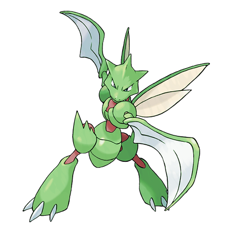
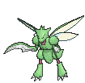
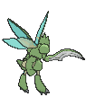
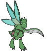
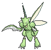
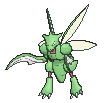

# #123 Scyther (Mantis Pokémon)

| Official Artwork | Shiny Artwork |
|------------------|---------------|
|  |  |

Scyther is blindingly fast. Its blazing speed enhances the effectiveness of the twin scythes on its forearms. This Pokémon’s scythes are so effective, they can slice through thick logs in one wicked stroke.

---

## Media

### Default Sprites

| Front | Shiny | Back | Shiny |
|-------|-------|------|-------|
|  |  |  |  |

### Female Sprites

| Front | Shiny | Back | Shiny |
|-------|-------|------|-------|
|  |  | N/A | N/A |

### Cries

Latest (Gen VI+):

<audio controls>
<source src='../../assets/cries/scyther/latest.ogg' type='audio/ogg'>
  Your browser does not support the audio element.
</audio>

Legacy:

<audio controls>
<source src='../../assets/cries/scyther/legacy.ogg' type='audio/ogg'>
  Your browser does not support the audio element.
</audio>

---

## Pokédex Data

| National № | Type(s) | Height | Weight | Abilities | Local № |
|------------|---------|--------|--------|-----------|---------|
| #123 | {: width="48"} {: width="48"} | 1.5 m / 4.9 ft | 56.0 kg / 123.5 lbs | 1. Swarm 2. Technician | N/A |

---

## Base Stats
|   | HP | Attack | Defense | Sp. Atk | Sp. Def | Speed |
|---|----|--------|---------|---------|---------|-------|
| **Base** | 70 | 110 | 80 | 55 | 80 | 105 |
| **Min** | 250 | 202 | 148 | 103 | 148 | 193 |
| **Max** | 344 | 350 | 284 | 229 | 284 | 339 |

The ranges shown above are for a level 100 Pokémon. Maximum values are based on a beneficial nature, 252 EVs, 31 IVs; minimum values are based on a hindering nature, 0 EVs, 0 IVs.

---

## Forms & Evolutions

!!! warning "WARNING"

    Information on evolutions may not be 100% accurate; differences between evolution methods across generations are not accounted for.

### Forms

Scyther has no alternate forms.

### Evolution Line

1. [Scyther](scyther.md/)
    1. Trade: [Scizor](scizor.md/)

---

## Training

| EV Yield | Catch Rate | Base Friendship | Base Exp. | Growth Rate | Held Items |
|----------|------------|-----------------|-----------|-------------|------------|
| 1 Atk | 45 | 50 | 100 | Medium | N/A |

---

## Breeding

| Egg Groups | Egg Cycles | Gender | Dimorphic | Color | Shape |
|------------|------------|--------|-----------|-------|-------|
| 1. Bug | 25 | 50.0% Male 50.0% Female | True | Green | Bug-Wings |

---

## Moves

!!! warning "WARNING"

    Specific move information may be incorrect. However, the general movepool should be accurate; this includes changes made in Sacred Gold and Storm Silver.

### Level Up Moves

| Lv. | Move | Type | Cat. | Power | Acc. | PP |
| --- | --- | --- | --- | --- | --- | --- |
| 1 | Leer | {: width="48"} | {: width="36"} | — | 100 | 30 |
| 1 | Quick Attack | {: width="48"} | {: width="36"} | 40 | 100 | 30 |
| 1 | Vacuum Wave | {: width="48"} | {: width="36"} | 40 | 100 | 30 |
| 4 | Focus Energy | {: width="48"} | {: width="36"} | — | — | 30 |
| 8 | Pursuit | {: width="48"} | {: width="36"} | 40 | 100 | 20 |
| 12 | Agility | {: width="48"} | {: width="36"} | — | — | 30 |
| 16 | Fury Cutter | {: width="48"} | {: width="36"} | 40 | 95 | 20 |
| 20 | Slash | {: width="48"} | {: width="36"} | 70 | 100 | 20 |
| 23 | Bug Bite | {: width="48"} | {: width="36"} | 60 | 100 | 20 |
| 26 | Wing Attack | {: width="48"} | {: width="36"} | 60 | 100 | 35 |
| 29 | False Swipe | {: width="48"} | {: width="36"} | 40 | 100 | 40 |
| 32 | Razor Wind | {: width="48"} | {: width="36"} | 80 | 100 | 10 |
| 35 | Double Team | {: width="48"} | {: width="36"} | — | — | 15 |
| 38 | X Scissor | {: width="48"} | {: width="36"} | 80 | 100 | 15 |
| 41 | Night Slash | {: width="48"} | {: width="36"} | 70 | 100 | 15 |
| 44 | Double Hit | {: width="48"} | {: width="36"} | 35 | 90 | 10 |
| 48 | Swords Dance | {: width="48"} | {: width="36"} | — | — | 20 |
| 52 | Air Slash | {: width="48"} | {: width="36"} | 75 | 95 | 15 |
| 56 | Feint | {: width="48"} | {: width="36"} | 30 | 100 | 10 |
| 60 | Reversal | {: width="48"} | {: width="36"} | — | 100 | 15 |

### TM Moves

| TM | Move | Type | Cat. | Power | Acc. | PP |
| --- | --- | --- | --- | --- | --- | --- |
| HM01 | Cut | {: width="48"} | {: width="36"} | 70 | 100 | 15 |
| HM06 | Rock Smash | {: width="48"} | {: width="36"} | 65 | 100 | 15 |
| TM06 | Toxic | {: width="48"} | {: width="36"} | — | 90 | 10 |
| TM10 | Hidden Power | {: width="48"} | {: width="36"} | 60 | 100 | 15 |
| TM100 | Confide | {: width="48"} | {: width="36"} | — | — | 20 |
| TM11 | Sunny Day | {: width="48"} | {: width="36"} | — | — | 5 |
| TM15 | Hyper Beam | {: width="48"} | {: width="36"} | 150 | 90 | 5 |
| TM16 | Light Screen | {: width="48"} | {: width="36"} | — | — | 30 |
| TM17 | Protect | {: width="48"} | {: width="36"} | — | — | 10 |
| TM18 | Rain Dance | {: width="48"} | {: width="36"} | — | — | 5 |
| TM19 | Roost | {: width="48"} | {: width="36"} | — | — | 5 |
| TM20 | Safeguard | {: width="48"} | {: width="36"} | — | — | 25 |
| TM21 | Frustration | {: width="48"} | {: width="36"} | — | 100 | 20 |
| TM27 | Return | {: width="48"} | {: width="36"} | — | 100 | 20 |
| TM31 | Brick Break | {: width="48"} | {: width="36"} | 75 | 100 | 15 |
| TM32 | Double Team | {: width="48"} | {: width="36"} | — | — | 15 |
| TM40 | Aerial Ace | {: width="48"} | {: width="36"} | 60 | — | 20 |
| TM42 | Facade | {: width="48"} | {: width="36"} | 70 | 100 | 20 |
| TM44 | Rest | {: width="48"} | {: width="36"} | — | — | 5 |
| TM45 | Attract | {: width="48"} | {: width="36"} | — | 100 | 15 |
| TM46 | Thief | {: width="48"} | {: width="36"} | 60 | 100 | 25 |
| TM48 | Round | {: width="48"} | {: width="36"} | 60 | 100 | 15 |
| TM51 | Steel Wing | {: width="48"} | {: width="36"} | 70 | 90 | 25 |
| TM54 | False Swipe | {: width="48"} | {: width="36"} | 40 | 100 | 40 |
| TM68 | Giga Impact | {: width="48"} | {: width="36"} | 150 | 90 | 5 |
| TM75 | Swords Dance | {: width="48"} | {: width="36"} | — | — | 20 |
| TM76 | Struggle Bug | {: width="48"} | {: width="36"} | 50 | 100 | 20 |
| TM81 | X Scissor | {: width="48"} | {: width="36"} | 80 | 100 | 15 |
| TM87 | Swagger | {: width="48"} | {: width="36"} | — | 85 | 15 |
| TM88 | Sleep Talk | {: width="48"} | {: width="36"} | — | — | 10 |
| TM89 | U Turn | {: width="48"} | {: width="36"} | 70 | 100 | 20 |
| TM90 | Substitute | {: width="48"} | {: width="36"} | — | — | 10 |
| TM94 | Secret Power | {: width="48"} | {: width="36"} | 70 | 100 | 20 |

### Egg Moves

| Move | Type | Cat. | Power | Acc. | PP |
| --- | --- | --- | --- | --- | --- |
| Baton Pass | {: width="48"} | {: width="36"} | — | — | 40 |
| Bug Buzz | {: width="48"} | {: width="36"} | 90 | 100 | 10 |
| Counter | {: width="48"} | {: width="36"} | — | 100 | 20 |
| Defog | {: width="48"} | {: width="36"} | — | — | 15 |
| Endure | {: width="48"} | {: width="36"} | — | — | 10 |
| Night Slash | {: width="48"} | {: width="36"} | 70 | 100 | 15 |
| Quick Guard | {: width="48"} | {: width="36"} | — | — | 15 |
| Razor Wind | {: width="48"} | {: width="36"} | 80 | 100 | 10 |
| Reversal | {: width="48"} | {: width="36"} | — | 100 | 15 |
| Silver Wind | {: width="48"} | {: width="36"} | 60 | 100 | 5 |
| Steel Wing | {: width="48"} | {: width="36"} | 70 | 90 | 25 |

### Tutor Moves

| Move | Type | Cat. | Power | Acc. | PP |
| --- | --- | --- | --- | --- | --- |
| Bug Bite | {: width="48"} | {: width="36"} | 60 | 100 | 20 |
| Knock Off | {: width="48"} | {: width="36"} | 65 | 100 | 20 |
| Snore | {: width="48"} | {: width="36"} | 50 | 100 | 15 |
| Tailwind | {: width="48"} | {: width="36"} | — | — | 15 |

