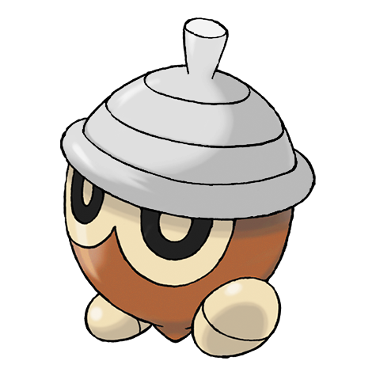
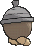
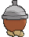

# #273 Seedot (Acorn Pokémon)

| Official Artwork | Shiny Artwork |
|------------------|---------------|
|  |  |

**Rising Ruby:** Seedot attaches itself to a tree branch using the top of its head. It sucks moisture from the tree while hanging off the branch. The more water it drinks, the glossier this Pokémon’s body becomes.

**Sinking Sapphire:** Seedot looks exactly like an acorn when it is dangling from a tree branch. It startles other Pokémon by suddenly moving. This Pokémon polishes its body once a day using leaves.

---

## Media

### Default Sprites

| Front | Shiny | Back | Shiny |
|-------|-------|------|-------|
|  |  |  |  |

### Cries

Latest (Gen VI+):

<audio controls>
<source src='../../assets/cries/seedot/latest.ogg' type='audio/ogg'>
  Your browser does not support the audio element.
</audio>

Legacy:

<audio controls>
<source src='../../assets/cries/seedot/legacy.ogg' type='audio/ogg'>
  Your browser does not support the audio element.
</audio>

---

## Pokédex Data

| National № | Type(s) | Height | Weight | Abilities | Local № |
|------------|---------|--------|--------|-----------|---------|
| #273 | {: width="48"} | 0.5 m / 1.6 ft | 4.0 kg / 8.8 lbs | 1. Chlorophyll 2. Early Bird | N/A |

---

## Base Stats
|   | HP | Attack | Defense | Sp. Atk | Sp. Def | Speed |
|---|----|--------|---------|---------|---------|-------|
| **Base** | 40 | 40 | 50 | 30 | 30 | 30 |
| **Min** | 190 | 76 | 94 | 58 | 58 | 58 |
| **Max** | 284 | 196 | 218 | 174 | 174 | 174 |

The ranges shown above are for a level 100 Pokémon. Maximum values are based on a beneficial nature, 252 EVs, 31 IVs; minimum values are based on a hindering nature, 0 EVs, 0 IVs.

---

## Forms & Evolutions

!!! warning "WARNING"

    Information on evolutions may not be 100% accurate; differences between evolution methods across generations are not accounted for.

### Forms

Seedot has no alternate forms.

### Evolution Line

1. [Seedot](seedot.md/)
    1. Level Up: [Nuzleaf](nuzleaf.md/)
        1. Use Item: [Shiftry](shiftry.md/)

---

## Training

| EV Yield | Catch Rate | Base Friendship | Base Exp. | Growth Rate | Held Items |
|----------|------------|-----------------|-----------|-------------|------------|
| 1 Def | 255 | 50 | 44 | Medium Slow | Power Herb (5%) |

---

## Breeding

| Egg Groups | Egg Cycles | Gender | Dimorphic | Color | Shape |
|------------|------------|--------|-----------|-------|-------|
| 1. Ground 2. Plant | 15 | 50.0% Male 50.0% Female | False | Brown | Legs |

---

## Moves

!!! warning "WARNING"

    Specific move information may be incorrect. However, the general movepool should be accurate; this includes changes made in Sacred Gold and Storm Silver.

### Level Up Moves

| Lv. | Move | Type | Cat. | Power | Acc. | PP |
| --- | --- | --- | --- | --- | --- | --- |
| 1 | Bide | {: width="48"} | {: width="36"} | — | — | 10 |
| 3 | Harden | {: width="48"} | {: width="36"} | — | — | 30 |
| 6 | Bullet Seed | {: width="48"} | {: width="36"} | 25 | 100 | 30 |
| 9 | Growth | {: width="48"} | {: width="36"} | — | — | 20 |
| 12 | Nature Power | {: width="48"} | {: width="36"} | — | — | 20 |
| 15 | Synthesis | {: width="48"} | {: width="36"} | — | — | 5 |
| 18 | Seed Bomb | {: width="48"} | {: width="36"} | 80 | 100 | 15 |
| 21 | Sunny Day | {: width="48"} | {: width="36"} | — | — | 5 |
| 24 | Explosion | {: width="48"} | {: width="36"} | 250 | 100 | 5 |

### TM Moves

| TM | Move | Type | Cat. | Power | Acc. | PP |
| --- | --- | --- | --- | --- | --- | --- |
| HM06 | Rock Smash | {: width="48"} | {: width="36"} | 65 | 100 | 15 |
| TM06 | Toxic | {: width="48"} | {: width="36"} | — | 90 | 10 |
| TM10 | Hidden Power | {: width="48"} | {: width="36"} | 60 | 100 | 15 |
| TM100 | Confide | {: width="48"} | {: width="36"} | — | — | 20 |
| TM11 | Sunny Day | {: width="48"} | {: width="36"} | — | — | 5 |
| TM17 | Protect | {: width="48"} | {: width="36"} | — | — | 10 |
| TM21 | Frustration | {: width="48"} | {: width="36"} | — | 100 | 20 |
| TM22 | Solar Beam | {: width="48"} | {: width="36"} | 120 | 100 | 10 |
| TM27 | Return | {: width="48"} | {: width="36"} | — | 100 | 20 |
| TM28 | Dig | {: width="48"} | {: width="36"} | 80 | 100 | 10 |
| TM30 | Shadow Ball | {: width="48"} | {: width="36"} | 80 | 100 | 15 |
| TM32 | Double Team | {: width="48"} | {: width="36"} | — | — | 15 |
| TM42 | Facade | {: width="48"} | {: width="36"} | 70 | 100 | 20 |
| TM44 | Rest | {: width="48"} | {: width="36"} | — | — | 5 |
| TM45 | Attract | {: width="48"} | {: width="36"} | — | 100 | 15 |
| TM48 | Round | {: width="48"} | {: width="36"} | 60 | 100 | 15 |
| TM53 | Energy Ball | {: width="48"} | {: width="36"} | 90 | 100 | 10 |
| TM54 | False Swipe | {: width="48"} | {: width="36"} | 40 | 100 | 40 |
| TM64 | Explosion | {: width="48"} | {: width="36"} | 250 | 100 | 5 |
| TM67 | Retaliate | {: width="48"} | {: width="36"} | 70 | 100 | 5 |
| TM70 | Flash | {: width="48"} | {: width="36"} | — | 100 | 20 |
| TM75 | Swords Dance | {: width="48"} | {: width="36"} | — | — | 20 |
| TM86 | Grass Knot | {: width="48"} | {: width="36"} | — | 100 | 20 |
| TM87 | Swagger | {: width="48"} | {: width="36"} | — | 85 | 15 |
| TM88 | Sleep Talk | {: width="48"} | {: width="36"} | — | — | 10 |
| TM90 | Substitute | {: width="48"} | {: width="36"} | — | — | 10 |
| TM94 | Secret Power | {: width="48"} | {: width="36"} | 70 | 100 | 20 |
| TM96 | Nature Power | {: width="48"} | {: width="36"} | — | — | 20 |

### Egg Moves

| Move | Type | Cat. | Power | Acc. | PP |
| --- | --- | --- | --- | --- | --- |
| Amnesia | {: width="48"} | {: width="36"} | — | — | 20 |
| Beat Up | {: width="48"} | {: width="36"} | — | 100 | 10 |
| Bullet Seed | {: width="48"} | {: width="36"} | 25 | 100 | 30 |
| Defog | {: width="48"} | {: width="36"} | — | — | 15 |
| Foul Play | {: width="48"} | {: width="36"} | 95 | 100 | 15 |
| Grassy Terrain | {: width="48"} | {: width="36"} | — | — | 10 |
| Leech Seed | {: width="48"} | {: width="36"} | — | 90 | 10 |
| Nasty Plot | {: width="48"} | {: width="36"} | — | — | 20 |
| Power Swap | {: width="48"} | {: width="36"} | — | — | 10 |
| Quick Attack | {: width="48"} | {: width="36"} | 40 | 100 | 30 |
| Razor Wind | {: width="48"} | {: width="36"} | 80 | 100 | 10 |
| Take Down | {: width="48"} | {: width="36"} | 90 | 85 | 20 |
| Worry Seed | {: width="48"} | {: width="36"} | — | 100 | 10 |

### Tutor Moves

| Move | Type | Cat. | Power | Acc. | PP |
| --- | --- | --- | --- | --- | --- |
| Foul Play | {: width="48"} | {: width="36"} | 95 | 100 | 15 |
| Giga Drain | {: width="48"} | {: width="36"} | 75 | 100 | 10 |
| Seed Bomb | {: width="48"} | {: width="36"} | 80 | 100 | 15 |
| Snore | {: width="48"} | {: width="36"} | 50 | 100 | 15 |
| Spite | {: width="48"} | {: width="36"} | — | 100 | 10 |
| Synthesis | {: width="48"} | {: width="36"} | — | — | 5 |
| Worry Seed | {: width="48"} | {: width="36"} | — | 100 | 10 |

