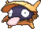
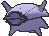
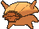

# #090 Shellder (Bivalve Pokémon)

| Official Artwork | Shiny Artwork |
|------------------|---------------|
|  |  |

At night, this Pokémon uses its broad tongue to burrow a hole in the seafloor sand and then sleep in it. While it is sleeping, Shellder closes its shell, but leaves its tongue hanging out.

---

## Media

### Default Sprites

| Front | Shiny | Back | Shiny |
|-------|-------|------|-------|
|  |  |  |  |

### Cries

Latest (Gen VI+):

<audio controls>
<source src='../../assets/cries/shellder/latest.ogg' type='audio/ogg'>
  Your browser does not support the audio element.
</audio>

Legacy:

<audio controls>
<source src='../../assets/cries/shellder/legacy.ogg' type='audio/ogg'>
  Your browser does not support the audio element.
</audio>

---

## Pokédex Data

| National № | Type(s) | Height | Weight | Abilities | Local № |
|------------|---------|--------|--------|-----------|---------|
| #90 | {: width="48"} | 0.3 m / 1.0 ft | 4.0 kg / 8.8 lbs | 1. Shell Armor 2. Skill Link | N/A |

---

## Base Stats
|   | HP | Attack | Defense | Sp. Atk | Sp. Def | Speed |
|---|----|--------|---------|---------|---------|-------|
| **Base** | 30 | 65 | 100 | 45 | 25 | 40 |
| **Min** | 170 | 121 | 184 | 85 | 49 | 76 |
| **Max** | 264 | 251 | 328 | 207 | 163 | 196 |

The ranges shown above are for a level 100 Pokémon. Maximum values are based on a beneficial nature, 252 EVs, 31 IVs; minimum values are based on a hindering nature, 0 EVs, 0 IVs.

---

## Forms & Evolutions

!!! warning "WARNING"

    Information on evolutions may not be 100% accurate; differences between evolution methods across generations are not accounted for.

### Forms

Shellder has no alternate forms.

### Evolution Line

1. [Shellder](shellder.md/)
    1. Use Item: [Cloyster](cloyster.md/)

---

## Training

| EV Yield | Catch Rate | Base Friendship | Base Exp. | Growth Rate | Held Items |
|----------|------------|-----------------|-----------|-------------|------------|
| 1 Def | 190 | 50 | 61 | Slow | Pearl (50%) Big Pearl (5%) |

---

## Breeding

| Egg Groups | Egg Cycles | Gender | Dimorphic | Color | Shape |
|------------|------------|--------|-----------|-------|-------|
| 1. Water3 | 20 | 50.0% Male 50.0% Female | False | Purple | Ball |

---

## Moves

!!! warning "WARNING"

    Specific move information may be incorrect. However, the general movepool should be accurate; this includes changes made in Sacred Gold and Storm Silver.

### Level Up Moves

| Lv. | Move | Type | Cat. | Power | Acc. | PP |
| --- | --- | --- | --- | --- | --- | --- |
| 1 | Tackle | {: width="48"} | {: width="36"} | 40 | 100 | 35 |
| 4 | Withdraw | {: width="48"} | {: width="36"} | — | — | 40 |
| 7 | Supersonic | {: width="48"} | {: width="36"} | — | 55 | 20 |
| 10 | Icicle Spear | {: width="48"} | {: width="36"} | 25 | 100 | 30 |
| 13 | Bubble Beam | {: width="48"} | {: width="36"} | 65 | 100 | 20 |
| 16 | Protect | {: width="48"} | {: width="36"} | — | — | 10 |
| 19 | Clamp | {: width="48"} | {: width="36"} | 35 | 85 | 15 |
| 22 | Leer | {: width="48"} | {: width="36"} | — | 100 | 30 |
| 25 | Ice Shard | {: width="48"} | {: width="36"} | 40 | 100 | 30 |
| 28 | Razor Shell | {: width="48"} | {: width="36"} | 75 | 95 | 10 |
| 31 | Aurora Beam | {: width="48"} | {: width="36"} | 65 | 100 | 20 |
| 34 | Whirlpool | {: width="48"} | {: width="36"} | 35 | 85 | 15 |
| 37 | Brine | {: width="48"} | {: width="36"} | 65 | 100 | 10 |
| 40 | Iron Defense | {: width="48"} | {: width="36"} | — | — | 15 |
| 43 | Ice Beam | {: width="48"} | {: width="36"} | 90 | 100 | 10 |
| 46 | Shell Smash | {: width="48"} | {: width="36"} | — | — | 15 |
| 49 | Hydro Pump | {: width="48"} | {: width="36"} | 110 | 80 | 5 |

### TM Moves

| TM | Move | Type | Cat. | Power | Acc. | PP |
| --- | --- | --- | --- | --- | --- | --- |
| HM03 | Surf | {: width="48"} | {: width="36"} | 90 | 100 | 15 |
| HM07 | Dive | {: width="48"} | {: width="36"} | 80 | 100 | 10 |
| TM06 | Toxic | {: width="48"} | {: width="36"} | — | 90 | 10 |
| TM07 | Hail | {: width="48"} | {: width="36"} | — | — | 10 |
| TM10 | Hidden Power | {: width="48"} | {: width="36"} | 60 | 100 | 15 |
| TM100 | Confide | {: width="48"} | {: width="36"} | — | — | 20 |
| TM13 | Ice Beam | {: width="48"} | {: width="36"} | 90 | 100 | 10 |
| TM14 | Blizzard | {: width="48"} | {: width="36"} | 110 | 70 | 5 |
| TM17 | Protect | {: width="48"} | {: width="36"} | — | — | 10 |
| TM18 | Rain Dance | {: width="48"} | {: width="36"} | — | — | 5 |
| TM21 | Frustration | {: width="48"} | {: width="36"} | — | 100 | 20 |
| TM27 | Return | {: width="48"} | {: width="36"} | — | 100 | 20 |
| TM32 | Double Team | {: width="48"} | {: width="36"} | — | — | 15 |
| TM42 | Facade | {: width="48"} | {: width="36"} | 70 | 100 | 20 |
| TM44 | Rest | {: width="48"} | {: width="36"} | — | — | 5 |
| TM45 | Attract | {: width="48"} | {: width="36"} | — | 100 | 15 |
| TM48 | Round | {: width="48"} | {: width="36"} | 60 | 100 | 15 |
| TM64 | Explosion | {: width="48"} | {: width="36"} | 250 | 100 | 5 |
| TM66 | Payback | {: width="48"} | {: width="36"} | 50 | 100 | 10 |
| TM87 | Swagger | {: width="48"} | {: width="36"} | — | 85 | 15 |
| TM88 | Sleep Talk | {: width="48"} | {: width="36"} | — | — | 10 |
| TM90 | Substitute | {: width="48"} | {: width="36"} | — | — | 10 |
| TM94 | Secret Power | {: width="48"} | {: width="36"} | 70 | 100 | 20 |

### Egg Moves

| Move | Type | Cat. | Power | Acc. | PP |
| --- | --- | --- | --- | --- | --- |
| Aqua Ring | {: width="48"} | {: width="36"} | — | — | 20 |
| Avalanche | {: width="48"} | {: width="36"} | 60 | 100 | 10 |
| Barrier | {: width="48"} | {: width="36"} | — | — | 20 |
| Bubble Beam | {: width="48"} | {: width="36"} | 65 | 100 | 20 |
| Icicle Spear | {: width="48"} | {: width="36"} | 25 | 100 | 30 |
| Mud Shot | {: width="48"} | {: width="36"} | 55 | 95 | 15 |
| Rapid Spin | {: width="48"} | {: width="36"} | 50 | 100 | 40 |
| Rock Blast | {: width="48"} | {: width="36"} | 25 | 90 | 10 |
| Screech | {: width="48"} | {: width="36"} | — | 85 | 40 |
| Take Down | {: width="48"} | {: width="36"} | 90 | 85 | 20 |
| Twineedle | {: width="48"} | {: width="36"} | 25 | 100 | 20 |
| Water Pulse | {: width="48"} | {: width="36"} | 60 | 100 | 20 |

### Tutor Moves

| Move | Type | Cat. | Power | Acc. | PP |
| --- | --- | --- | --- | --- | --- |
| Icy Wind | {: width="48"} | {: width="36"} | 55 | 95 | 15 |
| Iron Defense | {: width="48"} | {: width="36"} | — | — | 15 |
| Snore | {: width="48"} | {: width="36"} | 50 | 100 | 15 |
| Water Pulse | {: width="48"} | {: width="36"} | 60 | 100 | 20 |

