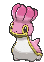
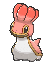
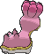
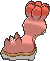
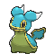
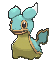
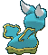
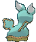

# #422 Shellos (Sea Slug Pokémon)

| Official Artwork | Shiny Artwork |
|------------------|---------------|
|  |  |

**Rising Ruby:** Beware of pushing strongly on its squishy body, as it makes a mysterious purple fluid ooze out.

**Sinking Sapphire:** Its shape and coloration vary, depending on its habitat.

---

## Media

### Default Sprites

| Front | Shiny | Back | Shiny |
|-------|-------|------|-------|
|  |  |  |  |

### Shellos East Sprites

| Front | Shiny | Back | Shiny |
|-------|-------|------|-------|
|  |  |  |  |

### Cries

Latest (Gen VI+):

<audio controls>
<source src='../../assets/cries/shellos/latest.ogg' type='audio/ogg'>
  Your browser does not support the audio element.
</audio>

Legacy:

<audio controls>
<source src='../../assets/cries/shellos/legacy.ogg' type='audio/ogg'>
  Your browser does not support the audio element.
</audio>

---

## Pokédex Data

| National № | Type(s) | Height | Weight | Abilities | Local № |
|------------|---------|--------|--------|-----------|---------|
| #422 | {: width="48"} | 0.3 m / 1.0 ft | 6.3 kg / 13.9 lbs | 1. Sticky Hold 2. Storm Drain | #60 |

---

## Base Stats
|   | HP | Attack | Defense | Sp. Atk | Sp. Def | Speed |
|---|----|--------|---------|---------|---------|-------|
| **Base** | 76 | 48 | 48 | 57 | 62 | 34 |
| **Min** | 262 | 90 | 90 | 107 | 116 | 65 |
| **Max** | 356 | 214 | 214 | 234 | 245 | 183 |

The ranges shown above are for a level 100 Pokémon. Maximum values are based on a beneficial nature, 252 EVs, 31 IVs; minimum values are based on a hindering nature, 0 EVs, 0 IVs.

---

## Forms & Evolutions

!!! warning "WARNING"

    Information on evolutions may not be 100% accurate; differences between evolution methods across generations are not accounted for.

### Forms

Shellos has no alternate forms.

### Evolution Line

1. [Shellos](shellos.md/)
    1. Level Up: [Gastrodon](gastrodon.md/)

---

## Training

| EV Yield | Catch Rate | Base Friendship | Base Exp. | Growth Rate | Held Items |
|----------|------------|-----------------|-----------|-------------|------------|
| 1 HP | 190 | 50 | 65 | Medium | N/A |

---

## Breeding

| Egg Groups | Egg Cycles | Gender | Dimorphic | Color | Shape |
|------------|------------|--------|-----------|-------|-------|
| 1. Water1 2. Indeterminate | 20 | 50.0% Male 50.0% Female | False | Purple | Squiggle |

---

## Moves

!!! warning "WARNING"

    Specific move information may be incorrect. However, the general movepool should be accurate; this includes changes made in Sacred Gold and Storm Silver.

### Level Up Moves

| Lv. | Move | Type | Cat. | Power | Acc. | PP |
| --- | --- | --- | --- | --- | --- | --- |
| 1 | Mud Slap | {: width="48"} | {: width="36"} | 20 | 100 | 10 |
| 3 | Mud Sport | {: width="48"} | {: width="36"} | — | — | 15 |
| 6 | Harden | {: width="48"} | {: width="36"} | — | — | 30 |
| 9 | Water Pulse | {: width="48"} | {: width="36"} | 60 | 100 | 20 |
| 12 | Mud Bomb | {: width="48"} | {: width="36"} | 65 | 85 | 10 |
| 15 | Sludge | {: width="48"} | {: width="36"} | 65 | 100 | 20 |
| 18 | Hidden Power | {: width="48"} | {: width="36"} | 60 | 100 | 15 |
| 21 | Rain Dance | {: width="48"} | {: width="36"} | — | — | 5 |
| 24 | Brine | {: width="48"} | {: width="36"} | 65 | 100 | 10 |
| 27 | Body Slam | {: width="48"} | {: width="36"} | 85 | 100 | 15 |
| 30 | Muddy Water | {: width="48"} | {: width="36"} | 90 | 85 | 10 |
| 33 | Earth Power | {: width="48"} | {: width="36"} | 90 | 100 | 10 |
| 36 | Recover | {: width="48"} | {: width="36"} | — | — | 5 |

### TM Moves

| TM | Move | Type | Cat. | Power | Acc. | PP |
| --- | --- | --- | --- | --- | --- | --- |
| HM03 | Surf | {: width="48"} | {: width="36"} | 90 | 100 | 15 |
| HM07 | Dive | {: width="48"} | {: width="36"} | 80 | 100 | 10 |
| TM06 | Toxic | {: width="48"} | {: width="36"} | — | 90 | 10 |
| TM07 | Hail | {: width="48"} | {: width="36"} | — | — | 10 |
| TM10 | Hidden Power | {: width="48"} | {: width="36"} | 60 | 100 | 15 |
| TM100 | Confide | {: width="48"} | {: width="36"} | — | — | 20 |
| TM13 | Ice Beam | {: width="48"} | {: width="36"} | 90 | 100 | 10 |
| TM14 | Blizzard | {: width="48"} | {: width="36"} | 110 | 70 | 5 |
| TM17 | Protect | {: width="48"} | {: width="36"} | — | — | 10 |
| TM18 | Rain Dance | {: width="48"} | {: width="36"} | — | — | 5 |
| TM21 | Frustration | {: width="48"} | {: width="36"} | — | 100 | 20 |
| TM27 | Return | {: width="48"} | {: width="36"} | — | 100 | 20 |
| TM32 | Double Team | {: width="48"} | {: width="36"} | — | — | 15 |
| TM42 | Facade | {: width="48"} | {: width="36"} | 70 | 100 | 20 |
| TM44 | Rest | {: width="48"} | {: width="36"} | — | — | 5 |
| TM45 | Attract | {: width="48"} | {: width="36"} | — | 100 | 15 |
| TM48 | Round | {: width="48"} | {: width="36"} | 60 | 100 | 15 |
| TM55 | Scald | {: width="48"} | {: width="36"} | 80 | 100 | 15 |
| TM83 | Infestation | {: width="48"} | {: width="36"} | 20 | 100 | 20 |
| TM87 | Swagger | {: width="48"} | {: width="36"} | — | 85 | 15 |
| TM88 | Sleep Talk | {: width="48"} | {: width="36"} | — | — | 10 |
| TM90 | Substitute | {: width="48"} | {: width="36"} | — | — | 10 |
| TM94 | Secret Power | {: width="48"} | {: width="36"} | 70 | 100 | 20 |

### Egg Moves

| Move | Type | Cat. | Power | Acc. | PP |
| --- | --- | --- | --- | --- | --- |
| Acid Armor | {: width="48"} | {: width="36"} | — | — | 20 |
| Amnesia | {: width="48"} | {: width="36"} | — | — | 20 |
| Brine | {: width="48"} | {: width="36"} | 65 | 100 | 10 |
| Clear Smog | {: width="48"} | {: width="36"} | 50 | — | 15 |
| Counter | {: width="48"} | {: width="36"} | — | 100 | 20 |
| Curse | {: width="48"} | {: width="36"} | — | — | 10 |
| Fissure | {: width="48"} | {: width="36"} | — | 30 | 5 |
| Memento | {: width="48"} | {: width="36"} | — | 100 | 10 |
| Mirror Coat | {: width="48"} | {: width="36"} | — | 100 | 20 |
| Mist | {: width="48"} | {: width="36"} | — | — | 30 |
| Sludge | {: width="48"} | {: width="36"} | 65 | 100 | 20 |
| Spit Up | {: width="48"} | {: width="36"} | — | 100 | 10 |
| Stockpile | {: width="48"} | {: width="36"} | — | — | 20 |
| Swallow | {: width="48"} | {: width="36"} | — | — | 10 |
| Trump Card | {: width="48"} | {: width="36"} | — | — | 5 |
| Yawn | {: width="48"} | {: width="36"} | — | — | 10 |

### Tutor Moves

| Move | Type | Cat. | Power | Acc. | PP |
| --- | --- | --- | --- | --- | --- |
| Earth Power | {: width="48"} | {: width="36"} | 90 | 100 | 10 |
| Icy Wind | {: width="48"} | {: width="36"} | 55 | 95 | 15 |
| Pain Split | {: width="48"} | {: width="36"} | — | — | 20 |
| Snore | {: width="48"} | {: width="36"} | 50 | 100 | 15 |
| Water Pulse | {: width="48"} | {: width="36"} | 60 | 100 | 20 |

