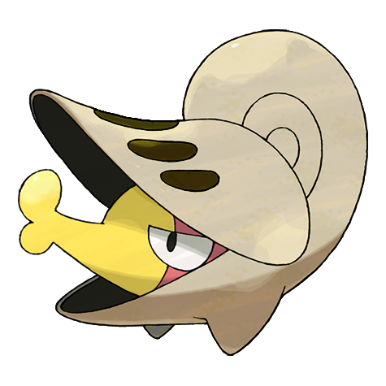
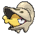
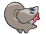
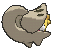

# #616 Shelmet (Snail Pokémon)

| Official Artwork | Shiny Artwork |
|------------------|---------------|
|  |  |

**Rising Ruby:** When it and Karrablast are together, and both receive electrical stimulation, they both evolve.

**Sinking Sapphire:** It evolves when bathed in an electric-like energy along with Karrablast. The reason is still unknown.

---

## Media

### Default Sprites

| Front | Shiny | Back | Shiny |
|-------|-------|------|-------|
|  |  |  |  |

### Cries

Latest (Gen VI+):

<audio controls>
<source src='../../assets/cries/shelmet/latest.ogg' type='audio/ogg'>
  Your browser does not support the audio element.
</audio>

Legacy:

<audio controls>
<source src='../../assets/cries/shelmet/legacy.ogg' type='audio/ogg'>
  Your browser does not support the audio element.
</audio>

---

## Pokédex Data

| National № | Type(s) | Height | Weight | Abilities | Local № |
|------------|---------|--------|--------|-----------|---------|
| #616 | {: width="48"} | 0.4 m / 1.3 ft | 7.7 kg / 17.0 lbs | 1. Hydration 2. Shell Armor | N/A |

---

## Base Stats
|   | HP | Attack | Defense | Sp. Atk | Sp. Def | Speed |
|---|----|--------|---------|---------|---------|-------|
| **Base** | 50 | 40 | 85 | 40 | 65 | 25 |
| **Min** | 210 | 76 | 157 | 76 | 121 | 49 |
| **Max** | 304 | 196 | 295 | 196 | 251 | 163 |

The ranges shown above are for a level 100 Pokémon. Maximum values are based on a beneficial nature, 252 EVs, 31 IVs; minimum values are based on a hindering nature, 0 EVs, 0 IVs.

---

## Forms & Evolutions

!!! warning "WARNING"

    Information on evolutions may not be 100% accurate; differences between evolution methods across generations are not accounted for.

### Forms

Shelmet has no alternate forms.

### Evolution Line

1. [Shelmet](shelmet.md/)
    1. Trade: [Accelgor](accelgor.md/)

---

## Training

| EV Yield | Catch Rate | Base Friendship | Base Exp. | Growth Rate | Held Items |
|----------|------------|-----------------|-----------|-------------|------------|
| 1 Def | 200 | 50 | 61 | Medium | N/A |

---

## Breeding

| Egg Groups | Egg Cycles | Gender | Dimorphic | Color | Shape |
|------------|------------|--------|-----------|-------|-------|
| 1. Bug | 15 | 50.0% Male 50.0% Female | False | Red | Ball |

---

## Moves

!!! warning "WARNING"

    Specific move information may be incorrect. However, the general movepool should be accurate; this includes changes made in Sacred Gold and Storm Silver.

### Level Up Moves

| Lv. | Move | Type | Cat. | Power | Acc. | PP |
| --- | --- | --- | --- | --- | --- | --- |
| 1 | Leech Life | {: width="48"} | {: width="36"} | 80 | 100 | 10 |
| 4 | Acid | {: width="48"} | {: width="36"} | 40 | 100 | 30 |
| 7 | Bide | {: width="48"} | {: width="36"} | — | — | 10 |
| 10 | Curse | {: width="48"} | {: width="36"} | — | — | 10 |
| 13 | Struggle Bug | {: width="48"} | {: width="36"} | 50 | 100 | 20 |
| 16 | Mega Drain | {: width="48"} | {: width="36"} | 40 | 100 | 15 |
| 19 | Yawn | {: width="48"} | {: width="36"} | — | — | 10 |
| 22 | Signal Beam | {: width="48"} | {: width="36"} | 75 | 100 | 15 |
| 25 | Protect | {: width="48"} | {: width="36"} | — | — | 10 |
| 28 | Acid Armor | {: width="48"} | {: width="36"} | — | — | 20 |
| 31 | Giga Drain | {: width="48"} | {: width="36"} | 75 | 100 | 10 |
| 34 | Body Slam | {: width="48"} | {: width="36"} | 85 | 100 | 15 |
| 37 | Bug Buzz | {: width="48"} | {: width="36"} | 90 | 100 | 10 |
| 40 | Recover | {: width="48"} | {: width="36"} | — | — | 5 |
| 43 | Sludge Bomb | {: width="48"} | {: width="36"} | 90 | 100 | 10 |
| 46 | Guard Swap | {: width="48"} | {: width="36"} | — | — | 10 |
| 49 | Final Gambit | {: width="48"} | {: width="36"} | — | 100 | 5 |

### TM Moves

| TM | Move | Type | Cat. | Power | Acc. | PP |
| --- | --- | --- | --- | --- | --- | --- |
| TM06 | Toxic | {: width="48"} | {: width="36"} | — | 90 | 10 |
| TM09 | Venoshock | {: width="48"} | {: width="36"} | 65 | 100 | 10 |
| TM10 | Hidden Power | {: width="48"} | {: width="36"} | 60 | 100 | 15 |
| TM100 | Confide | {: width="48"} | {: width="36"} | — | — | 20 |
| TM17 | Protect | {: width="48"} | {: width="36"} | — | — | 10 |
| TM18 | Rain Dance | {: width="48"} | {: width="36"} | — | — | 5 |
| TM21 | Frustration | {: width="48"} | {: width="36"} | — | 100 | 20 |
| TM27 | Return | {: width="48"} | {: width="36"} | — | 100 | 20 |
| TM32 | Double Team | {: width="48"} | {: width="36"} | — | — | 15 |
| TM36 | Sludge Bomb | {: width="48"} | {: width="36"} | 90 | 100 | 10 |
| TM42 | Facade | {: width="48"} | {: width="36"} | 70 | 100 | 20 |
| TM44 | Rest | {: width="48"} | {: width="36"} | — | — | 5 |
| TM45 | Attract | {: width="48"} | {: width="36"} | — | 100 | 15 |
| TM48 | Round | {: width="48"} | {: width="36"} | 60 | 100 | 15 |
| TM53 | Energy Ball | {: width="48"} | {: width="36"} | 90 | 100 | 10 |
| TM76 | Struggle Bug | {: width="48"} | {: width="36"} | 50 | 100 | 20 |
| TM83 | Infestation | {: width="48"} | {: width="36"} | 20 | 100 | 20 |
| TM87 | Swagger | {: width="48"} | {: width="36"} | — | 85 | 15 |
| TM88 | Sleep Talk | {: width="48"} | {: width="36"} | — | — | 10 |
| TM90 | Substitute | {: width="48"} | {: width="36"} | — | — | 10 |
| TM94 | Secret Power | {: width="48"} | {: width="36"} | 70 | 100 | 20 |

### Egg Moves

| Move | Type | Cat. | Power | Acc. | PP |
| --- | --- | --- | --- | --- | --- |
| Baton Pass | {: width="48"} | {: width="36"} | — | — | 40 |
| Double Edge | {: width="48"} | {: width="36"} | 120 | 100 | 15 |
| Encore | {: width="48"} | {: width="36"} | — | 100 | 5 |
| Endure | {: width="48"} | {: width="36"} | — | — | 10 |
| Feint | {: width="48"} | {: width="36"} | 30 | 100 | 10 |
| Guard Split | {: width="48"} | {: width="36"} | — | — | 10 |
| Mind Reader | {: width="48"} | {: width="36"} | — | — | 5 |
| Mud Slap | {: width="48"} | {: width="36"} | 20 | 100 | 10 |
| Pursuit | {: width="48"} | {: width="36"} | 40 | 100 | 20 |
| Spikes | {: width="48"} | {: width="36"} | — | — | 20 |

### Tutor Moves

| Move | Type | Cat. | Power | Acc. | PP |
| --- | --- | --- | --- | --- | --- |
| Bug Bite | {: width="48"} | {: width="36"} | 60 | 100 | 20 |
| Gastro Acid | {: width="48"} | {: width="36"} | — | 100 | 10 |
| Giga Drain | {: width="48"} | {: width="36"} | 75 | 100 | 10 |
| Signal Beam | {: width="48"} | {: width="36"} | 75 | 100 | 15 |
| Snore | {: width="48"} | {: width="36"} | 50 | 100 | 15 |

