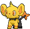
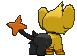
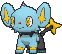
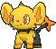

# #403 Shinx (Flash Pokémon)

| Official Artwork | Shiny Artwork |
|------------------|---------------|
|  |  |

**Rising Ruby:** The extension and contraction of its muscles generates electricity. It glows when in trouble.

**Sinking Sapphire:** All of its fur dazzles if danger is sensed. It flees while the foe is momentarily blinded.

---

## Media

### Default Sprites

| Front | Shiny | Back | Shiny |
|-------|-------|------|-------|
|  |  |  |  |

### Female Sprites

| Front | Shiny | Back | Shiny |
|-------|-------|------|-------|
|  |  | N/A | N/A |

### Cries

Latest (Gen VI+):

<audio controls>
<source src='../../assets/cries/shinx/latest.ogg' type='audio/ogg'>
  Your browser does not support the audio element.
</audio>

Legacy:

<audio controls>
<source src='../../assets/cries/shinx/legacy.ogg' type='audio/ogg'>
  Your browser does not support the audio element.
</audio>

---

## Pokédex Data

| National № | Type(s) | Height | Weight | Abilities | Local № |
|------------|---------|--------|--------|-----------|---------|
| #403 | {: width="48"} | 0.5 m / 1.6 ft | 9.5 kg / 20.9 lbs | 1. Rivalry 2. Intimidate | #17 |

---

## Base Stats
|   | HP | Attack | Defense | Sp. Atk | Sp. Def | Speed |
|---|----|--------|---------|---------|---------|-------|
| **Base** | 45 | 65 | 34 | 40 | 34 | 45 |
| **Min** | 200 | 121 | 65 | 76 | 65 | 85 |
| **Max** | 294 | 251 | 183 | 196 | 183 | 207 |

The ranges shown above are for a level 100 Pokémon. Maximum values are based on a beneficial nature, 252 EVs, 31 IVs; minimum values are based on a hindering nature, 0 EVs, 0 IVs.

---

## Forms & Evolutions

!!! warning "WARNING"

    Information on evolutions may not be 100% accurate; differences between evolution methods across generations are not accounted for.

### Forms

Shinx has no alternate forms.

### Evolution Line

1. [Shinx](shinx.md/)
    1. Level Up: [Luxio](luxio.md/)
        1. Level Up: [Luxray](luxray.md/)

---

## Training

| EV Yield | Catch Rate | Base Friendship | Base Exp. | Growth Rate | Held Items |
|----------|------------|-----------------|-----------|-------------|------------|
| 1 Atk | 235 | 50 | 53 | Medium Slow | N/A |

---

## Breeding

| Egg Groups | Egg Cycles | Gender | Dimorphic | Color | Shape |
|------------|------------|--------|-----------|-------|-------|
| 1. Ground | 20 | 50.0% Male 50.0% Female | True | Blue | Quadruped |

---

## Moves

!!! warning "WARNING"

    Specific move information may be incorrect. However, the general movepool should be accurate; this includes changes made in Sacred Gold and Storm Silver.

### Level Up Moves

| Lv. | Move | Type | Cat. | Power | Acc. | PP |
| --- | --- | --- | --- | --- | --- | --- |
| 1 | Leer | {: width="48"} | {: width="36"} | — | 100 | 30 |
| 1 | Tackle | {: width="48"} | {: width="36"} | 40 | 100 | 35 |
| 5 | Charge | {: width="48"} | {: width="36"} | — | — | 20 |
| 8 | Quick Attack | {: width="48"} | {: width="36"} | 40 | 100 | 30 |
| 11 | Spark | {: width="48"} | {: width="36"} | 65 | 100 | 20 |
| 14 | Baby Doll Eyes | {: width="48"} | {: width="36"} | — | 100 | 30 |
| 17 | Bite | {: width="48"} | {: width="36"} | 60 | 100 | 25 |
| 20 | Thunder Fang | {: width="48"} | {: width="36"} | 65 | 95 | 15 |
| 23 | Roar | {: width="48"} | {: width="36"} | — | — | 20 |
| 26 | Double Kick | {: width="48"} | {: width="36"} | 30 | 100 | 30 |
| 29 | Wild Charge | {: width="48"} | {: width="36"} | 90 | 100 | 15 |
| 32 | Crunch | {: width="48"} | {: width="36"} | 80 | 100 | 15 |
| 35 | Swagger | {: width="48"} | {: width="36"} | — | 85 | 15 |
| 38 | Discharge | {: width="48"} | {: width="36"} | 80 | 100 | 15 |
| 41 | Scary Face | {: width="48"} | {: width="36"} | — | 100 | 10 |
| 44 | Sucker Punch | {: width="48"} | {: width="36"} | 70 | 100 | 5 |
| 47 | Volt Tackle | {: width="48"} | {: width="36"} | 120 | 100 | 15 |

### TM Moves

| TM | Move | Type | Cat. | Power | Acc. | PP |
| --- | --- | --- | --- | --- | --- | --- |
| HM04 | Strength | {: width="48"} | {: width="36"} | 100 | 100 | 10 |
| TM05 | Roar | {: width="48"} | {: width="36"} | — | — | 20 |
| TM06 | Toxic | {: width="48"} | {: width="36"} | — | 90 | 10 |
| TM10 | Hidden Power | {: width="48"} | {: width="36"} | 60 | 100 | 15 |
| TM100 | Confide | {: width="48"} | {: width="36"} | — | — | 20 |
| TM16 | Light Screen | {: width="48"} | {: width="36"} | — | — | 30 |
| TM17 | Protect | {: width="48"} | {: width="36"} | — | — | 10 |
| TM18 | Rain Dance | {: width="48"} | {: width="36"} | — | — | 5 |
| TM21 | Frustration | {: width="48"} | {: width="36"} | — | 100 | 20 |
| TM24 | Thunderbolt | {: width="48"} | {: width="36"} | 90 | 100 | 15 |
| TM25 | Thunder | {: width="48"} | {: width="36"} | 110 | 70 | 10 |
| TM27 | Return | {: width="48"} | {: width="36"} | — | 100 | 20 |
| TM32 | Double Team | {: width="48"} | {: width="36"} | — | — | 15 |
| TM42 | Facade | {: width="48"} | {: width="36"} | 70 | 100 | 20 |
| TM44 | Rest | {: width="48"} | {: width="36"} | — | — | 5 |
| TM45 | Attract | {: width="48"} | {: width="36"} | — | 100 | 15 |
| TM46 | Thief | {: width="48"} | {: width="36"} | 60 | 100 | 25 |
| TM48 | Round | {: width="48"} | {: width="36"} | 60 | 100 | 15 |
| TM57 | Charge Beam | {: width="48"} | {: width="36"} | 50 | 90 | 10 |
| TM70 | Flash | {: width="48"} | {: width="36"} | — | 100 | 20 |
| TM72 | Volt Switch | {: width="48"} | {: width="36"} | 70 | 100 | 20 |
| TM73 | Thunder Wave | {: width="48"} | {: width="36"} | — | 90 | 20 |
| TM87 | Swagger | {: width="48"} | {: width="36"} | — | 85 | 15 |
| TM88 | Sleep Talk | {: width="48"} | {: width="36"} | — | — | 10 |
| TM90 | Substitute | {: width="48"} | {: width="36"} | — | — | 10 |
| TM93 | Wild Charge | {: width="48"} | {: width="36"} | 90 | 100 | 15 |
| TM94 | Secret Power | {: width="48"} | {: width="36"} | 70 | 100 | 20 |
| TM95 | Snarl | {: width="48"} | {: width="36"} | 55 | 95 | 15 |

### Egg Moves

| Move | Type | Cat. | Power | Acc. | PP |
| --- | --- | --- | --- | --- | --- |
| Double Kick | {: width="48"} | {: width="36"} | 30 | 100 | 30 |
| Eerie Impulse | {: width="48"} | {: width="36"} | — | 100 | 15 |
| Fake Tears | {: width="48"} | {: width="36"} | — | 100 | 20 |
| Fire Fang | {: width="48"} | {: width="36"} | 65 | 95 | 15 |
| Helping Hand | {: width="48"} | {: width="36"} | — | — | 20 |
| Howl | {: width="48"} | {: width="36"} | — | — | 40 |
| Ice Fang | {: width="48"} | {: width="36"} | 65 | 95 | 15 |
| Night Slash | {: width="48"} | {: width="36"} | 70 | 100 | 15 |
| Quick Attack | {: width="48"} | {: width="36"} | 40 | 100 | 30 |
| Shock Wave | {: width="48"} | {: width="36"} | 60 | — | 20 |
| Signal Beam | {: width="48"} | {: width="36"} | 75 | 100 | 15 |
| Swift | {: width="48"} | {: width="36"} | 60 | — | 20 |
| Take Down | {: width="48"} | {: width="36"} | 90 | 85 | 20 |
| Thunder Fang | {: width="48"} | {: width="36"} | 65 | 95 | 15 |

### Tutor Moves

| Move | Type | Cat. | Power | Acc. | PP |
| --- | --- | --- | --- | --- | --- |
| Helping Hand | {: width="48"} | {: width="36"} | — | — | 20 |
| Iron Tail | {: width="48"} | {: width="36"} | 100 | 75 | 15 |
| Magnet Rise | {: width="48"} | {: width="36"} | — | — | 10 |
| Shock Wave | {: width="48"} | {: width="36"} | 60 | — | 20 |
| Signal Beam | {: width="48"} | {: width="36"} | 75 | 100 | 15 |
| Snore | {: width="48"} | {: width="36"} | 50 | 100 | 15 |

