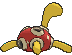
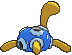

# #213 Shuckle (Mold Pokémon)

| Official Artwork | Shiny Artwork |
|------------------|---------------|
|  |  |

Shuckle quietly hides itself under rocks, keeping its body concealed inside its hard shell while eating berries it has stored away. The berries mix with its body fluids to become a juice.

---

## Media

### Default Sprites

| Front | Shiny | Back | Shiny |
|-------|-------|------|-------|
|  |  |  |  |

### Cries

Latest (Gen VI+):

<audio controls>
<source src='../../assets/cries/shuckle/latest.ogg' type='audio/ogg'>
  Your browser does not support the audio element.
</audio>

Legacy:

<audio controls>
<source src='../../assets/cries/shuckle/legacy.ogg' type='audio/ogg'>
  Your browser does not support the audio element.
</audio>

---

## Pokédex Data

| National № | Type(s) | Height | Weight | Abilities | Local № |
|------------|---------|--------|--------|-----------|---------|
| #213 | {: width="48"} {: width="48"} | 0.6 m / 2.0 ft | 20.5 kg / 45.2 lbs | 1. Sturdy 2. Gluttony | N/A |

---

## Base Stats
|   | HP | Attack | Defense | Sp. Atk | Sp. Def | Speed |
|---|----|--------|---------|---------|---------|-------|
| **Base** | 20 | 10 | 230 | 10 | 230 | 5 |
| **Min** | 150 | 22 | 418 | 22 | 418 | 13 |
| **Max** | 244 | 130 | 614 | 130 | 614 | 119 |

The ranges shown above are for a level 100 Pokémon. Maximum values are based on a beneficial nature, 252 EVs, 31 IVs; minimum values are based on a hindering nature, 0 EVs, 0 IVs.

---

## Forms & Evolutions

!!! warning "WARNING"

    Information on evolutions may not be 100% accurate; differences between evolution methods across generations are not accounted for.

### Forms

Shuckle has no alternate forms.

### Evolution Line

1. [Shuckle](shuckle.md/)

---

## Training

| EV Yield | Catch Rate | Base Friendship | Base Exp. | Growth Rate | Held Items |
|----------|------------|-----------------|-----------|-------------|------------|
| 1 Def 1 Sp.-Def | 190 | 50 | 177 | Medium Slow | Berry Juice (100%) |

---

## Breeding

| Egg Groups | Egg Cycles | Gender | Dimorphic | Color | Shape |
|------------|------------|--------|-----------|-------|-------|
| 1. Bug | 20 | 50.0% Male 50.0% Female | False | Yellow | Armor |

---

## Moves

!!! warning "WARNING"

    Specific move information may be incorrect. However, the general movepool should be accurate; this includes changes made in Sacred Gold and Storm Silver.

### Level Up Moves

| Lv. | Move | Type | Cat. | Power | Acc. | PP |
| --- | --- | --- | --- | --- | --- | --- |
| 1 | Bide | {: width="48"} | {: width="36"} | — | — | 10 |
| 1 | Constrict | {: width="48"} | {: width="36"} | 10 | 100 | 35 |
| 1 | Rollout | {: width="48"} | {: width="36"} | 30 | 90 | 20 |
| 1 | Sticky Web | {: width="48"} | {: width="36"} | — | — | 20 |
| 1 | Withdraw | {: width="48"} | {: width="36"} | — | — | 40 |
| 5 | Encore | {: width="48"} | {: width="36"} | — | 100 | 5 |
| 9 | Wrap | {: width="48"} | {: width="36"} | 15 | 90 | 20 |
| 12 | Struggle Bug | {: width="48"} | {: width="36"} | 50 | 100 | 20 |
| 16 | Safeguard | {: width="48"} | {: width="36"} | — | — | 25 |
| 20 | Rest | {: width="48"} | {: width="36"} | — | — | 5 |
| 23 | Rock Throw | {: width="48"} | {: width="36"} | 50 | 90 | 15 |
| 27 | Gastro Acid | {: width="48"} | {: width="36"} | — | 100 | 10 |
| 31 | Power Trick | {: width="48"} | {: width="36"} | — | — | 10 |
| 34 | Shell Smash | {: width="48"} | {: width="36"} | — | — | 15 |
| 38 | Rock Slide | {: width="48"} | {: width="36"} | 75 | 90 | 10 |
| 42 | Bug Bite | {: width="48"} | {: width="36"} | 60 | 100 | 20 |
| 45 | Guard Split | {: width="48"} | {: width="36"} | — | — | 10 |
| 45 | Power Split | {: width="48"} | {: width="36"} | — | — | 10 |
| 49 | Stone Edge | {: width="48"} | {: width="36"} | 100 | 80 | 5 |
| 53 | Sticky Web | {: width="48"} | {: width="36"} | — | — | 20 |

### TM Moves

| TM | Move | Type | Cat. | Power | Acc. | PP |
| --- | --- | --- | --- | --- | --- | --- |
| HM04 | Strength | {: width="48"} | {: width="36"} | 100 | 100 | 10 |
| HM06 | Rock Smash | {: width="48"} | {: width="36"} | 65 | 100 | 15 |
| TM06 | Toxic | {: width="48"} | {: width="36"} | — | 90 | 10 |
| TM09 | Venoshock | {: width="48"} | {: width="36"} | 65 | 100 | 10 |
| TM10 | Hidden Power | {: width="48"} | {: width="36"} | 60 | 100 | 15 |
| TM100 | Confide | {: width="48"} | {: width="36"} | — | — | 20 |
| TM11 | Sunny Day | {: width="48"} | {: width="36"} | — | — | 5 |
| TM17 | Protect | {: width="48"} | {: width="36"} | — | — | 10 |
| TM20 | Safeguard | {: width="48"} | {: width="36"} | — | — | 25 |
| TM21 | Frustration | {: width="48"} | {: width="36"} | — | 100 | 20 |
| TM23 | Smack Down | {: width="48"} | {: width="36"} | 50 | 100 | 15 |
| TM26 | Earthquake | {: width="48"} | {: width="36"} | 100 | 100 | 10 |
| TM27 | Return | {: width="48"} | {: width="36"} | — | 100 | 20 |
| TM28 | Dig | {: width="48"} | {: width="36"} | 80 | 100 | 10 |
| TM32 | Double Team | {: width="48"} | {: width="36"} | — | — | 15 |
| TM34 | Sludge Wave | {: width="48"} | {: width="36"} | 95 | 100 | 10 |
| TM36 | Sludge Bomb | {: width="48"} | {: width="36"} | 90 | 100 | 10 |
| TM37 | Sandstorm | {: width="48"} | {: width="36"} | — | — | 10 |
| TM39 | Rock Tomb | {: width="48"} | {: width="36"} | 60 | 95 | 15 |
| TM42 | Facade | {: width="48"} | {: width="36"} | 70 | 100 | 20 |
| TM44 | Rest | {: width="48"} | {: width="36"} | — | — | 5 |
| TM45 | Attract | {: width="48"} | {: width="36"} | — | 100 | 15 |
| TM48 | Round | {: width="48"} | {: width="36"} | 60 | 100 | 15 |
| TM69 | Rock Polish | {: width="48"} | {: width="36"} | — | — | 20 |
| TM70 | Flash | {: width="48"} | {: width="36"} | — | 100 | 20 |
| TM71 | Stone Edge | {: width="48"} | {: width="36"} | 100 | 80 | 5 |
| TM74 | Gyro Ball | {: width="48"} | {: width="36"} | — | 100 | 5 |
| TM76 | Struggle Bug | {: width="48"} | {: width="36"} | 50 | 100 | 20 |
| TM78 | Bulldoze | {: width="48"} | {: width="36"} | 60 | 100 | 20 |
| TM80 | Rock Slide | {: width="48"} | {: width="36"} | 75 | 90 | 10 |
| TM83 | Infestation | {: width="48"} | {: width="36"} | 20 | 100 | 20 |
| TM87 | Swagger | {: width="48"} | {: width="36"} | — | 85 | 15 |
| TM88 | Sleep Talk | {: width="48"} | {: width="36"} | — | — | 10 |
| TM90 | Substitute | {: width="48"} | {: width="36"} | — | — | 10 |
| TM94 | Secret Power | {: width="48"} | {: width="36"} | 70 | 100 | 20 |

### Egg Moves

| Move | Type | Cat. | Power | Acc. | PP |
| --- | --- | --- | --- | --- | --- |
| Acid | {: width="48"} | {: width="36"} | 40 | 100 | 30 |
| Acupressure | {: width="48"} | {: width="36"} | — | — | 30 |
| Final Gambit | {: width="48"} | {: width="36"} | — | 100 | 5 |
| Helping Hand | {: width="48"} | {: width="36"} | — | — | 20 |
| Knock Off | {: width="48"} | {: width="36"} | 65 | 100 | 20 |
| Mud Slap | {: width="48"} | {: width="36"} | 20 | 100 | 10 |
| Rock Blast | {: width="48"} | {: width="36"} | 25 | 90 | 10 |
| Sand Tomb | {: width="48"} | {: width="36"} | 35 | 85 | 15 |
| Sweet Scent | {: width="48"} | {: width="36"} | — | 100 | 20 |

### Tutor Moves

| Move | Type | Cat. | Power | Acc. | PP |
| --- | --- | --- | --- | --- | --- |
| After You | {: width="48"} | {: width="36"} | — | — | 15 |
| Bind | {: width="48"} | {: width="36"} | 15 | 85 | 20 |
| Bug Bite | {: width="48"} | {: width="36"} | 60 | 100 | 20 |
| Earth Power | {: width="48"} | {: width="36"} | 90 | 100 | 10 |
| Gastro Acid | {: width="48"} | {: width="36"} | — | 100 | 10 |
| Helping Hand | {: width="48"} | {: width="36"} | — | — | 20 |
| Knock Off | {: width="48"} | {: width="36"} | 65 | 100 | 20 |
| Snore | {: width="48"} | {: width="36"} | 50 | 100 | 15 |
| Stealth Rock | {: width="48"} | {: width="36"} | — | — | 20 |

