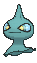

# #353 Shuppet (Puppet Pokémon)

| Official Artwork | Shiny Artwork |
|------------------|---------------|
|  |  |

**Rising Ruby:** Shuppet is attracted by feelings of jealousy and vindictiveness. If someone develops strong feelings of vengeance, this Pokémon will appear in a swarm and line up beneath the eaves of that person’s home.

**Sinking Sapphire:** Shuppet grows by feeding on dark emotions, such as vengefulness and envy, in the hearts of people. It roams through cities in search of grudges that taint people.

---

## Media

### Default Sprites

| Front | Shiny | Back | Shiny |
|-------|-------|------|-------|
|  |  |  |  |

### Cries

Latest (Gen VI+):

<audio controls>
<source src='../../assets/cries/shuppet/latest.ogg' type='audio/ogg'>
  Your browser does not support the audio element.
</audio>

Legacy:

<audio controls>
<source src='../../assets/cries/shuppet/legacy.ogg' type='audio/ogg'>
  Your browser does not support the audio element.
</audio>

---

## Pokédex Data

| National № | Type(s) | Height | Weight | Abilities | Local № |
|------------|---------|--------|--------|-----------|---------|
| #353 | {: width="48"} | 0.6 m / 2.0 ft | 2.3 kg / 5.1 lbs | 1. Insomnia 2. Frisk | N/A |

---

## Base Stats
|   | HP | Attack | Defense | Sp. Atk | Sp. Def | Speed |
|---|----|--------|---------|---------|---------|-------|
| **Base** | 44 | 75 | 35 | 63 | 33 | 45 |
| **Min** | 198 | 139 | 67 | 117 | 63 | 85 |
| **Max** | 292 | 273 | 185 | 247 | 181 | 207 |

The ranges shown above are for a level 100 Pokémon. Maximum values are based on a beneficial nature, 252 EVs, 31 IVs; minimum values are based on a hindering nature, 0 EVs, 0 IVs.

---

## Forms & Evolutions

!!! warning "WARNING"

    Information on evolutions may not be 100% accurate; differences between evolution methods across generations are not accounted for.

### Forms

Shuppet has no alternate forms.

### Evolution Line

1. [Shuppet](shuppet.md/)
    1. Level Up: [Banette](banette.md/)

---

## Training

| EV Yield | Catch Rate | Base Friendship | Base Exp. | Growth Rate | Held Items |
|----------|------------|-----------------|-----------|-------------|------------|
| 1 Atk | 225 | 35 | 59 | Fast | Spell Tag (5%) |

---

## Breeding

| Egg Groups | Egg Cycles | Gender | Dimorphic | Color | Shape |
|------------|------------|--------|-----------|-------|-------|
| 1. Indeterminate | 25 | 50.0% Male 50.0% Female | False | Black | Ball |

---

## Moves

!!! warning "WARNING"

    Specific move information may be incorrect. However, the general movepool should be accurate; this includes changes made in Sacred Gold and Storm Silver.

### Level Up Moves

| Lv. | Move | Type | Cat. | Power | Acc. | PP |
| --- | --- | --- | --- | --- | --- | --- |
| 1 | Knock Off | {: width="48"} | {: width="36"} | 65 | 100 | 20 |
| 4 | Screech | {: width="48"} | {: width="36"} | — | 85 | 40 |
| 7 | Night Shade | {: width="48"} | {: width="36"} | — | 100 | 15 |
| 10 | Spite | {: width="48"} | {: width="36"} | — | 100 | 10 |
| 13 | Shadow Sneak | {: width="48"} | {: width="36"} | 40 | 100 | 30 |
| 16 | Will O Wisp | {: width="48"} | {: width="36"} | — | 85 | 15 |
| 19 | Feint Attack | {: width="48"} | {: width="36"} | 60 | — | 20 |
| 22 | Hex | {: width="48"} | {: width="36"} | 65 | 100 | 10 |
| 25 | Curse | {: width="48"} | {: width="36"} | — | — | 10 |
| 28 | Shadow Ball | {: width="48"} | {: width="36"} | 80 | 100 | 15 |
| 31 | Embargo | {: width="48"} | {: width="36"} | — | 100 | 15 |
| 34 | Gunk Shot | {: width="48"} | {: width="36"} | 120 | 80 | 5 |
| 37 | Sucker Punch | {: width="48"} | {: width="36"} | 70 | 100 | 5 |
| 40 | Snatch | {: width="48"} | {: width="36"} | — | — | 10 |
| 43 | Grudge | {: width="48"} | {: width="36"} | — | — | 5 |
| 46 | Trick | {: width="48"} | {: width="36"} | — | 100 | 10 |
| 49 | Phantom Force | {: width="48"} | {: width="36"} | 90 | 100 | 10 |
| 52 | Destiny Bond | {: width="48"} | {: width="36"} | — | — | 5 |

### TM Moves

| TM | Move | Type | Cat. | Power | Acc. | PP |
| --- | --- | --- | --- | --- | --- | --- |
| TM04 | Calm Mind | {: width="48"} | {: width="36"} | — | — | 20 |
| TM06 | Toxic | {: width="48"} | {: width="36"} | — | 90 | 10 |
| TM10 | Hidden Power | {: width="48"} | {: width="36"} | 60 | 100 | 15 |
| TM100 | Confide | {: width="48"} | {: width="36"} | — | — | 20 |
| TM11 | Sunny Day | {: width="48"} | {: width="36"} | — | — | 5 |
| TM12 | Taunt | {: width="48"} | {: width="36"} | — | 100 | 20 |
| TM17 | Protect | {: width="48"} | {: width="36"} | — | — | 10 |
| TM18 | Rain Dance | {: width="48"} | {: width="36"} | — | — | 5 |
| TM21 | Frustration | {: width="48"} | {: width="36"} | — | 100 | 20 |
| TM24 | Thunderbolt | {: width="48"} | {: width="36"} | 90 | 100 | 15 |
| TM25 | Thunder | {: width="48"} | {: width="36"} | 110 | 70 | 10 |
| TM27 | Return | {: width="48"} | {: width="36"} | — | 100 | 20 |
| TM29 | Psychic | {: width="48"} | {: width="36"} | 90 | 100 | 10 |
| TM30 | Shadow Ball | {: width="48"} | {: width="36"} | 80 | 100 | 15 |
| TM32 | Double Team | {: width="48"} | {: width="36"} | — | — | 15 |
| TM41 | Torment | {: width="48"} | {: width="36"} | — | 100 | 15 |
| TM42 | Facade | {: width="48"} | {: width="36"} | 70 | 100 | 20 |
| TM44 | Rest | {: width="48"} | {: width="36"} | — | — | 5 |
| TM45 | Attract | {: width="48"} | {: width="36"} | — | 100 | 15 |
| TM46 | Thief | {: width="48"} | {: width="36"} | 60 | 100 | 25 |
| TM48 | Round | {: width="48"} | {: width="36"} | 60 | 100 | 15 |
| TM57 | Charge Beam | {: width="48"} | {: width="36"} | 50 | 90 | 10 |
| TM61 | Will O Wisp | {: width="48"} | {: width="36"} | — | 85 | 15 |
| TM63 | Embargo | {: width="48"} | {: width="36"} | — | 100 | 15 |
| TM66 | Payback | {: width="48"} | {: width="36"} | 50 | 100 | 10 |
| TM70 | Flash | {: width="48"} | {: width="36"} | — | 100 | 20 |
| TM73 | Thunder Wave | {: width="48"} | {: width="36"} | — | 90 | 20 |
| TM77 | Psych Up | {: width="48"} | {: width="36"} | — | — | 10 |
| TM85 | Dream Eater | {: width="48"} | {: width="36"} | 100 | 100 | 15 |
| TM87 | Swagger | {: width="48"} | {: width="36"} | — | 85 | 15 |
| TM88 | Sleep Talk | {: width="48"} | {: width="36"} | — | — | 10 |
| TM90 | Substitute | {: width="48"} | {: width="36"} | — | — | 10 |
| TM92 | Trick Room | {: width="48"} | {: width="36"} | — | — | 5 |
| TM94 | Secret Power | {: width="48"} | {: width="36"} | 70 | 100 | 20 |
| TM97 | Dark Pulse | {: width="48"} | {: width="36"} | 80 | 100 | 15 |
| TM99 | Dazzling Gleam | {: width="48"} | {: width="36"} | 80 | 100 | 10 |

### Egg Moves

| Move | Type | Cat. | Power | Acc. | PP |
| --- | --- | --- | --- | --- | --- |
| Astonish | {: width="48"} | {: width="36"} | 30 | 100 | 15 |
| Confuse Ray | {: width="48"} | {: width="36"} | — | 100 | 10 |
| Destiny Bond | {: width="48"} | {: width="36"} | — | — | 5 |
| Disable | {: width="48"} | {: width="36"} | — | 100 | 20 |
| Foresight | {: width="48"} | {: width="36"} | — | — | 40 |
| Gunk Shot | {: width="48"} | {: width="36"} | 120 | 80 | 5 |
| Imprison | {: width="48"} | {: width="36"} | — | — | 10 |
| Ominous Wind | {: width="48"} | {: width="36"} | 60 | 100 | 5 |
| Phantom Force | {: width="48"} | {: width="36"} | 90 | 100 | 10 |
| Pursuit | {: width="48"} | {: width="36"} | 40 | 100 | 20 |
| Shadow Sneak | {: width="48"} | {: width="36"} | 40 | 100 | 30 |

### Tutor Moves

| Move | Type | Cat. | Power | Acc. | PP |
| --- | --- | --- | --- | --- | --- |
| Foul Play | {: width="48"} | {: width="36"} | 95 | 100 | 15 |
| Icy Wind | {: width="48"} | {: width="36"} | 55 | 95 | 15 |
| Knock Off | {: width="48"} | {: width="36"} | 65 | 100 | 20 |
| Magic Coat | {: width="48"} | {: width="36"} | — | — | 15 |
| Magic Room | {: width="48"} | {: width="36"} | — | — | 10 |
| Pain Split | {: width="48"} | {: width="36"} | — | — | 20 |
| Role Play | {: width="48"} | {: width="36"} | — | — | 10 |
| Shock Wave | {: width="48"} | {: width="36"} | 60 | — | 20 |
| Skill Swap | {: width="48"} | {: width="36"} | — | — | 10 |
| Snatch | {: width="48"} | {: width="36"} | — | — | 10 |
| Snore | {: width="48"} | {: width="36"} | 50 | 100 | 15 |
| Spite | {: width="48"} | {: width="36"} | — | 100 | 10 |
| Trick | {: width="48"} | {: width="36"} | — | 100 | 10 |

