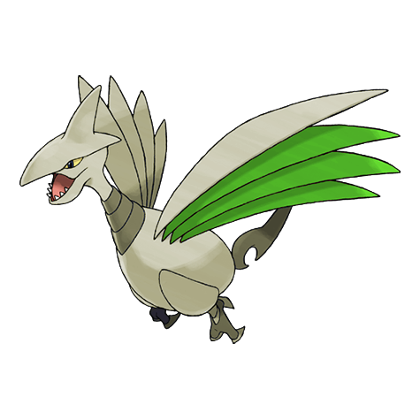
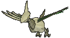
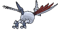
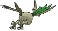

# #227 Skarmory (Armor Bird Pokémon)

| Official Artwork | Shiny Artwork |
|------------------|---------------|
|  |  |

**Rising Ruby:** Skarmory is entirely encased in hard, protective armor. This Pokémon flies at close to 190 mph. It slashes foes with its wings that possess swordlike cutting edges.

**Sinking Sapphire:** Skarmory’s steel wings become tattered and bashed in from repeated battles. Once a year, the battered wings grow back completely, restoring the cutting edges to their pristine state.

---

## Media

### Default Sprites

| Front | Shiny | Back | Shiny |
|-------|-------|------|-------|
|  |  |  |  |

### Cries

Latest (Gen VI+):

<audio controls>
<source src='../../assets/cries/skarmory/latest.ogg' type='audio/ogg'>
  Your browser does not support the audio element.
</audio>

Legacy:

<audio controls>
<source src='../../assets/cries/skarmory/legacy.ogg' type='audio/ogg'>
  Your browser does not support the audio element.
</audio>

---

## Pokédex Data

| National № | Type(s) | Height | Weight | Abilities | Local № |
|------------|---------|--------|--------|-----------|---------|
| #227 | {: width="48"} {: width="48"} | 1.7 m / 5.6 ft | 50.5 kg / 111.3 lbs | 1. Keen Eye 2. Sturdy | N/A |

---

## Base Stats
|   | HP | Attack | Defense | Sp. Atk | Sp. Def | Speed |
|---|----|--------|---------|---------|---------|-------|
| **Base** | 65 | 80 | 140 | 40 | 70 | 70 |
| **Min** | 240 | 148 | 256 | 76 | 130 | 130 |
| **Max** | 334 | 284 | 416 | 196 | 262 | 262 |

The ranges shown above are for a level 100 Pokémon. Maximum values are based on a beneficial nature, 252 EVs, 31 IVs; minimum values are based on a hindering nature, 0 EVs, 0 IVs.

---

## Forms & Evolutions

!!! warning "WARNING"

    Information on evolutions may not be 100% accurate; differences between evolution methods across generations are not accounted for.

### Forms

Skarmory has no alternate forms.

### Evolution Line

1. [Skarmory](skarmory.md/)

---

## Training

| EV Yield | Catch Rate | Base Friendship | Base Exp. | Growth Rate | Held Items |
|----------|------------|-----------------|-----------|-------------|------------|
| 2 Def | 25 | 50 | 163 | Slow | Metal Coat (5%) |

---

## Breeding

| Egg Groups | Egg Cycles | Gender | Dimorphic | Color | Shape |
|------------|------------|--------|-----------|-------|-------|
| 1. Flying | 25 | 50.0% Male 50.0% Female | False | Gray | Wings |

---

## Moves

!!! warning "WARNING"

    Specific move information may be incorrect. However, the general movepool should be accurate; this includes changes made in Sacred Gold and Storm Silver.

### Level Up Moves

| Lv. | Move | Type | Cat. | Power | Acc. | PP |
| --- | --- | --- | --- | --- | --- | --- |
| 1 | Leer | {: width="48"} | {: width="36"} | — | 100 | 30 |
| 1 | Peck | {: width="48"} | {: width="36"} | 35 | 100 | 35 |
| 6 | Sand Attack | {: width="48"} | {: width="36"} | — | 100 | 15 |
| 9 | Metal Claw | {: width="48"} | {: width="36"} | 50 | 95 | 35 |
| 12 | Air Cutter | {: width="48"} | {: width="36"} | 60 | 95 | 25 |
| 15 | Fury Attack | {: width="48"} | {: width="36"} | 15 | 85 | 20 |
| 18 | Feint | {: width="48"} | {: width="36"} | 30 | 100 | 10 |
| 21 | Steel Wing | {: width="48"} | {: width="36"} | 70 | 90 | 25 |
| 24 | Swift | {: width="48"} | {: width="36"} | 60 | — | 20 |
| 27 | Drill Peck | {: width="48"} | {: width="36"} | 80 | 100 | 20 |
| 30 | Spikes | {: width="48"} | {: width="36"} | — | — | 20 |
| 33 | Agility | {: width="48"} | {: width="36"} | — | — | 30 |
| 36 | Iron Head | {: width="48"} | {: width="36"} | 80 | 100 | 15 |
| 39 | Slash | {: width="48"} | {: width="36"} | 70 | 100 | 20 |
| 42 | Metal Sound | {: width="48"} | {: width="36"} | — | 85 | 40 |
| 45 | Air Slash | {: width="48"} | {: width="36"} | 75 | 95 | 15 |
| 48 | Autotomize | {: width="48"} | {: width="36"} | — | — | 15 |
| 51 | Night Slash | {: width="48"} | {: width="36"} | 70 | 100 | 15 |
| 54 | Brave Bird | {: width="48"} | {: width="36"} | 120 | 100 | 15 |

### TM Moves

| TM | Move | Type | Cat. | Power | Acc. | PP |
| --- | --- | --- | --- | --- | --- | --- |
| HM01 | Cut | {: width="48"} | {: width="36"} | 70 | 100 | 15 |
| HM02 | Fly | {: width="48"} | {: width="36"} | 100 | 100 | 10 |
| HM06 | Rock Smash | {: width="48"} | {: width="36"} | 65 | 100 | 15 |
| TM05 | Roar | {: width="48"} | {: width="36"} | — | — | 20 |
| TM06 | Toxic | {: width="48"} | {: width="36"} | — | 90 | 10 |
| TM10 | Hidden Power | {: width="48"} | {: width="36"} | 60 | 100 | 15 |
| TM100 | Confide | {: width="48"} | {: width="36"} | — | — | 20 |
| TM11 | Sunny Day | {: width="48"} | {: width="36"} | — | — | 5 |
| TM12 | Taunt | {: width="48"} | {: width="36"} | — | 100 | 20 |
| TM17 | Protect | {: width="48"} | {: width="36"} | — | — | 10 |
| TM19 | Roost | {: width="48"} | {: width="36"} | — | — | 5 |
| TM21 | Frustration | {: width="48"} | {: width="36"} | — | 100 | 20 |
| TM27 | Return | {: width="48"} | {: width="36"} | — | 100 | 20 |
| TM32 | Double Team | {: width="48"} | {: width="36"} | — | — | 15 |
| TM37 | Sandstorm | {: width="48"} | {: width="36"} | — | — | 10 |
| TM39 | Rock Tomb | {: width="48"} | {: width="36"} | 60 | 95 | 15 |
| TM40 | Aerial Ace | {: width="48"} | {: width="36"} | 60 | — | 20 |
| TM41 | Torment | {: width="48"} | {: width="36"} | — | 100 | 15 |
| TM42 | Facade | {: width="48"} | {: width="36"} | 70 | 100 | 20 |
| TM44 | Rest | {: width="48"} | {: width="36"} | — | — | 5 |
| TM45 | Attract | {: width="48"} | {: width="36"} | — | 100 | 15 |
| TM46 | Thief | {: width="48"} | {: width="36"} | 60 | 100 | 25 |
| TM48 | Round | {: width="48"} | {: width="36"} | 60 | 100 | 15 |
| TM51 | Steel Wing | {: width="48"} | {: width="36"} | 70 | 90 | 25 |
| TM58 | Sky Drop | {: width="48"} | {: width="36"} | 60 | 100 | 10 |
| TM66 | Payback | {: width="48"} | {: width="36"} | 50 | 100 | 10 |
| TM70 | Flash | {: width="48"} | {: width="36"} | — | 100 | 20 |
| TM75 | Swords Dance | {: width="48"} | {: width="36"} | — | — | 20 |
| TM80 | Rock Slide | {: width="48"} | {: width="36"} | 75 | 90 | 10 |
| TM81 | X Scissor | {: width="48"} | {: width="36"} | 80 | 100 | 15 |
| TM87 | Swagger | {: width="48"} | {: width="36"} | — | 85 | 15 |
| TM88 | Sleep Talk | {: width="48"} | {: width="36"} | — | — | 10 |
| TM90 | Substitute | {: width="48"} | {: width="36"} | — | — | 10 |
| TM91 | Flash Cannon | {: width="48"} | {: width="36"} | 80 | 100 | 10 |
| TM94 | Secret Power | {: width="48"} | {: width="36"} | 70 | 100 | 20 |
| TM97 | Dark Pulse | {: width="48"} | {: width="36"} | 80 | 100 | 15 |

### Egg Moves

| Move | Type | Cat. | Power | Acc. | PP |
| --- | --- | --- | --- | --- | --- |
| Assurance | {: width="48"} | {: width="36"} | 60 | 100 | 10 |
| Brave Bird | {: width="48"} | {: width="36"} | 120 | 100 | 15 |
| Curse | {: width="48"} | {: width="36"} | — | — | 10 |
| Drill Peck | {: width="48"} | {: width="36"} | 80 | 100 | 20 |
| Endure | {: width="48"} | {: width="36"} | — | — | 10 |
| Guard Swap | {: width="48"} | {: width="36"} | — | — | 10 |
| Pursuit | {: width="48"} | {: width="36"} | 40 | 100 | 20 |
| Sky Attack | {: width="48"} | {: width="36"} | 140 | 90 | 5 |
| Stealth Rock | {: width="48"} | {: width="36"} | — | — | 20 |
| Whirlwind | {: width="48"} | {: width="36"} | — | — | 20 |

### Tutor Moves

| Move | Type | Cat. | Power | Acc. | PP |
| --- | --- | --- | --- | --- | --- |
| Icy Wind | {: width="48"} | {: width="36"} | 55 | 95 | 15 |
| Iron Defense | {: width="48"} | {: width="36"} | — | — | 15 |
| Iron Head | {: width="48"} | {: width="36"} | 80 | 100 | 15 |
| Sky Attack | {: width="48"} | {: width="36"} | 140 | 90 | 5 |
| Snore | {: width="48"} | {: width="36"} | 50 | 100 | 15 |
| Stealth Rock | {: width="48"} | {: width="36"} | — | — | 20 |
| Tailwind | {: width="48"} | {: width="36"} | — | — | 15 |

