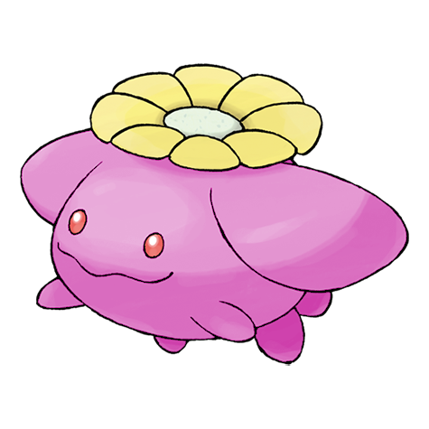
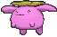
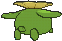
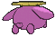

# #188 Skiploom (Cottonweed Pokémon)

| Official Artwork | Shiny Artwork |
|------------------|---------------|
|  |  |

Skiploom’s flower blossoms when the temperature rises above 64 degrees Fahrenheit. How much the flower opens depends on the temperature. For that reason, this Pokémon is sometimes used as a thermometer.

---

## Media

### Default Sprites

| Front | Shiny | Back | Shiny |
|-------|-------|------|-------|
|  |  |  |  |

### Cries

Latest (Gen VI+):

<audio controls>
<source src='../../assets/cries/skiploom/latest.ogg' type='audio/ogg'>
  Your browser does not support the audio element.
</audio>

Legacy:

<audio controls>
<source src='../../assets/cries/skiploom/legacy.ogg' type='audio/ogg'>
  Your browser does not support the audio element.
</audio>

---

## Pokédex Data

| National № | Type(s) | Height | Weight | Abilities | Local № |
|------------|---------|--------|--------|-----------|---------|
| #188 | {: width="48"} {: width="48"} | 0.6 m / 2.0 ft | 1.0 kg / 2.2 lbs | 1. Chlorophyll 2. Leaf Guard | N/A |

---

## Base Stats
|   | HP | Attack | Defense | Sp. Atk | Sp. Def | Speed |
|---|----|--------|---------|---------|---------|-------|
| **Base** | 55 | 65 | 50 | 65 | 75 | 80 |
| **Min** | 220 | 121 | 94 | 121 | 139 | 148 |
| **Max** | 314 | 251 | 218 | 251 | 273 | 284 |

The ranges shown above are for a level 100 Pokémon. Maximum values are based on a beneficial nature, 252 EVs, 31 IVs; minimum values are based on a hindering nature, 0 EVs, 0 IVs.

---

## Forms & Evolutions

!!! warning "WARNING"

    Information on evolutions may not be 100% accurate; differences between evolution methods across generations are not accounted for.

### Forms

Skiploom has no alternate forms.

### Evolution Line

1. [Hoppip](hoppip.md/)
    1. Level Up: [Skiploom](skiploom.md/)
        1. Level Up: [Jumpluff](jumpluff.md/)

---

## Training

| EV Yield | Catch Rate | Base Friendship | Base Exp. | Growth Rate | Held Items |
|----------|------------|-----------------|-----------|-------------|------------|
| 2 Spd | 120 | 70 | 119 | Medium Slow | N/A |

---

## Breeding

| Egg Groups | Egg Cycles | Gender | Dimorphic | Color | Shape |
|------------|------------|--------|-----------|-------|-------|
| 1. Fairy 2. Plant | 20 | 50.0% Male 50.0% Female | False | Green | Upright |

---

## Moves

!!! warning "WARNING"

    Specific move information may be incorrect. However, the general movepool should be accurate; this includes changes made in Sacred Gold and Storm Silver.

### Level Up Moves

| Lv. | Move | Type | Cat. | Power | Acc. | PP |
| --- | --- | --- | --- | --- | --- | --- |
| 1 | Splash | {: width="48"} | {: width="36"} | — | — | 40 |
| 1 | Synthesis | {: width="48"} | {: width="36"} | — | — | 5 |
| 1 | Tail Whip | {: width="48"} | {: width="36"} | — | 100 | 30 |
| 4 | Tackle | {: width="48"} | {: width="36"} | 40 | 100 | 35 |
| 6 | Mega Drain | {: width="48"} | {: width="36"} | 40 | 100 | 15 |
| 8 | Fairy Wind | {: width="48"} | {: width="36"} | 50 | 100 | 25 |
| 10 | Poison Powder | {: width="48"} | {: width="36"} | — | 75 | 35 |
| 12 | Stun Spore | {: width="48"} | {: width="36"} | — | 75 | 30 |
| 14 | Sleep Powder | {: width="48"} | {: width="36"} | — | 75 | 15 |
| 16 | Acrobatics | {: width="48"} | {: width="36"} | 55 | 100 | 15 |
| 19 | Bullet Seed | {: width="48"} | {: width="36"} | 25 | 100 | 30 |
| 22 | Leech Seed | {: width="48"} | {: width="36"} | — | 90 | 10 |
| 25 | Giga Drain | {: width="48"} | {: width="36"} | 75 | 100 | 10 |
| 28 | Silver Wind | {: width="48"} | {: width="36"} | 60 | 100 | 5 |
| 31 | Rage Powder | {: width="48"} | {: width="36"} | — | — | 20 |
| 34 | Cotton Spore | {: width="48"} | {: width="36"} | — | 100 | 40 |
| 37 | U Turn | {: width="48"} | {: width="36"} | 70 | 100 | 20 |
| 40 | Worry Seed | {: width="48"} | {: width="36"} | — | 100 | 10 |
| 43 | Bounce | {: width="48"} | {: width="36"} | 85 | 85 | 5 |
| 46 | Memento | {: width="48"} | {: width="36"} | — | 100 | 10 |
| 49 | Cotton Guard | {: width="48"} | {: width="36"} | — | — | 10 |

### TM Moves

| TM | Move | Type | Cat. | Power | Acc. | PP |
| --- | --- | --- | --- | --- | --- | --- |
| HM02 | Fly | {: width="48"} | {: width="36"} | 100 | 100 | 10 |
| TM06 | Toxic | {: width="48"} | {: width="36"} | — | 90 | 10 |
| TM10 | Hidden Power | {: width="48"} | {: width="36"} | 60 | 100 | 15 |
| TM100 | Confide | {: width="48"} | {: width="36"} | — | — | 20 |
| TM11 | Sunny Day | {: width="48"} | {: width="36"} | — | — | 5 |
| TM17 | Protect | {: width="48"} | {: width="36"} | — | — | 10 |
| TM21 | Frustration | {: width="48"} | {: width="36"} | — | 100 | 20 |
| TM22 | Solar Beam | {: width="48"} | {: width="36"} | 120 | 100 | 10 |
| TM27 | Return | {: width="48"} | {: width="36"} | — | 100 | 20 |
| TM32 | Double Team | {: width="48"} | {: width="36"} | — | — | 15 |
| TM33 | Reflect | {: width="48"} | {: width="36"} | — | — | 20 |
| TM40 | Aerial Ace | {: width="48"} | {: width="36"} | 60 | — | 20 |
| TM42 | Facade | {: width="48"} | {: width="36"} | 70 | 100 | 20 |
| TM44 | Rest | {: width="48"} | {: width="36"} | — | — | 5 |
| TM45 | Attract | {: width="48"} | {: width="36"} | — | 100 | 15 |
| TM48 | Round | {: width="48"} | {: width="36"} | 60 | 100 | 15 |
| TM53 | Energy Ball | {: width="48"} | {: width="36"} | 90 | 100 | 10 |
| TM62 | Acrobatics | {: width="48"} | {: width="36"} | 55 | 100 | 15 |
| TM70 | Flash | {: width="48"} | {: width="36"} | — | 100 | 20 |
| TM75 | Swords Dance | {: width="48"} | {: width="36"} | — | — | 20 |
| TM77 | Psych Up | {: width="48"} | {: width="36"} | — | — | 10 |
| TM83 | Infestation | {: width="48"} | {: width="36"} | 20 | 100 | 20 |
| TM86 | Grass Knot | {: width="48"} | {: width="36"} | — | 100 | 20 |
| TM87 | Swagger | {: width="48"} | {: width="36"} | — | 85 | 15 |
| TM88 | Sleep Talk | {: width="48"} | {: width="36"} | — | — | 10 |
| TM89 | U Turn | {: width="48"} | {: width="36"} | 70 | 100 | 20 |
| TM90 | Substitute | {: width="48"} | {: width="36"} | — | — | 10 |
| TM94 | Secret Power | {: width="48"} | {: width="36"} | 70 | 100 | 20 |
| TM99 | Dazzling Gleam | {: width="48"} | {: width="36"} | 80 | 100 | 10 |

### Egg Moves

Skiploom cannot learn any moves by breeding.
### Tutor Moves

| Move | Type | Cat. | Power | Acc. | PP |
| --- | --- | --- | --- | --- | --- |
| Bounce | {: width="48"} | {: width="36"} | 85 | 85 | 5 |
| Giga Drain | {: width="48"} | {: width="36"} | 75 | 100 | 10 |
| Helping Hand | {: width="48"} | {: width="36"} | — | — | 20 |
| Seed Bomb | {: width="48"} | {: width="36"} | 80 | 100 | 15 |
| Snore | {: width="48"} | {: width="36"} | 50 | 100 | 15 |
| Synthesis | {: width="48"} | {: width="36"} | — | — | 5 |
| Worry Seed | {: width="48"} | {: width="36"} | — | 100 | 10 |

