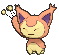
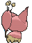
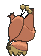

# #300 Skitty (Kitten Pokémon)

| Official Artwork | Shiny Artwork |
|------------------|---------------|
|  |  |

**Rising Ruby:** Skitty has the habit of becoming fascinated by moving objects and chasing them around. This Pokémon is known to chase after its own tail and become dizzy.

**Sinking Sapphire:** Skitty is known to chase around playfully after its own tail. In the wild, this Pokémon lives in holes in the trees of forests. It is very popular as a pet because of its adorable looks.

---

## Media

### Default Sprites

| Front | Shiny | Back | Shiny |
|-------|-------|------|-------|
|  |  |  |  |

### Cries

Latest (Gen VI+):

<audio controls>
<source src='../../assets/cries/skitty/latest.ogg' type='audio/ogg'>
  Your browser does not support the audio element.
</audio>

Legacy:

<audio controls>
<source src='../../assets/cries/skitty/legacy.ogg' type='audio/ogg'>
  Your browser does not support the audio element.
</audio>

---

## Pokédex Data

| National № | Type(s) | Height | Weight | Abilities | Local № |
|------------|---------|--------|--------|-----------|---------|
| #300 | {: width="48"} | 0.6 m / 2.0 ft | 11.0 kg / 24.3 lbs | 1. Cute Charm 2. Normalize | N/A |

---

## Base Stats
|   | HP | Attack | Defense | Sp. Atk | Sp. Def | Speed |
|---|----|--------|---------|---------|---------|-------|
| **Base** | 50 | 45 | 45 | 45 | 45 | 50 |
| **Min** | 210 | 85 | 85 | 85 | 85 | 94 |
| **Max** | 304 | 207 | 207 | 207 | 207 | 218 |

The ranges shown above are for a level 100 Pokémon. Maximum values are based on a beneficial nature, 252 EVs, 31 IVs; minimum values are based on a hindering nature, 0 EVs, 0 IVs.

---

## Forms & Evolutions

!!! warning "WARNING"

    Information on evolutions may not be 100% accurate; differences between evolution methods across generations are not accounted for.

### Forms

Skitty has no alternate forms.

### Evolution Line

1. [Skitty](skitty.md/)
    1. Use Item: [Delcatty](delcatty.md/)

---

## Training

| EV Yield | Catch Rate | Base Friendship | Base Exp. | Growth Rate | Held Items |
|----------|------------|-----------------|-----------|-------------|------------|
| 1 Spd | 255 | 70 | 52 | Fas |

---

## Breeding

| Egg Groups | Egg Cycles | Gender | Dimorphic | Color | Shape |
|------------|------------|--------|-----------|-------|-------|
| 1. Ground 2. Fairy | 15 | 25.0% Male 75.0% Female | False | Pink | Quadruped |

---

## Moves

!!! warning "WARNING"

    Specific move information may be incorrect. However, the general movepool should be accurate; this includes changes made in Sacred Gold and Storm Silver.

### Level Up Moves

| Lv. | Move | Type | Cat. | Power | Acc. | PP |
| --- | --- | --- | --- | --- | --- | --- |
| 1 | Fake Out | {: width="48"} | {: width="36"} | 40 | 100 | 10 |
| 1 | Growl | {: width="48"} | {: width="36"} | — | 100 | 40 |
| 1 | Tackle | {: width="48"} | {: width="36"} | 40 | 100 | 35 |
| 1 | Tail Whip | {: width="48"} | {: width="36"} | — | 100 | 30 |
| 5 | Foresight | {: width="48"} | {: width="36"} | — | — | 40 |
| 7 | Attract | {: width="48"} | {: width="36"} | — | 100 | 15 |
| 9 | Sing | {: width="48"} | {: width="36"} | — | 55 | 15 |
| 11 | Disarming Voice | {: width="48"} | {: width="36"} | 60 | — | 20 |
| 13 | Round | {: width="48"} | {: width="36"} | 60 | 100 | 15 |
| 15 | Double Slap | {: width="48"} | {: width="36"} | 15 | 85 | 10 |
| 17 | Shock Wave | {: width="48"} | {: width="36"} | 60 | — | 20 |
| 18 | Icy Wind | {: width="48"} | {: width="36"} | 55 | 95 | 15 |
| 19 | Mud Bomb | {: width="48"} | {: width="36"} | 65 | 85 | 10 |
| 21 | Copycat | {: width="48"} | {: width="36"} | — | — | 20 |
| 23 | Assist | {: width="48"} | {: width="36"} | — | — | 20 |
| 24 | Charm | {: width="48"} | {: width="36"} | — | 100 | 20 |
| 26 | Hyper Voice | {: width="48"} | {: width="36"} | 90 | 100 | 10 |
| 28 | Feint Attack | {: width="48"} | {: width="36"} | 60 | — | 20 |
| 31 | Wake Up Slap | {: width="48"} | {: width="36"} | 70 | 100 | 10 |
| 33 | Moonblast | {: width="48"} | {: width="36"} | 95 | 100 | 15 |
| 36 | Covet | {: width="48"} | {: width="36"} | 60 | 100 | 25 |
| 39 | Heal Bell | {: width="48"} | {: width="36"} | — | — | 5 |
| 43 | Double Edge | {: width="48"} | {: width="36"} | 120 | 100 | 15 |
| 46 | Captivate | {: width="48"} | {: width="36"} | — | 100 | 20 |
| 49 | Play Rough | {: width="48"} | {: width="36"} | 90 | 90 | 10 |

### TM Moves

| TM | Move | Type | Cat. | Power | Acc. | PP |
| --- | --- | --- | --- | --- | --- | --- |
| TM04 | Calm Mind | {: width="48"} | {: width="36"} | — | — | 20 |
| TM06 | Toxic | {: width="48"} | {: width="36"} | — | 90 | 10 |
| TM10 | Hidden Power | {: width="48"} | {: width="36"} | 60 | 100 | 15 |
| TM100 | Confide | {: width="48"} | {: width="36"} | — | — | 20 |
| TM11 | Sunny Day | {: width="48"} | {: width="36"} | — | — | 5 |
| TM13 | Ice Beam | {: width="48"} | {: width="36"} | 90 | 100 | 10 |
| TM14 | Blizzard | {: width="48"} | {: width="36"} | 110 | 70 | 5 |
| TM17 | Protect | {: width="48"} | {: width="36"} | — | — | 10 |
| TM18 | Rain Dance | {: width="48"} | {: width="36"} | — | — | 5 |
| TM20 | Safeguard | {: width="48"} | {: width="36"} | — | — | 25 |
| TM21 | Frustration | {: width="48"} | {: width="36"} | — | 100 | 20 |
| TM22 | Solar Beam | {: width="48"} | {: width="36"} | 120 | 100 | 10 |
| TM24 | Thunderbolt | {: width="48"} | {: width="36"} | 90 | 100 | 15 |
| TM25 | Thunder | {: width="48"} | {: width="36"} | 110 | 70 | 10 |
| TM27 | Return | {: width="48"} | {: width="36"} | — | 100 | 20 |
| TM28 | Dig | {: width="48"} | {: width="36"} | 80 | 100 | 10 |
| TM30 | Shadow Ball | {: width="48"} | {: width="36"} | 80 | 100 | 15 |
| TM32 | Double Team | {: width="48"} | {: width="36"} | — | — | 15 |
| TM42 | Facade | {: width="48"} | {: width="36"} | 70 | 100 | 20 |
| TM44 | Rest | {: width="48"} | {: width="36"} | — | — | 5 |
| TM45 | Attract | {: width="48"} | {: width="36"} | — | 100 | 15 |
| TM48 | Round | {: width="48"} | {: width="36"} | 60 | 100 | 15 |
| TM49 | Echoed Voice | {: width="48"} | {: width="36"} | 40 | 100 | 15 |
| TM57 | Charge Beam | {: width="48"} | {: width="36"} | 50 | 90 | 10 |
| TM66 | Payback | {: width="48"} | {: width="36"} | 50 | 100 | 10 |
| TM67 | Retaliate | {: width="48"} | {: width="36"} | 70 | 100 | 5 |
| TM70 | Flash | {: width="48"} | {: width="36"} | — | 100 | 20 |
| TM73 | Thunder Wave | {: width="48"} | {: width="36"} | — | 90 | 20 |
| TM77 | Psych Up | {: width="48"} | {: width="36"} | — | — | 10 |
| TM85 | Dream Eater | {: width="48"} | {: width="36"} | 100 | 100 | 15 |
| TM86 | Grass Knot | {: width="48"} | {: width="36"} | — | 100 | 20 |
| TM87 | Swagger | {: width="48"} | {: width="36"} | — | 85 | 15 |
| TM88 | Sleep Talk | {: width="48"} | {: width="36"} | — | — | 10 |
| TM90 | Substitute | {: width="48"} | {: width="36"} | — | — | 10 |
| TM93 | Wild Charge | {: width="48"} | {: width="36"} | 90 | 100 | 15 |
| TM94 | Secret Power | {: width="48"} | {: width="36"} | 70 | 100 | 20 |

### Egg Moves

| Move | Type | Cat. | Power | Acc. | PP |
| --- | --- | --- | --- | --- | --- |
| Baton Pass | {: width="48"} | {: width="36"} | — | — | 40 |
| Captivate | {: width="48"} | {: width="36"} | — | 100 | 20 |
| Cosmic Power | {: width="48"} | {: width="36"} | — | — | 20 |
| Fake Out | {: width="48"} | {: width="36"} | 40 | 100 | 10 |
| Fake Tears | {: width="48"} | {: width="36"} | — | 100 | 20 |
| Helping Hand | {: width="48"} | {: width="36"} | — | — | 20 |
| Last Resort | {: width="48"} | {: width="36"} | 140 | 100 | 5 |
| Mud Bomb | {: width="48"} | {: width="36"} | 65 | 85 | 10 |
| Simple Beam | {: width="48"} | {: width="36"} | — | 100 | 15 |
| Sucker Punch | {: width="48"} | {: width="36"} | 70 | 100 | 5 |
| Tickle | {: width="48"} | {: width="36"} | — | 100 | 20 |
| Uproar | {: width="48"} | {: width="36"} | 90 | 100 | 10 |
| Wish | {: width="48"} | {: width="36"} | — | — | 10 |
| Zen Headbutt | {: width="48"} | {: width="36"} | 80 | 90 | 15 |

### Tutor Moves

| Move | Type | Cat. | Power | Acc. | PP |
| --- | --- | --- | --- | --- | --- |
| Covet | {: width="48"} | {: width="36"} | 60 | 100 | 25 |
| Heal Bell | {: width="48"} | {: width="36"} | — | — | 5 |
| Helping Hand | {: width="48"} | {: width="36"} | — | — | 20 |
| Hyper Voice | {: width="48"} | {: width="36"} | 90 | 100 | 10 |
| Icy Wind | {: width="48"} | {: width="36"} | 55 | 95 | 15 |
| Iron Tail | {: width="48"} | {: width="36"} | 100 | 75 | 15 |
| Last Resort | {: width="48"} | {: width="36"} | 140 | 100 | 5 |
| Shock Wave | {: width="48"} | {: width="36"} | 60 | — | 20 |
| Snore | {: width="48"} | {: width="36"} | 50 | 100 | 15 |
| Uproar | {: width="48"} | {: width="36"} | 90 | 100 | 10 |
| Water Pulse | {: width="48"} | {: width="36"} | 60 | 100 | 20 |
| Zen Headbutt | {: width="48"} | {: width="36"} | 80 | 90 | 15 |

