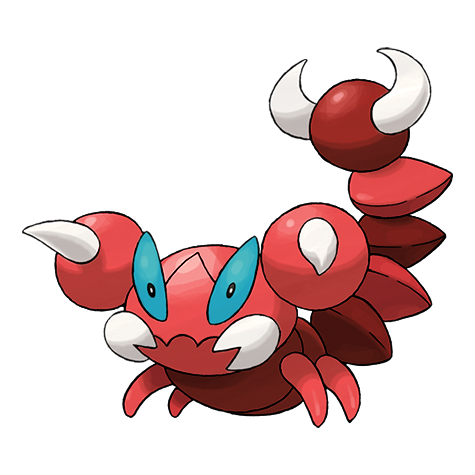
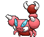
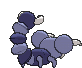
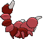

# #451 Skorupi (Scorpion Pokémon)

| Official Artwork | Shiny Artwork |
|------------------|---------------|
|  |  |

**Rising Ruby:** It grips prey with its tail claws and injects poison. It tenaciously hangs on until the poison takes.

**Sinking Sapphire:** It burrows under the sand to lie in wait for prey. Its tail claws can inject its prey with a savage poison.

---

## Media

### Default Sprites

| Front | Shiny | Back | Shiny |
|-------|-------|------|-------|
|  |  |  |  |

### Cries

Latest (Gen VI+):

<audio controls>
<source src='../../assets/cries/skorupi/latest.ogg' type='audio/ogg'>
  Your browser does not support the audio element.
</audio>

Legacy:

<audio controls>
<source src='../../assets/cries/skorupi/legacy.ogg' type='audio/ogg'>
  Your browser does not support the audio element.
</audio>

---

## Pokédex Data

| National № | Type(s) | Height | Weight | Abilities | Local № |
|------------|---------|--------|--------|-----------|---------|
| #451 | {: width="48"} {: width="48"} | 0.8 m / 2.6 ft | 12.0 kg / 26.5 lbs | 1. Battle Armor 2. Sniper | #127 |

---

## Base Stats
|   | HP | Attack | Defense | Sp. Atk | Sp. Def | Speed |
|---|----|--------|---------|---------|---------|-------|
| **Base** | 40 | 50 | 90 | 30 | 55 | 65 |
| **Min** | 190 | 94 | 166 | 58 | 103 | 121 |
| **Max** | 284 | 218 | 306 | 174 | 229 | 251 |

The ranges shown above are for a level 100 Pokémon. Maximum values are based on a beneficial nature, 252 EVs, 31 IVs; minimum values are based on a hindering nature, 0 EVs, 0 IVs.

---

## Forms & Evolutions

!!! warning "WARNING"

    Information on evolutions may not be 100% accurate; differences between evolution methods across generations are not accounted for.

### Forms

Skorupi has no alternate forms.

### Evolution Line

1. [Skorupi](skorupi.md/)
    1. Level Up: [Drapion](drapion.md/)

---

## Training

| EV Yield | Catch Rate | Base Friendship | Base Exp. | Growth Rate | Held Items |
|----------|------------|-----------------|-----------|-------------|------------|
| 1 Def | 120 | 50 | 66 | Slow | Poison Barb (5%) |

---

## Breeding

| Egg Groups | Egg Cycles | Gender | Dimorphic | Color | Shape |
|------------|------------|--------|-----------|-------|-------|
| 1. Bug 2. Water3 | 20 | 50.0% Male 50.0% Female | False | Purple | Armor |

---

## Moves

!!! warning "WARNING"

    Specific move information may be incorrect. However, the general movepool should be accurate; this includes changes made in Sacred Gold and Storm Silver.

### Level Up Moves

| Lv. | Move | Type | Cat. | Power | Acc. | PP |
| --- | --- | --- | --- | --- | --- | --- |
| 1 | Bite | {: width="48"} | {: width="36"} | 60 | 100 | 25 |
| 1 | Leer | {: width="48"} | {: width="36"} | — | 100 | 30 |
| 1 | Poison Sting | {: width="48"} | {: width="36"} | 15 | 100 | 35 |
| 5 | Knock Off | {: width="48"} | {: width="36"} | 65 | 100 | 20 |
| 8 | Pin Missile | {: width="48"} | {: width="36"} | 25 | 95 | 20 |
| 11 | Acupressure | {: width="48"} | {: width="36"} | — | — | 30 |
| 14 | Pursuit | {: width="48"} | {: width="36"} | 40 | 100 | 20 |
| 17 | Bug Bite | {: width="48"} | {: width="36"} | 60 | 100 | 20 |
| 20 | Poison Fang | {: width="48"} | {: width="36"} | 50 | 100 | 15 |
| 23 | Venoshock | {: width="48"} | {: width="36"} | 65 | 100 | 10 |
| 26 | Poison Tail | {: width="48"} | {: width="36"} | 50 | 100 | 25 |
| 29 | Night Slash | {: width="48"} | {: width="36"} | 70 | 100 | 15 |
| 32 | Cross Poison | {: width="48"} | {: width="36"} | 70 | 100 | 20 |
| 35 | X Scissor | {: width="48"} | {: width="36"} | 80 | 100 | 15 |
| 38 | Hone Claws | {: width="48"} | {: width="36"} | — | — | 15 |
| 41 | Crunch | {: width="48"} | {: width="36"} | 80 | 100 | 15 |
| 44 | Toxic Spikes | {: width="48"} | {: width="36"} | — | — | 20 |
| 47 | Scary Face | {: width="48"} | {: width="36"} | — | 100 | 10 |
| 50 | Fell Stinger | {: width="48"} | {: width="36"} | 50 | 100 | 25 |

### TM Moves

| TM | Move | Type | Cat. | Power | Acc. | PP |
| --- | --- | --- | --- | --- | --- | --- |
| HM01 | Cut | {: width="48"} | {: width="36"} | 70 | 100 | 15 |
| HM04 | Strength | {: width="48"} | {: width="36"} | 100 | 100 | 10 |
| HM06 | Rock Smash | {: width="48"} | {: width="36"} | 65 | 100 | 15 |
| TM01 | Hone Claws | {: width="48"} | {: width="36"} | — | — | 15 |
| TM06 | Toxic | {: width="48"} | {: width="36"} | — | 90 | 10 |
| TM09 | Venoshock | {: width="48"} | {: width="36"} | 65 | 100 | 10 |
| TM10 | Hidden Power | {: width="48"} | {: width="36"} | 60 | 100 | 15 |
| TM100 | Confide | {: width="48"} | {: width="36"} | — | — | 20 |
| TM11 | Sunny Day | {: width="48"} | {: width="36"} | — | — | 5 |
| TM12 | Taunt | {: width="48"} | {: width="36"} | — | 100 | 20 |
| TM17 | Protect | {: width="48"} | {: width="36"} | — | — | 10 |
| TM18 | Rain Dance | {: width="48"} | {: width="36"} | — | — | 5 |
| TM21 | Frustration | {: width="48"} | {: width="36"} | — | 100 | 20 |
| TM27 | Return | {: width="48"} | {: width="36"} | — | 100 | 20 |
| TM28 | Dig | {: width="48"} | {: width="36"} | 80 | 100 | 10 |
| TM30 | Shadow Ball | {: width="48"} | {: width="36"} | 80 | 100 | 15 |
| TM31 | Brick Break | {: width="48"} | {: width="36"} | 75 | 100 | 15 |
| TM32 | Double Team | {: width="48"} | {: width="36"} | — | — | 15 |
| TM36 | Sludge Bomb | {: width="48"} | {: width="36"} | 90 | 100 | 10 |
| TM39 | Rock Tomb | {: width="48"} | {: width="36"} | 60 | 95 | 15 |
| TM40 | Aerial Ace | {: width="48"} | {: width="36"} | 60 | — | 20 |
| TM41 | Torment | {: width="48"} | {: width="36"} | — | 100 | 15 |
| TM42 | Facade | {: width="48"} | {: width="36"} | 70 | 100 | 20 |
| TM44 | Rest | {: width="48"} | {: width="36"} | — | — | 5 |
| TM45 | Attract | {: width="48"} | {: width="36"} | — | 100 | 15 |
| TM46 | Thief | {: width="48"} | {: width="36"} | 60 | 100 | 25 |
| TM48 | Round | {: width="48"} | {: width="36"} | 60 | 100 | 15 |
| TM54 | False Swipe | {: width="48"} | {: width="36"} | 40 | 100 | 40 |
| TM56 | Fling | {: width="48"} | {: width="36"} | — | 100 | 10 |
| TM66 | Payback | {: width="48"} | {: width="36"} | 50 | 100 | 10 |
| TM70 | Flash | {: width="48"} | {: width="36"} | — | 100 | 20 |
| TM75 | Swords Dance | {: width="48"} | {: width="36"} | — | — | 20 |
| TM76 | Struggle Bug | {: width="48"} | {: width="36"} | 50 | 100 | 20 |
| TM81 | X Scissor | {: width="48"} | {: width="36"} | 80 | 100 | 15 |
| TM83 | Infestation | {: width="48"} | {: width="36"} | 20 | 100 | 20 |
| TM84 | Poison Jab | {: width="48"} | {: width="36"} | 80 | 100 | 20 |
| TM87 | Swagger | {: width="48"} | {: width="36"} | — | 85 | 15 |
| TM88 | Sleep Talk | {: width="48"} | {: width="36"} | — | — | 10 |
| TM90 | Substitute | {: width="48"} | {: width="36"} | — | — | 10 |
| TM94 | Secret Power | {: width="48"} | {: width="36"} | 70 | 100 | 20 |
| TM97 | Dark Pulse | {: width="48"} | {: width="36"} | 80 | 100 | 15 |

### Egg Moves

| Move | Type | Cat. | Power | Acc. | PP |
| --- | --- | --- | --- | --- | --- |
| Agility | {: width="48"} | {: width="36"} | — | — | 30 |
| Confuse Ray | {: width="48"} | {: width="36"} | — | 100 | 10 |
| Feint Attack | {: width="48"} | {: width="36"} | 60 | — | 20 |
| Iron Tail | {: width="48"} | {: width="36"} | 100 | 75 | 15 |
| Night Slash | {: width="48"} | {: width="36"} | 70 | 100 | 15 |
| Poison Tail | {: width="48"} | {: width="36"} | 50 | 100 | 25 |
| Pursuit | {: width="48"} | {: width="36"} | 40 | 100 | 20 |
| Sand Attack | {: width="48"} | {: width="36"} | — | 100 | 15 |
| Screech | {: width="48"} | {: width="36"} | — | 85 | 40 |
| Slash | {: width="48"} | {: width="36"} | 70 | 100 | 20 |
| Twineedle | {: width="48"} | {: width="36"} | 25 | 100 | 20 |
| Whirlwind | {: width="48"} | {: width="36"} | — | — | 20 |

### Tutor Moves

| Move | Type | Cat. | Power | Acc. | PP |
| --- | --- | --- | --- | --- | --- |
| Aqua Tail | {: width="48"} | {: width="36"} | 90 | 90 | 10 |
| Bug Bite | {: width="48"} | {: width="36"} | 60 | 100 | 20 |
| Iron Tail | {: width="48"} | {: width="36"} | 100 | 75 | 15 |
| Knock Off | {: width="48"} | {: width="36"} | 65 | 100 | 20 |
| Snore | {: width="48"} | {: width="36"} | 50 | 100 | 15 |

