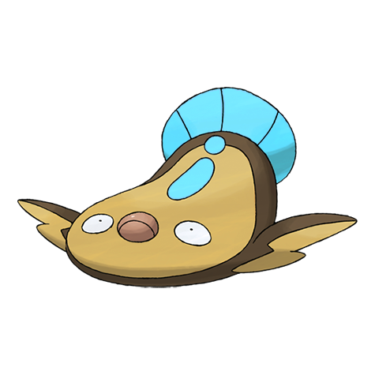

# #618 Stunfisk (Trap Pokémon)

| Official Artwork | Shiny Artwork |
|------------------|---------------|
|  |  |

**Rising Ruby:** Its skin is very hard, so it is unhurt even if stepped on by sumo wrestlers. It smiles when transmitting electricity.

**Sinking Sapphire:** It conceals itself in the mud of the seashore. Then it waits. When prey touch it, it delivers a jolt of electricity.

---

## Media

### Default Sprites

| Front | Shiny | Back | Shiny |
|-------|-------|------|-------|
|  |  |  |  |

### Cries

Latest (Gen VI+):

<audio controls>
<source src='../../assets/cries/stunfisk/latest.ogg' type='audio/ogg'>
  Your browser does not support the audio element.
</audio>

Legacy:

<audio controls>
<source src='../../assets/cries/stunfisk/legacy.ogg' type='audio/ogg'>
  Your browser does not support the audio element.
</audio>

---

## Pokédex Data

| National № | Type(s) | Height | Weight | Abilities | Local № |
|------------|---------|--------|--------|-----------|---------|
| #618 | {: width="48"} {: width="48"} | 0.7 m / 2.3 ft | 11.0 kg / 24.3 lbs | 1. Static 2. Limber | N/A |

---

## Base Stats
|   | HP | Attack | Defense | Sp. Atk | Sp. Def | Speed |
|---|----|--------|---------|---------|---------|-------|
| **Base** | 109 | 66 | 84 | 81 | 99 | 32 |
| **Min** | 328 | 123 | 155 | 150 | 182 | 62 |
| **Max** | 422 | 254 | 293 | 287 | 326 | 179 |

The ranges shown above are for a level 100 Pokémon. Maximum values are based on a beneficial nature, 252 EVs, 31 IVs; minimum values are based on a hindering nature, 0 EVs, 0 IVs.

---

## Forms & Evolutions

!!! warning "WARNING"

    Information on evolutions may not be 100% accurate; differences between evolution methods across generations are not accounted for.

### Forms

Stunfisk has no alternate forms.

### Evolution Line

1. [Stunfisk](stunfisk.md/)

---

## Training

| EV Yield | Catch Rate | Base Friendship | Base Exp. | Growth Rate | Held Items |
|----------|------------|-----------------|-----------|-------------|------------|
| 2 HP | 75 | 70 | 165 | Medium | Soft Sand (5%) |

---

## Breeding

| Egg Groups | Egg Cycles | Gender | Dimorphic | Color | Shape |
|------------|------------|--------|-----------|-------|-------|
| 1. Water1 2. Indeterminate | 20 | 50.0% Male 50.0% Female | False | Brown | Fish |

---

## Moves

!!! warning "WARNING"

    Specific move information may be incorrect. However, the general movepool should be accurate; this includes changes made in Sacred Gold and Storm Silver.

### Level Up Moves

| Lv. | Move | Type | Cat. | Power | Acc. | PP |
| --- | --- | --- | --- | --- | --- | --- |
| 1 | Fissure | {: width="48"} | {: width="36"} | — | 30 | 5 |
| 1 | Flail | {: width="48"} | {: width="36"} | — | 100 | 15 |
| 1 | Mud Slap | {: width="48"} | {: width="36"} | 20 | 100 | 10 |
| 1 | Mud Sport | {: width="48"} | {: width="36"} | — | — | 15 |
| 1 | Tackle | {: width="48"} | {: width="36"} | 40 | 100 | 35 |
| 1 | Water Gun | {: width="48"} | {: width="36"} | 40 | 100 | 25 |
| 5 | Bide | {: width="48"} | {: width="36"} | — | — | 10 |
| 9 | Thunder Shock | {: width="48"} | {: width="36"} | 40 | 100 | 30 |
| 13 | Mud Shot | {: width="48"} | {: width="36"} | 55 | 95 | 15 |
| 17 | Camouflage | {: width="48"} | {: width="36"} | — | — | 20 |
| 21 | Mud Bomb | {: width="48"} | {: width="36"} | 65 | 85 | 10 |
| 25 | Discharge | {: width="48"} | {: width="36"} | 80 | 100 | 15 |
| 29 | Endure | {: width="48"} | {: width="36"} | — | — | 10 |
| 33 | Bounce | {: width="48"} | {: width="36"} | 85 | 85 | 5 |
| 37 | Muddy Water | {: width="48"} | {: width="36"} | 90 | 85 | 10 |
| 41 | Thunderbolt | {: width="48"} | {: width="36"} | 90 | 100 | 15 |
| 45 | Earth Power | {: width="48"} | {: width="36"} | 90 | 100 | 10 |
| 49 | Sludge Wave | {: width="48"} | {: width="36"} | 95 | 100 | 10 |
| 53 | Revenge | {: width="48"} | {: width="36"} | 60 | 100 | 10 |
| 57 | Flail | {: width="48"} | {: width="36"} | — | 100 | 15 |
| 61 | Fissure | {: width="48"} | {: width="36"} | — | 30 | 5 |

### TM Moves

| TM | Move | Type | Cat. | Power | Acc. | PP |
| --- | --- | --- | --- | --- | --- | --- |
| HM03 | Surf | {: width="48"} | {: width="36"} | 90 | 100 | 15 |
| TM06 | Toxic | {: width="48"} | {: width="36"} | — | 90 | 10 |
| TM10 | Hidden Power | {: width="48"} | {: width="36"} | 60 | 100 | 15 |
| TM100 | Confide | {: width="48"} | {: width="36"} | — | — | 20 |
| TM17 | Protect | {: width="48"} | {: width="36"} | — | — | 10 |
| TM18 | Rain Dance | {: width="48"} | {: width="36"} | — | — | 5 |
| TM21 | Frustration | {: width="48"} | {: width="36"} | — | 100 | 20 |
| TM24 | Thunderbolt | {: width="48"} | {: width="36"} | 90 | 100 | 15 |
| TM25 | Thunder | {: width="48"} | {: width="36"} | 110 | 70 | 10 |
| TM26 | Earthquake | {: width="48"} | {: width="36"} | 100 | 100 | 10 |
| TM27 | Return | {: width="48"} | {: width="36"} | — | 100 | 20 |
| TM28 | Dig | {: width="48"} | {: width="36"} | 80 | 100 | 10 |
| TM32 | Double Team | {: width="48"} | {: width="36"} | — | — | 15 |
| TM34 | Sludge Wave | {: width="48"} | {: width="36"} | 95 | 100 | 10 |
| TM36 | Sludge Bomb | {: width="48"} | {: width="36"} | 90 | 100 | 10 |
| TM37 | Sandstorm | {: width="48"} | {: width="36"} | — | — | 10 |
| TM39 | Rock Tomb | {: width="48"} | {: width="36"} | 60 | 95 | 15 |
| TM42 | Facade | {: width="48"} | {: width="36"} | 70 | 100 | 20 |
| TM44 | Rest | {: width="48"} | {: width="36"} | — | — | 5 |
| TM45 | Attract | {: width="48"} | {: width="36"} | — | 100 | 15 |
| TM48 | Round | {: width="48"} | {: width="36"} | 60 | 100 | 15 |
| TM55 | Scald | {: width="48"} | {: width="36"} | 80 | 100 | 15 |
| TM66 | Payback | {: width="48"} | {: width="36"} | 50 | 100 | 10 |
| TM70 | Flash | {: width="48"} | {: width="36"} | — | 100 | 20 |
| TM71 | Stone Edge | {: width="48"} | {: width="36"} | 100 | 80 | 5 |
| TM73 | Thunder Wave | {: width="48"} | {: width="36"} | — | 90 | 20 |
| TM78 | Bulldoze | {: width="48"} | {: width="36"} | 60 | 100 | 20 |
| TM80 | Rock Slide | {: width="48"} | {: width="36"} | 75 | 90 | 10 |
| TM83 | Infestation | {: width="48"} | {: width="36"} | 20 | 100 | 20 |
| TM87 | Swagger | {: width="48"} | {: width="36"} | — | 85 | 15 |
| TM88 | Sleep Talk | {: width="48"} | {: width="36"} | — | — | 10 |
| TM90 | Substitute | {: width="48"} | {: width="36"} | — | — | 10 |
| TM94 | Secret Power | {: width="48"} | {: width="36"} | 70 | 100 | 20 |

### Egg Moves

| Move | Type | Cat. | Power | Acc. | PP |
| --- | --- | --- | --- | --- | --- |
| Astonish | {: width="48"} | {: width="36"} | 30 | 100 | 15 |
| Curse | {: width="48"} | {: width="36"} | — | — | 10 |
| Earth Power | {: width="48"} | {: width="36"} | 90 | 100 | 10 |
| Eerie Impulse | {: width="48"} | {: width="36"} | — | 100 | 15 |
| Me First | {: width="48"} | {: width="36"} | — | — | 20 |
| Pain Split | {: width="48"} | {: width="36"} | — | — | 20 |
| Reflect Type | {: width="48"} | {: width="36"} | — | — | 15 |
| Shock Wave | {: width="48"} | {: width="36"} | 60 | — | 20 |
| Sleep Talk | {: width="48"} | {: width="36"} | — | — | 10 |
| Spark | {: width="48"} | {: width="36"} | 65 | 100 | 20 |
| Spite | {: width="48"} | {: width="36"} | — | 100 | 10 |
| Yawn | {: width="48"} | {: width="36"} | — | — | 10 |

### Tutor Moves

| Move | Type | Cat. | Power | Acc. | PP |
| --- | --- | --- | --- | --- | --- |
| Aqua Tail | {: width="48"} | {: width="36"} | 90 | 90 | 10 |
| Bounce | {: width="48"} | {: width="36"} | 85 | 85 | 5 |
| Earth Power | {: width="48"} | {: width="36"} | 90 | 100 | 10 |
| Electroweb | {: width="48"} | {: width="36"} | 55 | 95 | 15 |
| Endeavor | {: width="48"} | {: width="36"} | — | 100 | 5 |
| Foul Play | {: width="48"} | {: width="36"} | 95 | 100 | 15 |
| Magnet Rise | {: width="48"} | {: width="36"} | — | — | 10 |
| Pain Split | {: width="48"} | {: width="36"} | — | — | 20 |
| Shock Wave | {: width="48"} | {: width="36"} | 60 | — | 20 |
| Snore | {: width="48"} | {: width="36"} | 50 | 100 | 15 |
| Spite | {: width="48"} | {: width="36"} | — | 100 | 10 |
| Stealth Rock | {: width="48"} | {: width="36"} | — | — | 20 |
| Uproar | {: width="48"} | {: width="36"} | 90 | 100 | 10 |
| Water Pulse | {: width="48"} | {: width="36"} | 60 | 100 | 20 |

