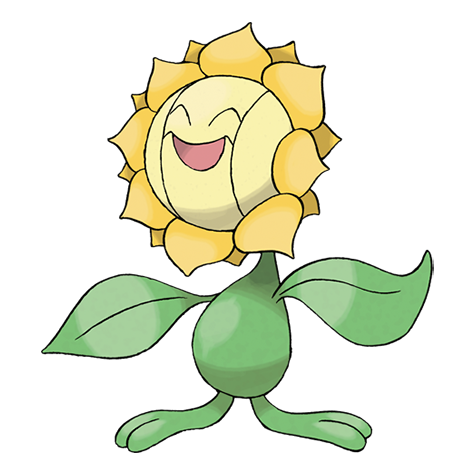
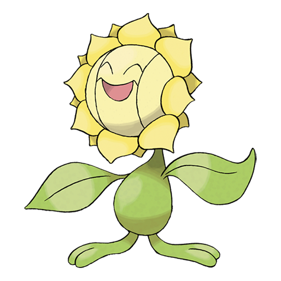
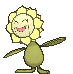
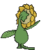
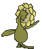

# #192 Sunflora (Sun Pokémon)

| Official Artwork | Shiny Artwork |
|------------------|---------------|
|  |  |

Sunflora converts solar energy into nutrition. It moves around actively in the daytime when it is warm. It stops moving as soon as the sun goes down for the night.

---

## Media

### Default Sprites

| Front | Shiny | Back | Shiny |
|-------|-------|------|-------|
|  |  |  |  |

### Cries

Latest (Gen VI+):

<audio controls>
<source src='../../assets/cries/sunflora/latest.ogg' type='audio/ogg'>
  Your browser does not support the audio element.
</audio>

Legacy:

<audio controls>
<source src='../../assets/cries/sunflora/legacy.ogg' type='audio/ogg'>
  Your browser does not support the audio element.
</audio>

---

## Pokédex Data

| National № | Type(s) | Height | Weight | Abilities | Local № |
|------------|---------|--------|--------|-----------|---------|
| #192 | {: width="48"} | 0.8 m / 2.6 ft | 8.5 kg / 18.7 lbs | 1. Chlorophyll 2. Solar Power | N/A |

---

## Base Stats
|   | HP | Attack | Defense | Sp. Atk | Sp. Def | Speed |
|---|----|--------|---------|---------|---------|-------|
| **Base** | 95 | 55 | 95 | 125 | 105 | 30 |
| **Min** | 300 | 103 | 175 | 229 | 193 | 58 |
| **Max** | 394 | 229 | 317 | 383 | 339 | 174 |

The ranges shown above are for a level 100 Pokémon. Maximum values are based on a beneficial nature, 252 EVs, 31 IVs; minimum values are based on a hindering nature, 0 EVs, 0 IVs.

---

## Forms & Evolutions

!!! warning "WARNING"

    Information on evolutions may not be 100% accurate; differences between evolution methods across generations are not accounted for.

### Forms

Sunflora has no alternate forms.

### Evolution Line

1. [Sunkern](sunkern.md/)
    1. Use Item: [Sunflora](sunflora.md/)

---

## Training

| EV Yield | Catch Rate | Base Friendship | Base Exp. | Growth Rate | Held Items |
|----------|------------|-----------------|-----------|-------------|------------|
| 2 Sp.-Atk | 120 | 70 | 149 | Medium Slow | N/A |

---

## Breeding

| Egg Groups | Egg Cycles | Gender | Dimorphic | Color | Shape |
|------------|------------|--------|-----------|-------|-------|
| 1. Plant | 20 | 50.0% Male 50.0% Female | False | Yellow | Humanoid |

---

## Moves

!!! warning "WARNING"

    Specific move information may be incorrect. However, the general movepool should be accurate; this includes changes made in Sacred Gold and Storm Silver.

### Level Up Moves

| Lv. | Move | Type | Cat. | Power | Acc. | PP |
| --- | --- | --- | --- | --- | --- | --- |
| 1 | Absorb | {: width="48"} | {: width="36"} | 20 | 100 | 25 |
| 1 | Flower Shield | {: width="48"} | {: width="36"} | — | — | 10 |
| 1 | Growth | {: width="48"} | {: width="36"} | — | — | 20 |
| 1 | Pound | {: width="48"} | {: width="36"} | 50 | 100 | 35 |
| 4 | Ingrain | {: width="48"} | {: width="36"} | — | — | 20 |
| 7 | Grass Whistle | {: width="48"} | {: width="36"} | — | 55 | 15 |
| 10 | Mega Drain | {: width="48"} | {: width="36"} | 40 | 100 | 15 |
| 13 | Leech Seed | {: width="48"} | {: width="36"} | — | 90 | 10 |
| 16 | Razor Leaf | {: width="48"} | {: width="36"} | 55 | 95 | 25 |
| 19 | Worry Seed | {: width="48"} | {: width="36"} | — | 100 | 10 |
| 22 | Giga Drain | {: width="48"} | {: width="36"} | 75 | 100 | 10 |
| 25 | Bullet Seed | {: width="48"} | {: width="36"} | 25 | 100 | 30 |
| 28 | Petal Dance | {: width="48"} | {: width="36"} | 120 | 100 | 10 |
| 31 | Natural Gift | {: width="48"} | {: width="36"} | — | 100 | 15 |
| 34 | Solar Beam | {: width="48"} | {: width="36"} | 120 | 100 | 10 |
| 37 | Double Edge | {: width="48"} | {: width="36"} | 120 | 100 | 15 |
| 40 | Sunny Day | {: width="48"} | {: width="36"} | — | — | 5 |
| 43 | Mystical Fire | {: width="48"} | {: width="36"} | 80 | 100 | 10 |
| 46 | Earth Power | {: width="48"} | {: width="36"} | 90 | 100 | 10 |
| 49 | Petal Blizzard | {: width="48"} | {: width="36"} | 90 | 100 | 15 |
| 52 | Leaf Storm | {: width="48"} | {: width="36"} | 130 | 90 | 5 |

### TM Moves

| TM | Move | Type | Cat. | Power | Acc. | PP |
| --- | --- | --- | --- | --- | --- | --- |
| HM01 | Cut | {: width="48"} | {: width="36"} | 70 | 100 | 15 |
| TM06 | Toxic | {: width="48"} | {: width="36"} | — | 90 | 10 |
| TM10 | Hidden Power | {: width="48"} | {: width="36"} | 60 | 100 | 15 |
| TM100 | Confide | {: width="48"} | {: width="36"} | — | — | 20 |
| TM11 | Sunny Day | {: width="48"} | {: width="36"} | — | — | 5 |
| TM15 | Hyper Beam | {: width="48"} | {: width="36"} | 150 | 90 | 5 |
| TM16 | Light Screen | {: width="48"} | {: width="36"} | — | — | 30 |
| TM17 | Protect | {: width="48"} | {: width="36"} | — | — | 10 |
| TM20 | Safeguard | {: width="48"} | {: width="36"} | — | — | 25 |
| TM21 | Frustration | {: width="48"} | {: width="36"} | — | 100 | 20 |
| TM22 | Solar Beam | {: width="48"} | {: width="36"} | 120 | 100 | 10 |
| TM27 | Return | {: width="48"} | {: width="36"} | — | 100 | 20 |
| TM32 | Double Team | {: width="48"} | {: width="36"} | — | — | 15 |
| TM36 | Sludge Bomb | {: width="48"} | {: width="36"} | 90 | 100 | 10 |
| TM42 | Facade | {: width="48"} | {: width="36"} | 70 | 100 | 20 |
| TM44 | Rest | {: width="48"} | {: width="36"} | — | — | 5 |
| TM45 | Attract | {: width="48"} | {: width="36"} | — | 100 | 15 |
| TM48 | Round | {: width="48"} | {: width="36"} | 60 | 100 | 15 |
| TM53 | Energy Ball | {: width="48"} | {: width="36"} | 90 | 100 | 10 |
| TM68 | Giga Impact | {: width="48"} | {: width="36"} | 150 | 90 | 5 |
| TM70 | Flash | {: width="48"} | {: width="36"} | — | 100 | 20 |
| TM75 | Swords Dance | {: width="48"} | {: width="36"} | — | — | 20 |
| TM86 | Grass Knot | {: width="48"} | {: width="36"} | — | 100 | 20 |
| TM87 | Swagger | {: width="48"} | {: width="36"} | — | 85 | 15 |
| TM88 | Sleep Talk | {: width="48"} | {: width="36"} | — | — | 10 |
| TM90 | Substitute | {: width="48"} | {: width="36"} | — | — | 10 |
| TM94 | Secret Power | {: width="48"} | {: width="36"} | 70 | 100 | 20 |
| TM96 | Nature Power | {: width="48"} | {: width="36"} | — | — | 20 |

### Egg Moves

Sunflora cannot learn any moves by breeding.
### Tutor Moves

| Move | Type | Cat. | Power | Acc. | PP |
| --- | --- | --- | --- | --- | --- |
| After You | {: width="48"} | {: width="36"} | — | — | 15 |
| Earth Power | {: width="48"} | {: width="36"} | 90 | 100 | 10 |
| Endeavor | {: width="48"} | {: width="36"} | — | 100 | 5 |
| Giga Drain | {: width="48"} | {: width="36"} | 75 | 100 | 10 |
| Helping Hand | {: width="48"} | {: width="36"} | — | — | 20 |
| Seed Bomb | {: width="48"} | {: width="36"} | 80 | 100 | 15 |
| Snore | {: width="48"} | {: width="36"} | 50 | 100 | 15 |
| Synthesis | {: width="48"} | {: width="36"} | — | — | 5 |
| Uproar | {: width="48"} | {: width="36"} | 90 | 100 | 10 |
| Worry Seed | {: width="48"} | {: width="36"} | — | 100 | 10 |

