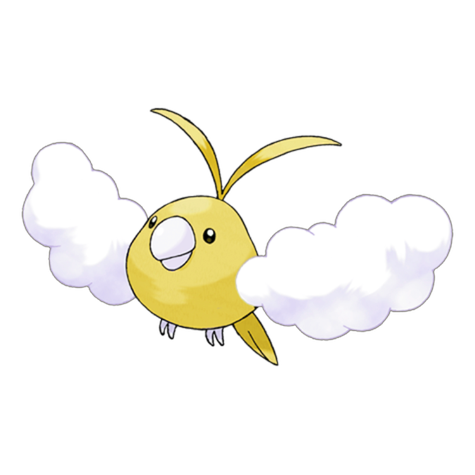

# #333 Swablu (Cotton Bird Pokémon)

| Official Artwork | Shiny Artwork |
|------------------|---------------|
|  |  |

**Rising Ruby:** Swablu has light and fluffy wings that are like cottony clouds. This Pokémon is not frightened of people. It lands on the heads of people and sits there like a cotton-fluff hat.

**Sinking Sapphire:** Swablu loves to make things clean. If it spots something dirty, it will wipe and polish it with its cottony wings. If its wings become dirty, this Pokémon finds a stream and showers itself.

---

## Media

### Default Sprites

| Front | Shiny | Back | Shiny |
|-------|-------|------|-------|
|  |  |  |  |

### Cries

Latest (Gen VI+):

<audio controls>
<source src='../../assets/cries/swablu/latest.ogg' type='audio/ogg'>
  Your browser does not support the audio element.
</audio>

Legacy:

<audio controls>
<source src='../../assets/cries/swablu/legacy.ogg' type='audio/ogg'>
  Your browser does not support the audio element.
</audio>

---

## Pokédex Data

| National № | Type(s) | Height | Weight | Abilities | Local № |
|------------|---------|--------|--------|-----------|---------|
| #333 | {: width="48"} {: width="48"} | 0.4 m / 1.3 ft | 1.2 kg / 2.6 lbs | 1. Natural Cure 2. Cloud Nine | N/A |

---

## Base Stats
|   | HP | Attack | Defense | Sp. Atk | Sp. Def | Speed |
|---|----|--------|---------|---------|---------|-------|
| **Base** | 45 | 40 | 60 | 40 | 75 | 50 |
| **Min** | 200 | 76 | 112 | 76 | 139 | 94 |
| **Max** | 294 | 196 | 240 | 196 | 273 | 218 |

The ranges shown above are for a level 100 Pokémon. Maximum values are based on a beneficial nature, 252 EVs, 31 IVs; minimum values are based on a hindering nature, 0 EVs, 0 IVs.

---

## Forms & Evolutions

!!! warning "WARNING"

    Information on evolutions may not be 100% accurate; differences between evolution methods across generations are not accounted for.

### Forms

Swablu has no alternate forms.

### Evolution Line

1. [Swablu](swablu.md/)
    1. Level Up: [Altaria](altaria.md/)

---

## Training

| EV Yield | Catch Rate | Base Friendship | Base Exp. | Growth Rate | Held Items |
|----------|------------|-----------------|-----------|-------------|------------|
| 1 Sp.-Def | 255 | 50 | 62 | Slow Then Very Fast | N/A |

---

## Breeding

| Egg Groups | Egg Cycles | Gender | Dimorphic | Color | Shape |
|------------|------------|--------|-----------|-------|-------|
| 1. Flying 2. Dragon | 20 | 50.0% Male 50.0% Female | False | Blue | Wings |

---

## Moves

!!! warning "WARNING"

    Specific move information may be incorrect. However, the general movepool should be accurate; this includes changes made in Sacred Gold and Storm Silver.

### Level Up Moves

| Lv. | Move | Type | Cat. | Power | Acc. | PP |
| --- | --- | --- | --- | --- | --- | --- |
| 1 | Growl | {: width="48"} | {: width="36"} | — | 100 | 40 |
| 1 | Peck | {: width="48"} | {: width="36"} | 35 | 100 | 35 |
| 3 | Astonish | {: width="48"} | {: width="36"} | 30 | 100 | 15 |
| 5 | Sing | {: width="48"} | {: width="36"} | — | 55 | 15 |
| 7 | Fury Attack | {: width="48"} | {: width="36"} | 15 | 85 | 20 |
| 9 | Safeguard | {: width="48"} | {: width="36"} | — | — | 25 |
| 11 | Disarming Voice | {: width="48"} | {: width="36"} | 60 | — | 20 |
| 13 | Mist | {: width="48"} | {: width="36"} | — | — | 30 |
| 15 | Round | {: width="48"} | {: width="36"} | 60 | 100 | 15 |
| 18 | Natural Gift | {: width="48"} | {: width="36"} | — | 100 | 15 |
| 21 | Take Down | {: width="48"} | {: width="36"} | 90 | 85 | 20 |
| 24 | Pluck | {: width="48"} | {: width="36"} | 60 | 100 | 20 |
| 27 | Cotton Guard | {: width="48"} | {: width="36"} | — | — | 10 |
| 30 | Mirror Move | {: width="48"} | {: width="36"} | — | — | 20 |
| 33 | Refresh | {: width="48"} | {: width="36"} | — | — | 20 |
| 36 | Dragon Pulse | {: width="48"} | {: width="36"} | 85 | 100 | 10 |
| 39 | Moonblast | {: width="48"} | {: width="36"} | 95 | 100 | 15 |
| 42 | Hyper Voice | {: width="48"} | {: width="36"} | 90 | 100 | 10 |
| 45 | Perish Song | {: width="48"} | {: width="36"} | — | — | 5 |
| 48 | Double Edge | {: width="48"} | {: width="36"} | 120 | 100 | 15 |

### TM Moves

| TM | Move | Type | Cat. | Power | Acc. | PP |
| --- | --- | --- | --- | --- | --- | --- |
| HM02 | Fly | {: width="48"} | {: width="36"} | 100 | 100 | 10 |
| TM06 | Toxic | {: width="48"} | {: width="36"} | — | 90 | 10 |
| TM10 | Hidden Power | {: width="48"} | {: width="36"} | 60 | 100 | 15 |
| TM100 | Confide | {: width="48"} | {: width="36"} | — | — | 20 |
| TM11 | Sunny Day | {: width="48"} | {: width="36"} | — | — | 5 |
| TM13 | Ice Beam | {: width="48"} | {: width="36"} | 90 | 100 | 10 |
| TM17 | Protect | {: width="48"} | {: width="36"} | — | — | 10 |
| TM18 | Rain Dance | {: width="48"} | {: width="36"} | — | — | 5 |
| TM19 | Roost | {: width="48"} | {: width="36"} | — | — | 5 |
| TM20 | Safeguard | {: width="48"} | {: width="36"} | — | — | 25 |
| TM21 | Frustration | {: width="48"} | {: width="36"} | — | 100 | 20 |
| TM22 | Solar Beam | {: width="48"} | {: width="36"} | 120 | 100 | 10 |
| TM27 | Return | {: width="48"} | {: width="36"} | — | 100 | 20 |
| TM32 | Double Team | {: width="48"} | {: width="36"} | — | — | 15 |
| TM40 | Aerial Ace | {: width="48"} | {: width="36"} | 60 | — | 20 |
| TM42 | Facade | {: width="48"} | {: width="36"} | 70 | 100 | 20 |
| TM44 | Rest | {: width="48"} | {: width="36"} | — | — | 5 |
| TM45 | Attract | {: width="48"} | {: width="36"} | — | 100 | 15 |
| TM46 | Thief | {: width="48"} | {: width="36"} | 60 | 100 | 25 |
| TM48 | Round | {: width="48"} | {: width="36"} | 60 | 100 | 15 |
| TM49 | Echoed Voice | {: width="48"} | {: width="36"} | 40 | 100 | 15 |
| TM51 | Steel Wing | {: width="48"} | {: width="36"} | 70 | 90 | 25 |
| TM77 | Psych Up | {: width="48"} | {: width="36"} | — | — | 10 |
| TM85 | Dream Eater | {: width="48"} | {: width="36"} | 100 | 100 | 15 |
| TM87 | Swagger | {: width="48"} | {: width="36"} | — | 85 | 15 |
| TM88 | Sleep Talk | {: width="48"} | {: width="36"} | — | — | 10 |
| TM90 | Substitute | {: width="48"} | {: width="36"} | — | — | 10 |
| TM94 | Secret Power | {: width="48"} | {: width="36"} | 70 | 100 | 20 |
| TM99 | Dazzling Gleam | {: width="48"} | {: width="36"} | 80 | 100 | 10 |

### Egg Moves

| Move | Type | Cat. | Power | Acc. | PP |
| --- | --- | --- | --- | --- | --- |
| Agility | {: width="48"} | {: width="36"} | — | — | 30 |
| Dragon Rush | {: width="48"} | {: width="36"} | 100 | 75 | 10 |
| Feather Dance | {: width="48"} | {: width="36"} | — | 100 | 15 |
| Haze | {: width="48"} | {: width="36"} | — | — | 30 |
| Hyper Voice | {: width="48"} | {: width="36"} | 90 | 100 | 10 |
| Power Swap | {: width="48"} | {: width="36"} | — | — | 10 |
| Pursuit | {: width="48"} | {: width="36"} | 40 | 100 | 20 |
| Rage | {: width="48"} | {: width="36"} | 20 | 100 | 20 |
| Roost | {: width="48"} | {: width="36"} | — | — | 5 |
| Steel Wing | {: width="48"} | {: width="36"} | 70 | 90 | 25 |

### Tutor Moves

| Move | Type | Cat. | Power | Acc. | PP |
| --- | --- | --- | --- | --- | --- |
| Dragon Pulse | {: width="48"} | {: width="36"} | 85 | 100 | 10 |
| Heal Bell | {: width="48"} | {: width="36"} | — | — | 5 |
| Heat Wave | {: width="48"} | {: width="36"} | 95 | 90 | 10 |
| Hyper Voice | {: width="48"} | {: width="36"} | 90 | 100 | 10 |
| Outrage | {: width="48"} | {: width="36"} | 120 | 100 | 10 |
| Sky Attack | {: width="48"} | {: width="36"} | 140 | 90 | 5 |
| Snore | {: width="48"} | {: width="36"} | 50 | 100 | 15 |
| Tailwind | {: width="48"} | {: width="36"} | — | — | 15 |
| Uproar | {: width="48"} | {: width="36"} | 90 | 100 | 10 |

