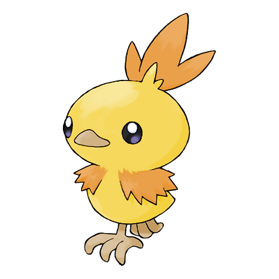

# #255 Torchic (Chick Pokémon)

| Official Artwork | Shiny Artwork |
|------------------|---------------|
|  |  |

**Rising Ruby:** Torchic sticks with its Trainer, following behind with unsteady steps. This Pokémon breathes fire of over 1,800 degrees Fahrenheit, including fireballs that leave the foe scorched black.

**Sinking Sapphire:** Torchic has a place inside its body where it keeps its flame. Give it a hug—it will be glowing with warmth. This Pokémon is covered all over by a fluffy coat of down.

---

## Media

### Default Sprites

| Front | Shiny | Back | Shiny |
|-------|-------|------|-------|
|  |  |  |  |

### Female Sprites

| Front | Shiny | Back | Shiny |
|-------|-------|------|-------|
|  |  | N/A | N/A |

### Cries

Latest (Gen VI+):

<audio controls>
<source src='../../assets/cries/torchic/latest.ogg' type='audio/ogg'>
  Your browser does not support the audio element.
</audio>

Legacy:

<audio controls>
<source src='../../assets/cries/torchic/legacy.ogg' type='audio/ogg'>
  Your browser does not support the audio element.
</audio>

---

## Pokédex Data

| National № | Type(s) | Height | Weight | Abilities | Local № |
|------------|---------|--------|--------|-----------|---------|
| #255 | {: width="48"} | 0.4 m / 1.3 ft | 2.5 kg / 5.5 lbs | 1. Blaze 2. Speed Boost | N/A |

---

## Base Stats
|   | HP | Attack | Defense | Sp. Atk | Sp. Def | Speed |
|---|----|--------|---------|---------|---------|-------|
| **Base** | 45 | 60 | 40 | 70 | 50 | 45 |
| **Min** | 200 | 112 | 76 | 130 | 94 | 85 |
| **Max** | 294 | 240 | 196 | 262 | 218 | 207 |

The ranges shown above are for a level 100 Pokémon. Maximum values are based on a beneficial nature, 252 EVs, 31 IVs; minimum values are based on a hindering nature, 0 EVs, 0 IVs.

---

## Forms & Evolutions

!!! warning "WARNING"

    Information on evolutions may not be 100% accurate; differences between evolution methods across generations are not accounted for.

### Forms

Torchic has no alternate forms.

### Evolution Line

1. [Torchic](torchic.md/)
    1. Level Up: [Combusken](combusken.md/)
        1. Level Up: [Blaziken](blaziken.md/)

---

## Training

| EV Yield | Catch Rate | Base Friendship | Base Exp. | Growth Rate | Held Items |
|----------|------------|-----------------|-----------|-------------|------------|
| 1 Sp.-Atk | 45 | 50 | 62 | Medium Slow | N/A |

---

## Breeding

| Egg Groups | Egg Cycles | Gender | Dimorphic | Color | Shape |
|------------|------------|--------|-----------|-------|-------|
| 1. Ground | 20 | 87.5% Male 12.5% Female | True | Red | Legs |

---

## Moves

!!! warning "WARNING"

    Specific move information may be incorrect. However, the general movepool should be accurate; this includes changes made in Sacred Gold and Storm Silver.

### Level Up Moves

| Lv. | Move | Type | Cat. | Power | Acc. | PP |
| --- | --- | --- | --- | --- | --- | --- |
| 1 | Scratch | {: width="48"} | {: width="36"} | 50 | 100 | 35 |
| 3 | Growl | {: width="48"} | {: width="36"} | — | 100 | 40 |
| 5 | Ember | {: width="48"} | {: width="36"} | 40 | 100 | 25 |
| 7 | Sand Attack | {: width="48"} | {: width="36"} | — | 100 | 15 |
| 9 | Peck | {: width="48"} | {: width="36"} | 35 | 100 | 35 |
| 11 | Fire Spin | {: width="48"} | {: width="36"} | 35 | 85 | 15 |
| 13 | Feather Dance | {: width="48"} | {: width="36"} | — | 100 | 15 |
| 15 | Flame Charge | {: width="48"} | {: width="36"} | 50 | 100 | 20 |
| 17 | Night Slash | {: width="48"} | {: width="36"} | 70 | 100 | 15 |
| 19 | Quick Attack | {: width="48"} | {: width="36"} | 40 | 100 | 30 |
| 21 | Flame Burst | {: width="48"} | {: width="36"} | 70 | 100 | 15 |
| 23 | Aerial Ace | {: width="48"} | {: width="36"} | 60 | — | 20 |
| 25 | Focus Energy | {: width="48"} | {: width="36"} | — | — | 30 |
| 27 | Slash | {: width="48"} | {: width="36"} | 70 | 100 | 20 |
| 29 | Bounce | {: width="48"} | {: width="36"} | 85 | 85 | 5 |
| 31 | Flamethrower | {: width="48"} | {: width="36"} | 90 | 100 | 15 |
| 33 | Mirror Move | {: width="48"} | {: width="36"} | — | — | 20 |
| 35 | Reversal | {: width="48"} | {: width="36"} | — | 100 | 15 |
| 37 | Fire Blast | {: width="48"} | {: width="36"} | 110 | 85 | 5 |

### TM Moves

| TM | Move | Type | Cat. | Power | Acc. | PP |
| --- | --- | --- | --- | --- | --- | --- |
| HM01 | Cut | {: width="48"} | {: width="36"} | 70 | 100 | 15 |
| HM04 | Strength | {: width="48"} | {: width="36"} | 100 | 100 | 10 |
| HM06 | Rock Smash | {: width="48"} | {: width="36"} | 65 | 100 | 15 |
| TM01 | Hone Claws | {: width="48"} | {: width="36"} | — | — | 15 |
| TM06 | Toxic | {: width="48"} | {: width="36"} | — | 90 | 10 |
| TM10 | Hidden Power | {: width="48"} | {: width="36"} | 60 | 100 | 15 |
| TM100 | Confide | {: width="48"} | {: width="36"} | — | — | 20 |
| TM11 | Sunny Day | {: width="48"} | {: width="36"} | — | — | 5 |
| TM17 | Protect | {: width="48"} | {: width="36"} | — | — | 10 |
| TM21 | Frustration | {: width="48"} | {: width="36"} | — | 100 | 20 |
| TM27 | Return | {: width="48"} | {: width="36"} | — | 100 | 20 |
| TM28 | Dig | {: width="48"} | {: width="36"} | 80 | 100 | 10 |
| TM32 | Double Team | {: width="48"} | {: width="36"} | — | — | 15 |
| TM35 | Flamethrower | {: width="48"} | {: width="36"} | 90 | 100 | 15 |
| TM38 | Fire Blast | {: width="48"} | {: width="36"} | 110 | 85 | 5 |
| TM39 | Rock Tomb | {: width="48"} | {: width="36"} | 60 | 95 | 15 |
| TM40 | Aerial Ace | {: width="48"} | {: width="36"} | 60 | — | 20 |
| TM42 | Facade | {: width="48"} | {: width="36"} | 70 | 100 | 20 |
| TM43 | Flame Charge | {: width="48"} | {: width="36"} | 50 | 100 | 20 |
| TM44 | Rest | {: width="48"} | {: width="36"} | — | — | 5 |
| TM45 | Attract | {: width="48"} | {: width="36"} | — | 100 | 15 |
| TM48 | Round | {: width="48"} | {: width="36"} | 60 | 100 | 15 |
| TM49 | Echoed Voice | {: width="48"} | {: width="36"} | 40 | 100 | 15 |
| TM50 | Overheat | {: width="48"} | {: width="36"} | 130 | 90 | 5 |
| TM59 | Incinerate | {: width="48"} | {: width="36"} | 60 | 100 | 15 |
| TM61 | Will O Wisp | {: width="48"} | {: width="36"} | — | 85 | 15 |
| TM65 | Shadow Claw | {: width="48"} | {: width="36"} | 70 | 100 | 15 |
| TM75 | Swords Dance | {: width="48"} | {: width="36"} | — | — | 20 |
| TM80 | Rock Slide | {: width="48"} | {: width="36"} | 75 | 90 | 10 |
| TM87 | Swagger | {: width="48"} | {: width="36"} | — | 85 | 15 |
| TM88 | Sleep Talk | {: width="48"} | {: width="36"} | — | — | 10 |
| TM90 | Substitute | {: width="48"} | {: width="36"} | — | — | 10 |
| TM94 | Secret Power | {: width="48"} | {: width="36"} | 70 | 100 | 20 |

### Egg Moves

| Move | Type | Cat. | Power | Acc. | PP |
| --- | --- | --- | --- | --- | --- |
| Agility | {: width="48"} | {: width="36"} | — | — | 30 |
| Baton Pass | {: width="48"} | {: width="36"} | — | — | 40 |
| Counter | {: width="48"} | {: width="36"} | — | 100 | 20 |
| Crush Claw | {: width="48"} | {: width="36"} | 75 | 95 | 10 |
| Curse | {: width="48"} | {: width="36"} | — | — | 10 |
| Endure | {: width="48"} | {: width="36"} | — | — | 10 |
| Feather Dance | {: width="48"} | {: width="36"} | — | 100 | 15 |
| Feint | {: width="48"} | {: width="36"} | 30 | 100 | 10 |
| Flame Burst | {: width="48"} | {: width="36"} | 70 | 100 | 15 |
| Last Resort | {: width="48"} | {: width="36"} | 140 | 100 | 5 |
| Low Kick | {: width="48"} | {: width="36"} | — | 100 | 20 |
| Night Slash | {: width="48"} | {: width="36"} | 70 | 100 | 15 |
| Reversal | {: width="48"} | {: width="36"} | — | 100 | 15 |
| Smelling Salts | {: width="48"} | {: width="36"} | 70 | 100 | 10 |

### Tutor Moves

| Move | Type | Cat. | Power | Acc. | PP |
| --- | --- | --- | --- | --- | --- |
| Bounce | {: width="48"} | {: width="36"} | 85 | 85 | 5 |
| Fire Pledge | {: width="48"} | {: width="36"} | 85 | 100 | 10 |
| Heat Wave | {: width="48"} | {: width="36"} | 95 | 90 | 10 |
| Helping Hand | {: width="48"} | {: width="36"} | — | — | 20 |
| Last Resort | {: width="48"} | {: width="36"} | 140 | 100 | 5 |
| Low Kick | {: width="48"} | {: width="36"} | — | 100 | 20 |
| Snore | {: width="48"} | {: width="36"} | 50 | 100 | 15 |

