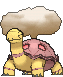
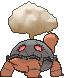
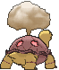

# #324 Torkoal (Coal Pokémon)

| Official Artwork | Shiny Artwork |
|------------------|---------------|
|  |  |

**Rising Ruby:** Torkoal digs through mountains in search of coal. If it finds some, it fills hollow spaces on its shell with the coal and burns it. If it is attacked, this Pokémon spouts thick black smoke to beat a retreat.

**Sinking Sapphire:** Torkoal generates energy by burning coal. It grows weaker as the fire dies down. When it is preparing for battle, this Pokémon burns more coal.

---

## Media

### Default Sprites

| Front | Shiny | Back | Shiny |
|-------|-------|------|-------|
|  |  |  |  |

### Cries

Latest (Gen VI+):

<audio controls>
<source src='../../assets/cries/torkoal/latest.ogg' type='audio/ogg'>
  Your browser does not support the audio element.
</audio>

Legacy:

<audio controls>
<source src='../../assets/cries/torkoal/legacy.ogg' type='audio/ogg'>
  Your browser does not support the audio element.
</audio>

---

## Pokédex Data

| National № | Type(s) | Height | Weight | Abilities | Local № |
|------------|---------|--------|--------|-----------|---------|
| #324 | {: width="48"} | 0.5 m / 1.6 ft | 80.4 kg / 177.3 lbs | 1. White Smoke 2. Shell Armor | N/A |

---

## Base Stats
|   | HP | Attack | Defense | Sp. Atk | Sp. Def | Speed |
|---|----|--------|---------|---------|---------|-------|
| **Base** | 70 | 85 | 140 | 85 | 70 | 20 |
| **Min** | 250 | 157 | 256 | 157 | 130 | 40 |
| **Max** | 344 | 295 | 416 | 295 | 262 | 152 |

The ranges shown above are for a level 100 Pokémon. Maximum values are based on a beneficial nature, 252 EVs, 31 IVs; minimum values are based on a hindering nature, 0 EVs, 0 IVs.

---

## Forms & Evolutions

!!! warning "WARNING"

    Information on evolutions may not be 100% accurate; differences between evolution methods across generations are not accounted for.

### Forms

Torkoal has no alternate forms.

### Evolution Line

1. [Torkoal](torkoal.md/)

---

## Training

| EV Yield | Catch Rate | Base Friendship | Base Exp. | Growth Rate | Held Items |
|----------|------------|-----------------|-----------|-------------|------------|
| 2 Def | 90 | 50 | 165 | Medium | Charcoal (5%) |

---

## Breeding

| Egg Groups | Egg Cycles | Gender | Dimorphic | Color | Shape |
|------------|------------|--------|-----------|-------|-------|
| 1. Ground | 20 | 50.0% Male 50.0% Female | False | Brown | Quadruped |

---

## Moves

!!! warning "WARNING"

    Specific move information may be incorrect. However, the general movepool should be accurate; this includes changes made in Sacred Gold and Storm Silver.

### Level Up Moves

| Lv. | Move | Type | Cat. | Power | Acc. | PP |
| --- | --- | --- | --- | --- | --- | --- |
| 1 | Ember | {: width="48"} | {: width="36"} | 40 | 100 | 25 |
| 4 | Smog | {: width="48"} | {: width="36"} | 30 | 70 | 20 |
| 7 | Withdraw | {: width="48"} | {: width="36"} | — | — | 40 |
| 10 | Rapid Spin | {: width="48"} | {: width="36"} | 50 | 100 | 40 |
| 13 | Fire Spin | {: width="48"} | {: width="36"} | 35 | 85 | 15 |
| 15 | Smokescreen | {: width="48"} | {: width="36"} | — | 100 | 20 |
| 18 | Flame Wheel | {: width="48"} | {: width="36"} | 60 | 100 | 25 |
| 22 | Curse | {: width="48"} | {: width="36"} | — | — | 10 |
| 25 | Lava Plume | {: width="48"} | {: width="36"} | 80 | 100 | 15 |
| 27 | Body Slam | {: width="48"} | {: width="36"} | 85 | 100 | 15 |
| 30 | Protect | {: width="48"} | {: width="36"} | — | — | 10 |
| 34 | Flamethrower | {: width="48"} | {: width="36"} | 90 | 100 | 15 |
| 38 | Iron Defense | {: width="48"} | {: width="36"} | — | — | 15 |
| 40 | Earth Power | {: width="48"} | {: width="36"} | 90 | 100 | 10 |
| 42 | Amnesia | {: width="48"} | {: width="36"} | — | — | 20 |
| 45 | Flail | {: width="48"} | {: width="36"} | — | 100 | 15 |
| 47 | Heat Wave | {: width="48"} | {: width="36"} | 95 | 90 | 10 |
| 50 | Shell Smash | {: width="48"} | {: width="36"} | — | — | 15 |
| 53 | Inferno | {: width="48"} | {: width="36"} | 100 | 50 | 5 |
| 57 | Superpower | {: width="48"} | {: width="36"} | 120 | 100 | 5 |
| 60 | Eruption | {: width="48"} | {: width="36"} | 150 | 100 | 5 |

### TM Moves

| TM | Move | Type | Cat. | Power | Acc. | PP |
| --- | --- | --- | --- | --- | --- | --- |
| HM04 | Strength | {: width="48"} | {: width="36"} | 100 | 100 | 10 |
| HM06 | Rock Smash | {: width="48"} | {: width="36"} | 65 | 100 | 15 |
| TM06 | Toxic | {: width="48"} | {: width="36"} | — | 90 | 10 |
| TM10 | Hidden Power | {: width="48"} | {: width="36"} | 60 | 100 | 15 |
| TM100 | Confide | {: width="48"} | {: width="36"} | — | — | 20 |
| TM11 | Sunny Day | {: width="48"} | {: width="36"} | — | — | 5 |
| TM15 | Hyper Beam | {: width="48"} | {: width="36"} | 150 | 90 | 5 |
| TM17 | Protect | {: width="48"} | {: width="36"} | — | — | 10 |
| TM21 | Frustration | {: width="48"} | {: width="36"} | — | 100 | 20 |
| TM22 | Solar Beam | {: width="48"} | {: width="36"} | 120 | 100 | 10 |
| TM26 | Earthquake | {: width="48"} | {: width="36"} | 100 | 100 | 10 |
| TM27 | Return | {: width="48"} | {: width="36"} | — | 100 | 20 |
| TM32 | Double Team | {: width="48"} | {: width="36"} | — | — | 15 |
| TM35 | Flamethrower | {: width="48"} | {: width="36"} | 90 | 100 | 15 |
| TM36 | Sludge Bomb | {: width="48"} | {: width="36"} | 90 | 100 | 10 |
| TM38 | Fire Blast | {: width="48"} | {: width="36"} | 110 | 85 | 5 |
| TM39 | Rock Tomb | {: width="48"} | {: width="36"} | 60 | 95 | 15 |
| TM42 | Facade | {: width="48"} | {: width="36"} | 70 | 100 | 20 |
| TM43 | Flame Charge | {: width="48"} | {: width="36"} | 50 | 100 | 20 |
| TM44 | Rest | {: width="48"} | {: width="36"} | — | — | 5 |
| TM45 | Attract | {: width="48"} | {: width="36"} | — | 100 | 15 |
| TM48 | Round | {: width="48"} | {: width="36"} | 60 | 100 | 15 |
| TM50 | Overheat | {: width="48"} | {: width="36"} | 130 | 90 | 5 |
| TM59 | Incinerate | {: width="48"} | {: width="36"} | 60 | 100 | 15 |
| TM61 | Will O Wisp | {: width="48"} | {: width="36"} | — | 85 | 15 |
| TM64 | Explosion | {: width="48"} | {: width="36"} | 250 | 100 | 5 |
| TM68 | Giga Impact | {: width="48"} | {: width="36"} | 150 | 90 | 5 |
| TM71 | Stone Edge | {: width="48"} | {: width="36"} | 100 | 80 | 5 |
| TM74 | Gyro Ball | {: width="48"} | {: width="36"} | — | 100 | 5 |
| TM78 | Bulldoze | {: width="48"} | {: width="36"} | 60 | 100 | 20 |
| TM80 | Rock Slide | {: width="48"} | {: width="36"} | 75 | 90 | 10 |
| TM87 | Swagger | {: width="48"} | {: width="36"} | — | 85 | 15 |
| TM88 | Sleep Talk | {: width="48"} | {: width="36"} | — | — | 10 |
| TM90 | Substitute | {: width="48"} | {: width="36"} | — | — | 10 |
| TM94 | Secret Power | {: width="48"} | {: width="36"} | 70 | 100 | 20 |
| TM96 | Nature Power | {: width="48"} | {: width="36"} | — | — | 20 |

### Egg Moves

| Move | Type | Cat. | Power | Acc. | PP |
| --- | --- | --- | --- | --- | --- |
| Clear Smog | {: width="48"} | {: width="36"} | 50 | — | 15 |
| Endure | {: width="48"} | {: width="36"} | — | — | 10 |
| Eruption | {: width="48"} | {: width="36"} | 150 | 100 | 5 |
| Fissure | {: width="48"} | {: width="36"} | — | 30 | 5 |
| Flame Burst | {: width="48"} | {: width="36"} | 70 | 100 | 15 |
| Skull Bash | {: width="48"} | {: width="36"} | 130 | 100 | 10 |
| Sleep Talk | {: width="48"} | {: width="36"} | — | — | 10 |
| Superpower | {: width="48"} | {: width="36"} | 120 | 100 | 5 |
| Yawn | {: width="48"} | {: width="36"} | — | — | 10 |

### Tutor Moves

| Move | Type | Cat. | Power | Acc. | PP |
| --- | --- | --- | --- | --- | --- |
| After You | {: width="48"} | {: width="36"} | — | — | 15 |
| Earth Power | {: width="48"} | {: width="36"} | 90 | 100 | 10 |
| Heat Wave | {: width="48"} | {: width="36"} | 95 | 90 | 10 |
| Iron Defense | {: width="48"} | {: width="36"} | — | — | 15 |
| Iron Tail | {: width="48"} | {: width="36"} | 100 | 75 | 15 |
| Snore | {: width="48"} | {: width="36"} | 50 | 100 | 15 |
| Stealth Rock | {: width="48"} | {: width="36"} | — | — | 20 |
| Superpower | {: width="48"} | {: width="36"} | 120 | 100 | 5 |

