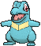
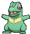
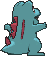
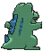

# #158 Totodile (Big Jaw Pokémon)

| Official Artwork | Shiny Artwork |
|------------------|---------------|
|  |  |

Despite the smallness of its body, Totodile’s jaws are very powerful. While the Pokémon may think it is just playfully nipping, its bite has enough power to cause serious injury.

---

## Media

### Default Sprites

| Front | Shiny | Back | Shiny |
|-------|-------|------|-------|
|  |  |  |  |

### Cries

Latest (Gen VI+):

<audio controls>
<source src='../../assets/cries/totodile/latest.ogg' type='audio/ogg'>
  Your browser does not support the audio element.
</audio>

Legacy:

<audio controls>
<source src='../../assets/cries/totodile/legacy.ogg' type='audio/ogg'>
  Your browser does not support the audio element.
</audio>

---

## Pokédex Data

| National № | Type(s) | Height | Weight | Abilities | Local № |
|------------|---------|--------|--------|-----------|---------|
| #158 | {: width="48"} | 0.6 m / 2.0 ft | 9.5 kg / 20.9 lbs | 1. Torrent 2. Sheer Force | N/A |

---

## Base Stats
|   | HP | Attack | Defense | Sp. Atk | Sp. Def | Speed |
|---|----|--------|---------|---------|---------|-------|
| **Base** | 50 | 65 | 64 | 44 | 48 | 43 |
| **Min** | 210 | 121 | 119 | 83 | 90 | 81 |
| **Max** | 304 | 251 | 249 | 205 | 214 | 203 |

The ranges shown above are for a level 100 Pokémon. Maximum values are based on a beneficial nature, 252 EVs, 31 IVs; minimum values are based on a hindering nature, 0 EVs, 0 IVs.

---

## Forms & Evolutions

!!! warning "WARNING"

    Information on evolutions may not be 100% accurate; differences between evolution methods across generations are not accounted for.

### Forms

Totodile has no alternate forms.

### Evolution Line

1. [Totodile](totodile.md/)
    1. Level Up: [Croconaw](croconaw.md/)
        1. Level Up: [Feraligatr](feraligatr.md/)

---

## Training

| EV Yield | Catch Rate | Base Friendship | Base Exp. | Growth Rate | Held Items |
|----------|------------|-----------------|-----------|-------------|------------|
| 1 Atk | 45 | 70 | 63 | Medium Slow | N/A |

---

## Breeding

| Egg Groups | Egg Cycles | Gender | Dimorphic | Color | Shape |
|------------|------------|--------|-----------|-------|-------|
| 1. Monster 2. Water1 | 20 | 87.5% Male 12.5% Female | False | Blue | Upright |

---

## Moves

!!! warning "WARNING"

    Specific move information may be incorrect. However, the general movepool should be accurate; this includes changes made in Sacred Gold and Storm Silver.

### Level Up Moves

| Lv. | Move | Type | Cat. | Power | Acc. | PP |
| --- | --- | --- | --- | --- | --- | --- |
| 1 | Leer | {: width="48"} | {: width="36"} | — | 100 | 30 |
| 1 | Scratch | {: width="48"} | {: width="36"} | 50 | 100 | 35 |
| 5 | Water Gun | {: width="48"} | {: width="36"} | 40 | 100 | 25 |
| 7 | Rage | {: width="48"} | {: width="36"} | 20 | 100 | 20 |
| 9 | Bite | {: width="48"} | {: width="36"} | 60 | 100 | 25 |
| 11 | Scary Face | {: width="48"} | {: width="36"} | — | 100 | 10 |
| 13 | Metal Claw | {: width="48"} | {: width="36"} | 50 | 95 | 35 |
| 15 | Aqua Jet | {: width="48"} | {: width="36"} | 40 | 100 | 20 |
| 17 | Ice Fang | {: width="48"} | {: width="36"} | 65 | 95 | 15 |
| 19 | Flail | {: width="48"} | {: width="36"} | — | 100 | 15 |
| 21 | Chip Away | {: width="48"} | {: width="36"} | 70 | 100 | 20 |
| 23 | Aqua Tail | {: width="48"} | {: width="36"} | 90 | 90 | 10 |
| 25 | Slash | {: width="48"} | {: width="36"} | 70 | 100 | 20 |
| 28 | Crunch | {: width="48"} | {: width="36"} | 80 | 100 | 15 |
| 31 | Screech | {: width="48"} | {: width="36"} | — | 85 | 40 |
| 34 | Thrash | {: width="48"} | {: width="36"} | 120 | 100 | 10 |
| 37 | Dragon Dance | {: width="48"} | {: width="36"} | — | — | 20 |
| 40 | Superpower | {: width="48"} | {: width="36"} | 120 | 100 | 5 |
| 43 | Hydro Pump | {: width="48"} | {: width="36"} | 110 | 80 | 5 |

### TM Moves

| TM | Move | Type | Cat. | Power | Acc. | PP |
| --- | --- | --- | --- | --- | --- | --- |
| HM01 | Cut | {: width="48"} | {: width="36"} | 70 | 100 | 15 |
| HM03 | Surf | {: width="48"} | {: width="36"} | 90 | 100 | 15 |
| HM05 | Waterfall | {: width="48"} | {: width="36"} | 80 | 100 | 15 |
| HM07 | Dive | {: width="48"} | {: width="36"} | 80 | 100 | 10 |
| TM01 | Hone Claws | {: width="48"} | {: width="36"} | — | — | 15 |
| TM02 | Dragon Claw | {: width="48"} | {: width="36"} | 80 | 100 | 15 |
| TM06 | Toxic | {: width="48"} | {: width="36"} | — | 90 | 10 |
| TM07 | Hail | {: width="48"} | {: width="36"} | — | — | 10 |
| TM10 | Hidden Power | {: width="48"} | {: width="36"} | 60 | 100 | 15 |
| TM100 | Confide | {: width="48"} | {: width="36"} | — | — | 20 |
| TM13 | Ice Beam | {: width="48"} | {: width="36"} | 90 | 100 | 10 |
| TM14 | Blizzard | {: width="48"} | {: width="36"} | 110 | 70 | 5 |
| TM17 | Protect | {: width="48"} | {: width="36"} | — | — | 10 |
| TM18 | Rain Dance | {: width="48"} | {: width="36"} | — | — | 5 |
| TM21 | Frustration | {: width="48"} | {: width="36"} | — | 100 | 20 |
| TM27 | Return | {: width="48"} | {: width="36"} | — | 100 | 20 |
| TM28 | Dig | {: width="48"} | {: width="36"} | 80 | 100 | 10 |
| TM31 | Brick Break | {: width="48"} | {: width="36"} | 75 | 100 | 15 |
| TM32 | Double Team | {: width="48"} | {: width="36"} | — | — | 15 |
| TM39 | Rock Tomb | {: width="48"} | {: width="36"} | 60 | 95 | 15 |
| TM40 | Aerial Ace | {: width="48"} | {: width="36"} | 60 | — | 20 |
| TM42 | Facade | {: width="48"} | {: width="36"} | 70 | 100 | 20 |
| TM44 | Rest | {: width="48"} | {: width="36"} | — | — | 5 |
| TM45 | Attract | {: width="48"} | {: width="36"} | — | 100 | 15 |
| TM48 | Round | {: width="48"} | {: width="36"} | 60 | 100 | 15 |
| TM55 | Scald | {: width="48"} | {: width="36"} | 80 | 100 | 15 |
| TM56 | Fling | {: width="48"} | {: width="36"} | — | 100 | 10 |
| TM65 | Shadow Claw | {: width="48"} | {: width="36"} | 70 | 100 | 15 |
| TM75 | Swords Dance | {: width="48"} | {: width="36"} | — | — | 20 |
| TM80 | Rock Slide | {: width="48"} | {: width="36"} | 75 | 90 | 10 |
| TM87 | Swagger | {: width="48"} | {: width="36"} | — | 85 | 15 |
| TM88 | Sleep Talk | {: width="48"} | {: width="36"} | — | — | 10 |
| TM90 | Substitute | {: width="48"} | {: width="36"} | — | — | 10 |
| TM94 | Secret Power | {: width="48"} | {: width="36"} | 70 | 100 | 20 |
| TM98 | Power Up Punch | {: width="48"} | {: width="36"} | 40 | 100 | 20 |

### Egg Moves

| Move | Type | Cat. | Power | Acc. | PP |
| --- | --- | --- | --- | --- | --- |
| Ancient Power | {: width="48"} | {: width="36"} | 80 | 100 | 10 |
| Aqua Jet | {: width="48"} | {: width="36"} | 40 | 100 | 20 |
| Block | {: width="48"} | {: width="36"} | — | — | 5 |
| Crunch | {: width="48"} | {: width="36"} | 80 | 100 | 15 |
| Dragon Dance | {: width="48"} | {: width="36"} | — | — | 20 |
| Fake Tears | {: width="48"} | {: width="36"} | — | 100 | 20 |
| Flatter | {: width="48"} | {: width="36"} | — | 100 | 15 |
| Hydro Pump | {: width="48"} | {: width="36"} | 110 | 80 | 5 |
| Ice Punch | {: width="48"} | {: width="36"} | 75 | 100 | 15 |
| Metal Claw | {: width="48"} | {: width="36"} | 50 | 95 | 35 |
| Mud Sport | {: width="48"} | {: width="36"} | — | — | 15 |
| Thrash | {: width="48"} | {: width="36"} | 120 | 100 | 10 |
| Water Pulse | {: width="48"} | {: width="36"} | 60 | 100 | 20 |
| Water Sport | {: width="48"} | {: width="36"} | — | — | 15 |

### Tutor Moves

| Move | Type | Cat. | Power | Acc. | PP |
| --- | --- | --- | --- | --- | --- |
| Aqua Tail | {: width="48"} | {: width="36"} | 90 | 90 | 10 |
| Block | {: width="48"} | {: width="36"} | — | — | 5 |
| Focus Punch | {: width="48"} | {: width="36"} | 150 | 100 | 20 |
| Ice Punch | {: width="48"} | {: width="36"} | 75 | 100 | 15 |
| Icy Wind | {: width="48"} | {: width="36"} | 55 | 95 | 15 |
| Iron Tail | {: width="48"} | {: width="36"} | 100 | 75 | 15 |
| Low Kick | {: width="48"} | {: width="36"} | — | 100 | 20 |
| Snore | {: width="48"} | {: width="36"} | 50 | 100 | 15 |
| Spite | {: width="48"} | {: width="36"} | — | 100 | 10 |
| Superpower | {: width="48"} | {: width="36"} | 120 | 100 | 5 |
| Uproar | {: width="48"} | {: width="36"} | 90 | 100 | 10 |
| Water Pledge | {: width="48"} | {: width="36"} | 85 | 100 | 10 |
| Water Pulse | {: width="48"} | {: width="36"} | 60 | 100 | 20 |

