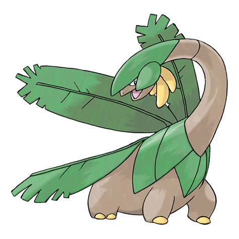
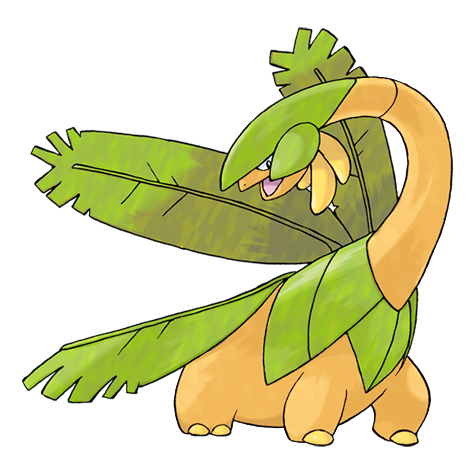
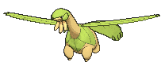
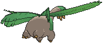
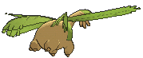

# #357 Tropius (Fruit Pokémon)

| Official Artwork | Shiny Artwork |
|------------------|---------------|
|  |  |

**Rising Ruby:** The bunches of fruit around Tropius’s neck are very popular with children. This Pokémon loves fruit, and eats it continuously. Apparently, its love for fruit resulted in its own outgrowth of fruit.

**Sinking Sapphire:** Children of the southern tropics eat as snacks the fruit that grows in bunches around the neck of Tropius. This Pokémon flies by flapping the leaves on its back as if they were wings.

---

## Media

### Default Sprites

| Front | Shiny | Back | Shiny |
|-------|-------|------|-------|
|  |  |  |  |

### Cries

Latest (Gen VI+):

<audio controls>
<source src='../../assets/cries/tropius/latest.ogg' type='audio/ogg'>
  Your browser does not support the audio element.
</audio>

Legacy:

<audio controls>
<source src='../../assets/cries/tropius/legacy.ogg' type='audio/ogg'>
  Your browser does not support the audio element.
</audio>

---

## Pokédex Data

| National № | Type(s) | Height | Weight | Abilities | Local № |
|------------|---------|--------|--------|-----------|---------|
| #357 | {: width="48"} {: width="48"} | 2.0 m / 6.6 ft | 100.0 kg / 220.5 lbs | 1. Chlorophyll 2. Solar Power | N/A |

---

## Base Stats
|   | HP | Attack | Defense | Sp. Atk | Sp. Def | Speed |
|---|----|--------|---------|---------|---------|-------|
| **Base** | 105 | 75 | 105 | 85 | 105 | 60 |
| **Min** | 320 | 139 | 193 | 157 | 193 | 112 |
| **Max** | 414 | 273 | 339 | 295 | 339 | 240 |

The ranges shown above are for a level 100 Pokémon. Maximum values are based on a beneficial nature, 252 EVs, 31 IVs; minimum values are based on a hindering nature, 0 EVs, 0 IVs.

---

## Forms & Evolutions

!!! warning "WARNING"

    Information on evolutions may not be 100% accurate; differences between evolution methods across generations are not accounted for.

### Forms

Tropius has no alternate forms.

### Evolution Line

1. [Tropius](tropius.md/)

---

## Training

| EV Yield | Catch Rate | Base Friendship | Base Exp. | Growth Rate | Held Items |
|----------|------------|-----------------|-----------|-------------|------------|
| 2 HP | 200 | 70 | 161 | Slow | N/A |

---

## Breeding

| Egg Groups | Egg Cycles | Gender | Dimorphic | Color | Shape |
|------------|------------|--------|-----------|-------|-------|
| 1. Monster 2. Plant | 25 | 50.0% Male 50.0% Female | False | Green | Quadruped |

---

## Moves

!!! warning "WARNING"

    Specific move information may be incorrect. However, the general movepool should be accurate; this includes changes made in Sacred Gold and Storm Silver.

### Level Up Moves

| Lv. | Move | Type | Cat. | Power | Acc. | PP |
| --- | --- | --- | --- | --- | --- | --- |
| 1 | Growth | {: width="48"} | {: width="36"} | — | — | 20 |
| 1 | Gust | {: width="48"} | {: width="36"} | 40 | 100 | 35 |
| 1 | Hurricane | {: width="48"} | {: width="36"} | 110 | 70 | 10 |
| 1 | Leaf Storm | {: width="48"} | {: width="36"} | 130 | 90 | 5 |
| 1 | Leer | {: width="48"} | {: width="36"} | — | 100 | 30 |
| 1 | Razor Leaf | {: width="48"} | {: width="36"} | 55 | 95 | 25 |
| 6 | Sweet Scent | {: width="48"} | {: width="36"} | — | 100 | 20 |
| 10 | Stomp | {: width="48"} | {: width="36"} | 65 | 100 | 20 |
| 14 | Magical Leaf | {: width="48"} | {: width="36"} | 60 | — | 20 |
| 18 | Whirlwind | {: width="48"} | {: width="36"} | — | — | 20 |
| 22 | Leaf Tornado | {: width="48"} | {: width="36"} | 65 | 90 | 10 |
| 26 | Air Slash | {: width="48"} | {: width="36"} | 75 | 95 | 15 |
| 30 | Giga Drain | {: width="48"} | {: width="36"} | 75 | 100 | 10 |
| 34 | Body Slam | {: width="48"} | {: width="36"} | 85 | 100 | 15 |
| 38 | Natural Gift | {: width="48"} | {: width="36"} | — | 100 | 15 |
| 42 | Dragon Pulse | {: width="48"} | {: width="36"} | 85 | 100 | 10 |
| 46 | Bestow | {: width="48"} | {: width="36"} | — | — | 15 |
| 50 | Synthesis | {: width="48"} | {: width="36"} | — | — | 5 |
| 54 | Energy Ball | {: width="48"} | {: width="36"} | 90 | 100 | 10 |
| 58 | Solar Beam | {: width="48"} | {: width="36"} | 120 | 100 | 10 |
| 62 | Leaf Storm | {: width="48"} | {: width="36"} | 130 | 90 | 5 |
| 66 | Hurricane | {: width="48"} | {: width="36"} | 110 | 70 | 10 |

### TM Moves

| TM | Move | Type | Cat. | Power | Acc. | PP |
| --- | --- | --- | --- | --- | --- | --- |
| HM01 | Cut | {: width="48"} | {: width="36"} | 70 | 100 | 15 |
| HM02 | Fly | {: width="48"} | {: width="36"} | 100 | 100 | 10 |
| HM04 | Strength | {: width="48"} | {: width="36"} | 100 | 100 | 10 |
| HM06 | Rock Smash | {: width="48"} | {: width="36"} | 65 | 100 | 15 |
| TM05 | Roar | {: width="48"} | {: width="36"} | — | — | 20 |
| TM06 | Toxic | {: width="48"} | {: width="36"} | — | 90 | 10 |
| TM10 | Hidden Power | {: width="48"} | {: width="36"} | 60 | 100 | 15 |
| TM100 | Confide | {: width="48"} | {: width="36"} | — | — | 20 |
| TM11 | Sunny Day | {: width="48"} | {: width="36"} | — | — | 5 |
| TM15 | Hyper Beam | {: width="48"} | {: width="36"} | 150 | 90 | 5 |
| TM17 | Protect | {: width="48"} | {: width="36"} | — | — | 10 |
| TM19 | Roost | {: width="48"} | {: width="36"} | — | — | 5 |
| TM20 | Safeguard | {: width="48"} | {: width="36"} | — | — | 25 |
| TM21 | Frustration | {: width="48"} | {: width="36"} | — | 100 | 20 |
| TM22 | Solar Beam | {: width="48"} | {: width="36"} | 120 | 100 | 10 |
| TM26 | Earthquake | {: width="48"} | {: width="36"} | 100 | 100 | 10 |
| TM27 | Return | {: width="48"} | {: width="36"} | — | 100 | 20 |
| TM32 | Double Team | {: width="48"} | {: width="36"} | — | — | 15 |
| TM40 | Aerial Ace | {: width="48"} | {: width="36"} | 60 | — | 20 |
| TM42 | Facade | {: width="48"} | {: width="36"} | 70 | 100 | 20 |
| TM44 | Rest | {: width="48"} | {: width="36"} | — | — | 5 |
| TM45 | Attract | {: width="48"} | {: width="36"} | — | 100 | 15 |
| TM48 | Round | {: width="48"} | {: width="36"} | 60 | 100 | 15 |
| TM51 | Steel Wing | {: width="48"} | {: width="36"} | 70 | 90 | 25 |
| TM53 | Energy Ball | {: width="48"} | {: width="36"} | 90 | 100 | 10 |
| TM68 | Giga Impact | {: width="48"} | {: width="36"} | 150 | 90 | 5 |
| TM70 | Flash | {: width="48"} | {: width="36"} | — | 100 | 20 |
| TM75 | Swords Dance | {: width="48"} | {: width="36"} | — | — | 20 |
| TM78 | Bulldoze | {: width="48"} | {: width="36"} | 60 | 100 | 20 |
| TM86 | Grass Knot | {: width="48"} | {: width="36"} | — | 100 | 20 |
| TM87 | Swagger | {: width="48"} | {: width="36"} | — | 85 | 15 |
| TM88 | Sleep Talk | {: width="48"} | {: width="36"} | — | — | 10 |
| TM90 | Substitute | {: width="48"} | {: width="36"} | — | — | 10 |
| TM94 | Secret Power | {: width="48"} | {: width="36"} | 70 | 100 | 20 |
| TM96 | Nature Power | {: width="48"} | {: width="36"} | — | — | 20 |

### Egg Moves

| Move | Type | Cat. | Power | Acc. | PP |
| --- | --- | --- | --- | --- | --- |
| Bullet Seed | {: width="48"} | {: width="36"} | 25 | 100 | 30 |
| Curse | {: width="48"} | {: width="36"} | — | — | 10 |
| Dragon Dance | {: width="48"} | {: width="36"} | — | — | 20 |
| Headbutt | {: width="48"} | {: width="36"} | 70 | 100 | 15 |
| Leaf Blade | {: width="48"} | {: width="36"} | 90 | 100 | 15 |
| Leaf Storm | {: width="48"} | {: width="36"} | 130 | 90 | 5 |
| Leech Seed | {: width="48"} | {: width="36"} | — | 90 | 10 |
| Natural Gift | {: width="48"} | {: width="36"} | — | 100 | 15 |
| Nature Power | {: width="48"} | {: width="36"} | — | — | 20 |
| Razor Wind | {: width="48"} | {: width="36"} | 80 | 100 | 10 |
| Slam | {: width="48"} | {: width="36"} | 80 | 75 | 20 |
| Synthesis | {: width="48"} | {: width="36"} | — | — | 5 |

### Tutor Moves

| Move | Type | Cat. | Power | Acc. | PP |
| --- | --- | --- | --- | --- | --- |
| Dragon Pulse | {: width="48"} | {: width="36"} | 85 | 100 | 10 |
| Giga Drain | {: width="48"} | {: width="36"} | 75 | 100 | 10 |
| Outrage | {: width="48"} | {: width="36"} | 120 | 100 | 10 |
| Seed Bomb | {: width="48"} | {: width="36"} | 80 | 100 | 15 |
| Snore | {: width="48"} | {: width="36"} | 50 | 100 | 15 |
| Synthesis | {: width="48"} | {: width="36"} | — | — | 5 |
| Tailwind | {: width="48"} | {: width="36"} | — | — | 15 |
| Worry Seed | {: width="48"} | {: width="36"} | — | 100 | 10 |

