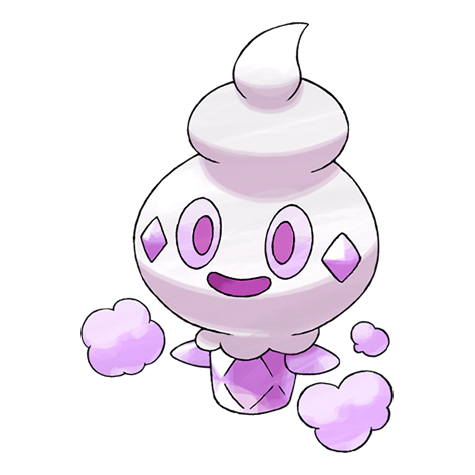
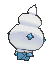

# #582 Vanillite (Fresh Snow Pokémon)

| Official Artwork | Shiny Artwork |
|------------------|---------------|
|  |  |

**Rising Ruby:** The temperature of their breath is -58 degrees Fahrenheit. They create snow crystals and make snow fall in the areas around them.

**Sinking Sapphire:** This Pokémon formed from icicles bathed in energy from the morning sun. It sleeps buried in snow.

---

## Media

### Default Sprites

| Front | Shiny | Back | Shiny |
|-------|-------|------|-------|
|  |  |  |  |

### Cries

Latest (Gen VI+):

<audio controls>
<source src='../../assets/cries/vanillite/latest.ogg' type='audio/ogg'>
  Your browser does not support the audio element.
</audio>

Legacy:

<audio controls>
<source src='../../assets/cries/vanillite/legacy.ogg' type='audio/ogg'>
  Your browser does not support the audio element.
</audio>

---

## Pokédex Data

| National № | Type(s) | Height | Weight | Abilities | Local № |
|------------|---------|--------|--------|-----------|---------|
| #582 | {: width="48"} | 0.4 m / 1.3 ft | 5.7 kg / 12.6 lbs | 1. Ice Body 2. Weak Armor | N/A |

---

## Base Stats
|   | HP | Attack | Defense | Sp. Atk | Sp. Def | Speed |
|---|----|--------|---------|---------|---------|-------|
| **Base** | 36 | 50 | 50 | 65 | 60 | 44 |
| **Min** | 182 | 94 | 94 | 121 | 112 | 83 |
| **Max** | 276 | 218 | 218 | 251 | 240 | 205 |

The ranges shown above are for a level 100 Pokémon. Maximum values are based on a beneficial nature, 252 EVs, 31 IVs; minimum values are based on a hindering nature, 0 EVs, 0 IVs.

---

## Forms & Evolutions

!!! warning "WARNING"

    Information on evolutions may not be 100% accurate; differences between evolution methods across generations are not accounted for.

### Forms

Vanillite has no alternate forms.

### Evolution Line

1. [Vanillite](vanillite.md/)
    1. Level Up: [Vanillish](vanillish.md/)
        1. Level Up: [Vanilluxe](vanilluxe.md/)

---

## Training

| EV Yield | Catch Rate | Base Friendship | Base Exp. | Growth Rate | Held Items |
|----------|------------|-----------------|-----------|-------------|------------|
| 1 Sp.-Atk | 255 | 50 | 61 | Slo |

---

## Breeding

| Egg Groups | Egg Cycles | Gender | Dimorphic | Color | Shape |
|------------|------------|--------|-----------|-------|-------|
| 1. Mineral | 20 | 50.0% Male 50.0% Female | False | White | Blob |

---

## Moves

!!! warning "WARNING"

    Specific move information may be incorrect. However, the general movepool should be accurate; this includes changes made in Sacred Gold and Storm Silver.

### Level Up Moves

| Lv. | Move | Type | Cat. | Power | Acc. | PP |
| --- | --- | --- | --- | --- | --- | --- |
| 1 | Icicle Spear | {: width="48"} | {: width="36"} | 25 | 100 | 30 |
| 4 | Harden | {: width="48"} | {: width="36"} | — | — | 30 |
| 7 | Astonish | {: width="48"} | {: width="36"} | 30 | 100 | 15 |
| 10 | Uproar | {: width="48"} | {: width="36"} | 90 | 100 | 10 |
| 13 | Icy Wind | {: width="48"} | {: width="36"} | 55 | 95 | 15 |
| 16 | Mist | {: width="48"} | {: width="36"} | — | — | 30 |
| 19 | Avalanche | {: width="48"} | {: width="36"} | 60 | 100 | 10 |
| 22 | Taunt | {: width="48"} | {: width="36"} | — | 100 | 20 |
| 25 | Mirror Shot | {: width="48"} | {: width="36"} | 65 | 85 | 10 |
| 28 | Water Pulse | {: width="48"} | {: width="36"} | 60 | 100 | 20 |
| 31 | Acid Armor | {: width="48"} | {: width="36"} | — | — | 20 |
| 34 | Ice Beam | {: width="48"} | {: width="36"} | 90 | 100 | 10 |
| 37 | Hail | {: width="48"} | {: width="36"} | — | — | 10 |
| 40 | Flash Cannon | {: width="48"} | {: width="36"} | 80 | 100 | 10 |
| 43 | Mirror Coat | {: width="48"} | {: width="36"} | — | 100 | 20 |
| 46 | Blizzard | {: width="48"} | {: width="36"} | 110 | 70 | 5 |
| 49 | Sheer Cold | {: width="48"} | {: width="36"} | — | 30 | 5 |

### TM Moves

| TM | Move | Type | Cat. | Power | Acc. | PP |
| --- | --- | --- | --- | --- | --- | --- |
| TM06 | Toxic | {: width="48"} | {: width="36"} | — | 90 | 10 |
| TM07 | Hail | {: width="48"} | {: width="36"} | — | — | 10 |
| TM10 | Hidden Power | {: width="48"} | {: width="36"} | 60 | 100 | 15 |
| TM100 | Confide | {: width="48"} | {: width="36"} | — | — | 20 |
| TM12 | Taunt | {: width="48"} | {: width="36"} | — | 100 | 20 |
| TM13 | Ice Beam | {: width="48"} | {: width="36"} | 90 | 100 | 10 |
| TM14 | Blizzard | {: width="48"} | {: width="36"} | 110 | 70 | 5 |
| TM16 | Light Screen | {: width="48"} | {: width="36"} | — | — | 30 |
| TM17 | Protect | {: width="48"} | {: width="36"} | — | — | 10 |
| TM18 | Rain Dance | {: width="48"} | {: width="36"} | — | — | 5 |
| TM21 | Frustration | {: width="48"} | {: width="36"} | — | 100 | 20 |
| TM27 | Return | {: width="48"} | {: width="36"} | — | 100 | 20 |
| TM32 | Double Team | {: width="48"} | {: width="36"} | — | — | 15 |
| TM42 | Facade | {: width="48"} | {: width="36"} | 70 | 100 | 20 |
| TM44 | Rest | {: width="48"} | {: width="36"} | — | — | 5 |
| TM45 | Attract | {: width="48"} | {: width="36"} | — | 100 | 15 |
| TM48 | Round | {: width="48"} | {: width="36"} | 60 | 100 | 15 |
| TM64 | Explosion | {: width="48"} | {: width="36"} | 250 | 100 | 5 |
| TM79 | Frost Breath | {: width="48"} | {: width="36"} | 60 | 90 | 10 |
| TM87 | Swagger | {: width="48"} | {: width="36"} | — | 85 | 15 |
| TM88 | Sleep Talk | {: width="48"} | {: width="36"} | — | — | 10 |
| TM90 | Substitute | {: width="48"} | {: width="36"} | — | — | 10 |
| TM91 | Flash Cannon | {: width="48"} | {: width="36"} | 80 | 100 | 10 |
| TM94 | Secret Power | {: width="48"} | {: width="36"} | 70 | 100 | 20 |

### Egg Moves

| Move | Type | Cat. | Power | Acc. | PP |
| --- | --- | --- | --- | --- | --- |
| Autotomize | {: width="48"} | {: width="36"} | — | — | 15 |
| Ice Shard | {: width="48"} | {: width="36"} | 40 | 100 | 30 |
| Imprison | {: width="48"} | {: width="36"} | — | — | 10 |
| Iron Defense | {: width="48"} | {: width="36"} | — | — | 15 |
| Magnet Rise | {: width="48"} | {: width="36"} | — | — | 10 |
| Natural Gift | {: width="48"} | {: width="36"} | — | 100 | 15 |
| Powder Snow | {: width="48"} | {: width="36"} | 40 | 100 | 25 |
| Water Pulse | {: width="48"} | {: width="36"} | 60 | 100 | 20 |

### Tutor Moves

| Move | Type | Cat. | Power | Acc. | PP |
| --- | --- | --- | --- | --- | --- |
| Icy Wind | {: width="48"} | {: width="36"} | 55 | 95 | 15 |
| Iron Defense | {: width="48"} | {: width="36"} | — | — | 15 |
| Magic Coat | {: width="48"} | {: width="36"} | — | — | 15 |
| Magnet Rise | {: width="48"} | {: width="36"} | — | — | 10 |
| Signal Beam | {: width="48"} | {: width="36"} | 75 | 100 | 15 |
| Snore | {: width="48"} | {: width="36"} | 50 | 100 | 15 |
| Uproar | {: width="48"} | {: width="36"} | 90 | 100 | 10 |
| Water Pulse | {: width="48"} | {: width="36"} | 60 | 100 | 20 |

