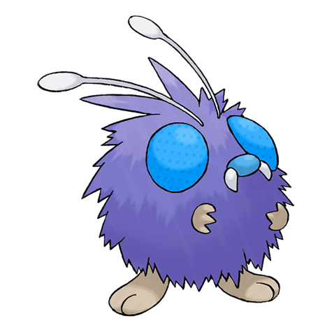
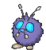
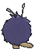
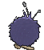

# #048 Venonat (Insect Pokémon)

| Official Artwork | Shiny Artwork |
|------------------|---------------|
|  |  |

Venonat is said to have evolved with a coat of thin, stiff hair that covers its entire body for protection. It possesses large eyes that never fail to spot even minuscule prey.

---

## Media

### Default Sprites

| Front | Shiny | Back | Shiny |
|-------|-------|------|-------|
|  |  |  |  |

### Cries

Latest (Gen VI+):

<audio controls>
<source src='../../assets/cries/venonat/latest.ogg' type='audio/ogg'>
  Your browser does not support the audio element.
</audio>

Legacy:

<audio controls>
<source src='../../assets/cries/venonat/legacy.ogg' type='audio/ogg'>
  Your browser does not support the audio element.
</audio>

---

## Pokédex Data

| National № | Type(s) | Height | Weight | Abilities | Local № |
|------------|---------|--------|--------|-----------|---------|
| #48 | {: width="48"} {: width="48"} | 1.0 m / 3.3 ft | 30.0 kg / 66.1 lbs | 1. Compound Eyes 2. Tinted Lens | N/A |

---

## Base Stats
|   | HP | Attack | Defense | Sp. Atk | Sp. Def | Speed |
|---|----|--------|---------|---------|---------|-------|
| **Base** | 60 | 55 | 50 | 40 | 55 | 45 |
| **Min** | 230 | 103 | 94 | 76 | 103 | 85 |
| **Max** | 324 | 229 | 218 | 196 | 229 | 207 |

The ranges shown above are for a level 100 Pokémon. Maximum values are based on a beneficial nature, 252 EVs, 31 IVs; minimum values are based on a hindering nature, 0 EVs, 0 IVs.

---

## Forms & Evolutions

!!! warning "WARNING"

    Information on evolutions may not be 100% accurate; differences between evolution methods across generations are not accounted for.

### Forms

Venonat has no alternate forms.

### Evolution Line

1. [Venonat](venonat.md/)
    1. Level Up: [Venomoth](venomoth.md/)

---

## Training

| EV Yield | Catch Rate | Base Friendship | Base Exp. | Growth Rate | Held Items |
|----------|------------|-----------------|-----------|-------------|------------|
| 1 Sp.-Def | 190 | 70 | 61 | Medium | N/A |

---

## Breeding

| Egg Groups | Egg Cycles | Gender | Dimorphic | Color | Shape |
|------------|------------|--------|-----------|-------|-------|
| 1. Bug | 20 | 50.0% Male 50.0% Female | False | Purple | Humanoid |

---

## Moves

!!! warning "WARNING"

    Specific move information may be incorrect. However, the general movepool should be accurate; this includes changes made in Sacred Gold and Storm Silver.

### Level Up Moves

| Lv. | Move | Type | Cat. | Power | Acc. | PP |
| --- | --- | --- | --- | --- | --- | --- |
| 1 | Disable | {: width="48"} | {: width="36"} | — | 100 | 20 |
| 1 | Foresight | {: width="48"} | {: width="36"} | — | — | 40 |
| 1 | Tackle | {: width="48"} | {: width="36"} | 40 | 100 | 35 |
| 5 | Leech Life | {: width="48"} | {: width="36"} | 80 | 100 | 10 |
| 8 | Supersonic | {: width="48"} | {: width="36"} | — | 55 | 20 |
| 11 | Poison Fang | {: width="48"} | {: width="36"} | 50 | 100 | 15 |
| 14 | Bug Bite | {: width="48"} | {: width="36"} | 60 | 100 | 20 |
| 17 | Confusion | {: width="48"} | {: width="36"} | 50 | 100 | 25 |
| 20 | Poison Powder | {: width="48"} | {: width="36"} | — | 75 | 35 |
| 23 | Stun Spore | {: width="48"} | {: width="36"} | — | 75 | 30 |
| 26 | Sleep Powder | {: width="48"} | {: width="36"} | — | 75 | 15 |
| 29 | Zen Headbutt | {: width="48"} | {: width="36"} | 80 | 90 | 15 |
| 32 | Signal Beam | {: width="48"} | {: width="36"} | 75 | 100 | 15 |
| 35 | Venoshock | {: width="48"} | {: width="36"} | 65 | 100 | 10 |
| 38 | Energy Ball | {: width="48"} | {: width="36"} | 90 | 100 | 10 |
| 41 | Psychic | {: width="48"} | {: width="36"} | 90 | 100 | 10 |

### TM Moves

| TM | Move | Type | Cat. | Power | Acc. | PP |
| --- | --- | --- | --- | --- | --- | --- |
| TM06 | Toxic | {: width="48"} | {: width="36"} | — | 90 | 10 |
| TM09 | Venoshock | {: width="48"} | {: width="36"} | 65 | 100 | 10 |
| TM10 | Hidden Power | {: width="48"} | {: width="36"} | 60 | 100 | 15 |
| TM100 | Confide | {: width="48"} | {: width="36"} | — | — | 20 |
| TM11 | Sunny Day | {: width="48"} | {: width="36"} | — | — | 5 |
| TM17 | Protect | {: width="48"} | {: width="36"} | — | — | 10 |
| TM21 | Frustration | {: width="48"} | {: width="36"} | — | 100 | 20 |
| TM22 | Solar Beam | {: width="48"} | {: width="36"} | 120 | 100 | 10 |
| TM27 | Return | {: width="48"} | {: width="36"} | — | 100 | 20 |
| TM29 | Psychic | {: width="48"} | {: width="36"} | 90 | 100 | 10 |
| TM32 | Double Team | {: width="48"} | {: width="36"} | — | — | 15 |
| TM36 | Sludge Bomb | {: width="48"} | {: width="36"} | 90 | 100 | 10 |
| TM42 | Facade | {: width="48"} | {: width="36"} | 70 | 100 | 20 |
| TM44 | Rest | {: width="48"} | {: width="36"} | — | — | 5 |
| TM45 | Attract | {: width="48"} | {: width="36"} | — | 100 | 15 |
| TM46 | Thief | {: width="48"} | {: width="36"} | 60 | 100 | 25 |
| TM48 | Round | {: width="48"} | {: width="36"} | 60 | 100 | 15 |
| TM70 | Flash | {: width="48"} | {: width="36"} | — | 100 | 20 |
| TM76 | Struggle Bug | {: width="48"} | {: width="36"} | 50 | 100 | 20 |
| TM83 | Infestation | {: width="48"} | {: width="36"} | 20 | 100 | 20 |
| TM87 | Swagger | {: width="48"} | {: width="36"} | — | 85 | 15 |
| TM88 | Sleep Talk | {: width="48"} | {: width="36"} | — | — | 10 |
| TM90 | Substitute | {: width="48"} | {: width="36"} | — | — | 10 |
| TM94 | Secret Power | {: width="48"} | {: width="36"} | 70 | 100 | 20 |

### Egg Moves

| Move | Type | Cat. | Power | Acc. | PP |
| --- | --- | --- | --- | --- | --- |
| Agility | {: width="48"} | {: width="36"} | — | — | 30 |
| Baton Pass | {: width="48"} | {: width="36"} | — | — | 40 |
| Bug Bite | {: width="48"} | {: width="36"} | 60 | 100 | 20 |
| Giga Drain | {: width="48"} | {: width="36"} | 75 | 100 | 10 |
| Morning Sun | {: width="48"} | {: width="36"} | — | — | 5 |
| Rage Powder | {: width="48"} | {: width="36"} | — | — | 20 |
| Screech | {: width="48"} | {: width="36"} | — | 85 | 40 |
| Secret Power | {: width="48"} | {: width="36"} | 70 | 100 | 20 |
| Signal Beam | {: width="48"} | {: width="36"} | 75 | 100 | 15 |
| Skill Swap | {: width="48"} | {: width="36"} | — | — | 10 |
| Toxic Spikes | {: width="48"} | {: width="36"} | — | — | 20 |

### Tutor Moves

| Move | Type | Cat. | Power | Acc. | PP |
| --- | --- | --- | --- | --- | --- |
| Bug Bite | {: width="48"} | {: width="36"} | 60 | 100 | 20 |
| Giga Drain | {: width="48"} | {: width="36"} | 75 | 100 | 10 |
| Signal Beam | {: width="48"} | {: width="36"} | 75 | 100 | 15 |
| Skill Swap | {: width="48"} | {: width="36"} | — | — | 10 |
| Snore | {: width="48"} | {: width="36"} | 50 | 100 | 15 |
| Zen Headbutt | {: width="48"} | {: width="36"} | 80 | 90 | 15 |

