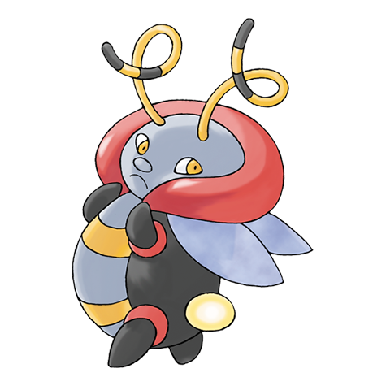
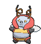

# #313 Volbeat (Firefly Pokémon)

| Official Artwork | Shiny Artwork |
|------------------|---------------|
|  |  |

**Rising Ruby:** With the arrival of night, Volbeat emits light from its tail. It communicates with others by adjusting the intensity and flashing of its light. This Pokémon is attracted by the sweet aroma of Illumise.

**Sinking Sapphire:** Volbeat’s tail glows like a lightbulb. With other Volbeat, it uses its tail to draw geometric shapes in the night sky. This Pokémon loves the sweet aroma given off by Illumise.

---

## Media

### Default Sprites

| Front | Shiny | Back | Shiny |
|-------|-------|------|-------|
|  |  |  |  |

### Cries

Latest (Gen VI+):

<audio controls>
<source src='../../assets/cries/volbeat/latest.ogg' type='audio/ogg'>
  Your browser does not support the audio element.
</audio>

Legacy:

<audio controls>
<source src='../../assets/cries/volbeat/legacy.ogg' type='audio/ogg'>
  Your browser does not support the audio element.
</audio>

---

## Pokédex Data

| National № | Type(s) | Height | Weight | Abilities | Local № |
|------------|---------|--------|--------|-----------|---------|
| #313 | {: width="48"} {: width="48"} | 0.7 m / 2.3 ft | 17.7 kg / 39.0 lbs | 1. Illuminate 2. Swarm | N/A |

---

## Base Stats
|   | HP | Attack | Defense | Sp. Atk | Sp. Def | Speed |
|---|----|--------|---------|---------|---------|-------|
| **Base** | 65 | 105 | 60 | 45 | 80 | 95 |
| **Min** | 240 | 193 | 112 | 85 | 148 | 175 |
| **Max** | 334 | 339 | 240 | 207 | 284 | 317 |

The ranges shown above are for a level 100 Pokémon. Maximum values are based on a beneficial nature, 252 EVs, 31 IVs; minimum values are based on a hindering nature, 0 EVs, 0 IVs.

---

## Forms & Evolutions

!!! warning "WARNING"

    Information on evolutions may not be 100% accurate; differences between evolution methods across generations are not accounted for.

### Forms

Volbeat has no alternate forms.

### Evolution Line

1. [Volbeat](volbeat.md/)

---

## Training

| EV Yield | Catch Rate | Base Friendship | Base Exp. | Growth Rate | Held Items |
|----------|------------|-----------------|-----------|-------------|------------|
| 1 Atk 1 Spd | 150 | 70 | 151 | Slow Then Very Fast | Bright Powder (5%) |

---

## Breeding

| Egg Groups | Egg Cycles | Gender | Dimorphic | Color | Shape |
|------------|------------|--------|-----------|-------|-------|
| 1. Bug 2. Humanshape | 15 | 100.0% Male 0.0% Female | False | Gray | Upright |

---

## Moves

!!! warning "WARNING"

    Specific move information may be incorrect. However, the general movepool should be accurate; this includes changes made in Sacred Gold and Storm Silver.

### Level Up Moves

| Lv. | Move | Type | Cat. | Power | Acc. | PP |
| --- | --- | --- | --- | --- | --- | --- |
| 1 | Acrobatics | {: width="48"} | {: width="36"} | 55 | 100 | 15 |
| 1 | Brick Break | {: width="48"} | {: width="36"} | 75 | 100 | 15 |
| 1 | Flash | {: width="48"} | {: width="36"} | — | 100 | 20 |
| 1 | Tackle | {: width="48"} | {: width="36"} | 40 | 100 | 35 |
| 1 | U Turn | {: width="48"} | {: width="36"} | 70 | 100 | 20 |
| 1 | Wild Charge | {: width="48"} | {: width="36"} | 90 | 100 | 15 |
| 5 | Double Team | {: width="48"} | {: width="36"} | — | — | 15 |
| 8 | Confuse Ray | {: width="48"} | {: width="36"} | — | 100 | 10 |
| 11 | Quick Attack | {: width="48"} | {: width="36"} | 40 | 100 | 30 |
| 14 | Bug Bite | {: width="48"} | {: width="36"} | 60 | 100 | 20 |
| 17 | Moonlight | {: width="48"} | {: width="36"} | — | — | 5 |
| 20 | Play Rough | {: width="48"} | {: width="36"} | 90 | 90 | 10 |
| 23 | Thunder Punch | {: width="48"} | {: width="36"} | 75 | 100 | 15 |
| 26 | Signal Beam | {: width="48"} | {: width="36"} | 75 | 100 | 15 |
| 29 | Thunder Wave | {: width="48"} | {: width="36"} | — | 90 | 20 |
| 32 | Zen Headbutt | {: width="48"} | {: width="36"} | 80 | 90 | 15 |
| 35 | Tail Glow | {: width="48"} | {: width="36"} | — | — | 20 |
| 38 | Bug Buzz | {: width="48"} | {: width="36"} | 90 | 100 | 10 |
| 41 | Protect | {: width="48"} | {: width="36"} | — | — | 10 |
| 44 | Helping Hand | {: width="48"} | {: width="36"} | — | — | 20 |
| 47 | Moonblast | {: width="48"} | {: width="36"} | 95 | 100 | 15 |
| 50 | Double Edge | {: width="48"} | {: width="36"} | 120 | 100 | 15 |
| 53 | Wild Charge | {: width="48"} | {: width="36"} | 90 | 100 | 15 |

### TM Moves

| TM | Move | Type | Cat. | Power | Acc. | PP |
| --- | --- | --- | --- | --- | --- | --- |
| TM06 | Toxic | {: width="48"} | {: width="36"} | — | 90 | 10 |
| TM10 | Hidden Power | {: width="48"} | {: width="36"} | 60 | 100 | 15 |
| TM100 | Confide | {: width="48"} | {: width="36"} | — | — | 20 |
| TM11 | Sunny Day | {: width="48"} | {: width="36"} | — | — | 5 |
| TM16 | Light Screen | {: width="48"} | {: width="36"} | — | — | 30 |
| TM17 | Protect | {: width="48"} | {: width="36"} | — | — | 10 |
| TM18 | Rain Dance | {: width="48"} | {: width="36"} | — | — | 5 |
| TM19 | Roost | {: width="48"} | {: width="36"} | — | — | 5 |
| TM21 | Frustration | {: width="48"} | {: width="36"} | — | 100 | 20 |
| TM22 | Solar Beam | {: width="48"} | {: width="36"} | 120 | 100 | 10 |
| TM24 | Thunderbolt | {: width="48"} | {: width="36"} | 90 | 100 | 15 |
| TM25 | Thunder | {: width="48"} | {: width="36"} | 110 | 70 | 10 |
| TM27 | Return | {: width="48"} | {: width="36"} | — | 100 | 20 |
| TM30 | Shadow Ball | {: width="48"} | {: width="36"} | 80 | 100 | 15 |
| TM31 | Brick Break | {: width="48"} | {: width="36"} | 75 | 100 | 15 |
| TM32 | Double Team | {: width="48"} | {: width="36"} | — | — | 15 |
| TM40 | Aerial Ace | {: width="48"} | {: width="36"} | 60 | — | 20 |
| TM42 | Facade | {: width="48"} | {: width="36"} | 70 | 100 | 20 |
| TM44 | Rest | {: width="48"} | {: width="36"} | — | — | 5 |
| TM45 | Attract | {: width="48"} | {: width="36"} | — | 100 | 15 |
| TM46 | Thief | {: width="48"} | {: width="36"} | 60 | 100 | 25 |
| TM48 | Round | {: width="48"} | {: width="36"} | 60 | 100 | 15 |
| TM56 | Fling | {: width="48"} | {: width="36"} | — | 100 | 10 |
| TM57 | Charge Beam | {: width="48"} | {: width="36"} | 50 | 90 | 10 |
| TM62 | Acrobatics | {: width="48"} | {: width="36"} | 55 | 100 | 15 |
| TM70 | Flash | {: width="48"} | {: width="36"} | — | 100 | 20 |
| TM73 | Thunder Wave | {: width="48"} | {: width="36"} | — | 90 | 20 |
| TM76 | Struggle Bug | {: width="48"} | {: width="36"} | 50 | 100 | 20 |
| TM77 | Psych Up | {: width="48"} | {: width="36"} | — | — | 10 |
| TM87 | Swagger | {: width="48"} | {: width="36"} | — | 85 | 15 |
| TM88 | Sleep Talk | {: width="48"} | {: width="36"} | — | — | 10 |
| TM89 | U Turn | {: width="48"} | {: width="36"} | 70 | 100 | 20 |
| TM90 | Substitute | {: width="48"} | {: width="36"} | — | — | 10 |
| TM93 | Wild Charge | {: width="48"} | {: width="36"} | 90 | 100 | 15 |
| TM94 | Secret Power | {: width="48"} | {: width="36"} | 70 | 100 | 20 |
| TM98 | Power Up Punch | {: width="48"} | {: width="36"} | 40 | 100 | 20 |
| TM99 | Dazzling Gleam | {: width="48"} | {: width="36"} | 80 | 100 | 10 |

### Egg Moves

| Move | Type | Cat. | Power | Acc. | PP |
| --- | --- | --- | --- | --- | --- |
| Baton Pass | {: width="48"} | {: width="36"} | — | — | 40 |
| Bug Buzz | {: width="48"} | {: width="36"} | 90 | 100 | 10 |
| Dizzy Punch | {: width="48"} | {: width="36"} | 70 | 100 | 10 |
| Encore | {: width="48"} | {: width="36"} | — | 100 | 5 |
| Seismic Toss | {: width="48"} | {: width="36"} | — | 100 | 20 |
| Silver Wind | {: width="48"} | {: width="36"} | 60 | 100 | 5 |
| Trick | {: width="48"} | {: width="36"} | — | 100 | 10 |

### Tutor Moves

| Move | Type | Cat. | Power | Acc. | PP |
| --- | --- | --- | --- | --- | --- |
| Bug Bite | {: width="48"} | {: width="36"} | 60 | 100 | 20 |
| Focus Punch | {: width="48"} | {: width="36"} | 150 | 100 | 20 |
| Giga Drain | {: width="48"} | {: width="36"} | 75 | 100 | 10 |
| Helping Hand | {: width="48"} | {: width="36"} | — | — | 20 |
| Ice Punch | {: width="48"} | {: width="36"} | 75 | 100 | 15 |
| Shock Wave | {: width="48"} | {: width="36"} | 60 | — | 20 |
| Signal Beam | {: width="48"} | {: width="36"} | 75 | 100 | 15 |
| Snore | {: width="48"} | {: width="36"} | 50 | 100 | 15 |
| Tailwind | {: width="48"} | {: width="36"} | — | — | 15 |
| Thunder Punch | {: width="48"} | {: width="36"} | 75 | 100 | 15 |
| Trick | {: width="48"} | {: width="36"} | — | 100 | 10 |
| Water Pulse | {: width="48"} | {: width="36"} | 60 | 100 | 20 |
| Zen Headbutt | {: width="48"} | {: width="36"} | 80 | 90 | 15 |

