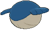
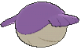

# #320 Wailmer (Ball Whale Pokémon)

| Official Artwork | Shiny Artwork |
|------------------|---------------|
|  |  |

**Rising Ruby:** Wailmer’s nostrils are located above its eyes. This playful Pokémon loves to startle people by forcefully snorting out seawater it stores inside its body out of its nostrils.

**Sinking Sapphire:** Wailmer can store water inside its body to transform itself into a ball for bouncing around on the ground. By filling itself up with more water, this Pokémon can elevate the height of its bounces.

---

## Media

### Default Sprites

| Front | Shiny | Back | Shiny |
|-------|-------|------|-------|
|  |  |  |  |

### Cries

Latest (Gen VI+):

<audio controls>
<source src='../../assets/cries/wailmer/latest.ogg' type='audio/ogg'>
  Your browser does not support the audio element.
</audio>

Legacy:

<audio controls>
<source src='../../assets/cries/wailmer/legacy.ogg' type='audio/ogg'>
  Your browser does not support the audio element.
</audio>

---

## Pokédex Data

| National № | Type(s) | Height | Weight | Abilities | Local № |
|------------|---------|--------|--------|-----------|---------|
| #320 | {: width="48"} | 2.0 m / 6.6 ft | 130.0 kg / 286.6 lbs | 1. Water Veil 2. Oblivious | N/A |

---

## Base Stats
|   | HP | Attack | Defense | Sp. Atk | Sp. Def | Speed |
|---|----|--------|---------|---------|---------|-------|
| **Base** | 130 | 70 | 35 | 70 | 35 | 60 |
| **Min** | 370 | 130 | 67 | 130 | 67 | 112 |
| **Max** | 464 | 262 | 185 | 262 | 185 | 240 |

The ranges shown above are for a level 100 Pokémon. Maximum values are based on a beneficial nature, 252 EVs, 31 IVs; minimum values are based on a hindering nature, 0 EVs, 0 IVs.

---

## Forms & Evolutions

!!! warning "WARNING"

    Information on evolutions may not be 100% accurate; differences between evolution methods across generations are not accounted for.

### Forms

Wailmer has no alternate forms.

### Evolution Line

1. [Wailmer](wailmer.md/)
    1. Level Up: [Wailord](wailord.md/)

---

## Training

| EV Yield | Catch Rate | Base Friendship | Base Exp. | Growth Rate | Held Items |
|----------|------------|-----------------|-----------|-------------|------------|
| 1 HP | 125 | 50 | 80 | Fast Then Very Slow | N/A |

---

## Breeding

| Egg Groups | Egg Cycles | Gender | Dimorphic | Color | Shape |
|------------|------------|--------|-----------|-------|-------|
| 1. Ground 2. Water2 | 40 | 50.0% Male 50.0% Female | False | Blue | Fish |

---

## Moves

!!! warning "WARNING"

    Specific move information may be incorrect. However, the general movepool should be accurate; this includes changes made in Sacred Gold and Storm Silver.

### Level Up Moves

| Lv. | Move | Type | Cat. | Power | Acc. | PP |
| --- | --- | --- | --- | --- | --- | --- |
| 1 | Splash | {: width="48"} | {: width="36"} | — | — | 40 |
| 4 | Growl | {: width="48"} | {: width="36"} | — | 100 | 40 |
| 7 | Water Gun | {: width="48"} | {: width="36"} | 40 | 100 | 25 |
| 10 | Rollout | {: width="48"} | {: width="36"} | 30 | 90 | 20 |
| 13 | Whirlpool | {: width="48"} | {: width="36"} | 35 | 85 | 15 |
| 16 | Astonish | {: width="48"} | {: width="36"} | 30 | 100 | 15 |
| 19 | Water Pulse | {: width="48"} | {: width="36"} | 60 | 100 | 20 |
| 22 | Mist | {: width="48"} | {: width="36"} | — | — | 30 |
| 25 | Brine | {: width="48"} | {: width="36"} | 65 | 100 | 10 |
| 28 | Rest | {: width="48"} | {: width="36"} | — | — | 5 |
| 31 | Body Slam | {: width="48"} | {: width="36"} | 85 | 100 | 15 |
| 34 | Dive | {: width="48"} | {: width="36"} | 80 | 100 | 10 |
| 37 | Zen Headbutt | {: width="48"} | {: width="36"} | 80 | 90 | 15 |
| 40 | Amnesia | {: width="48"} | {: width="36"} | — | — | 20 |
| 43 | Water Spout | {: width="48"} | {: width="36"} | 150 | 100 | 5 |
| 46 | Bounce | {: width="48"} | {: width="36"} | 85 | 85 | 5 |
| 49 | Hydro Pump | {: width="48"} | {: width="36"} | 110 | 80 | 5 |
| 52 | Double Edge | {: width="48"} | {: width="36"} | 120 | 100 | 15 |
| 55 | Fissure | {: width="48"} | {: width="36"} | — | 30 | 5 |
| 58 | Heavy Slam | {: width="48"} | {: width="36"} | — | 100 | 10 |

### TM Moves

| TM | Move | Type | Cat. | Power | Acc. | PP |
| --- | --- | --- | --- | --- | --- | --- |
| HM03 | Surf | {: width="48"} | {: width="36"} | 90 | 100 | 15 |
| HM04 | Strength | {: width="48"} | {: width="36"} | 100 | 100 | 10 |
| HM05 | Waterfall | {: width="48"} | {: width="36"} | 80 | 100 | 15 |
| HM06 | Rock Smash | {: width="48"} | {: width="36"} | 65 | 100 | 15 |
| HM07 | Dive | {: width="48"} | {: width="36"} | 80 | 100 | 10 |
| TM05 | Roar | {: width="48"} | {: width="36"} | — | — | 20 |
| TM06 | Toxic | {: width="48"} | {: width="36"} | — | 90 | 10 |
| TM07 | Hail | {: width="48"} | {: width="36"} | — | — | 10 |
| TM10 | Hidden Power | {: width="48"} | {: width="36"} | 60 | 100 | 15 |
| TM100 | Confide | {: width="48"} | {: width="36"} | — | — | 20 |
| TM13 | Ice Beam | {: width="48"} | {: width="36"} | 90 | 100 | 10 |
| TM14 | Blizzard | {: width="48"} | {: width="36"} | 110 | 70 | 5 |
| TM17 | Protect | {: width="48"} | {: width="36"} | — | — | 10 |
| TM18 | Rain Dance | {: width="48"} | {: width="36"} | — | — | 5 |
| TM21 | Frustration | {: width="48"} | {: width="36"} | — | 100 | 20 |
| TM26 | Earthquake | {: width="48"} | {: width="36"} | 100 | 100 | 10 |
| TM27 | Return | {: width="48"} | {: width="36"} | — | 100 | 20 |
| TM32 | Double Team | {: width="48"} | {: width="36"} | — | — | 15 |
| TM39 | Rock Tomb | {: width="48"} | {: width="36"} | 60 | 95 | 15 |
| TM42 | Facade | {: width="48"} | {: width="36"} | 70 | 100 | 20 |
| TM44 | Rest | {: width="48"} | {: width="36"} | — | — | 5 |
| TM45 | Attract | {: width="48"} | {: width="36"} | — | 100 | 15 |
| TM48 | Round | {: width="48"} | {: width="36"} | 60 | 100 | 15 |
| TM49 | Echoed Voice | {: width="48"} | {: width="36"} | 40 | 100 | 15 |
| TM55 | Scald | {: width="48"} | {: width="36"} | 80 | 100 | 15 |
| TM78 | Bulldoze | {: width="48"} | {: width="36"} | 60 | 100 | 20 |
| TM87 | Swagger | {: width="48"} | {: width="36"} | — | 85 | 15 |
| TM88 | Sleep Talk | {: width="48"} | {: width="36"} | — | — | 10 |
| TM90 | Substitute | {: width="48"} | {: width="36"} | — | — | 10 |
| TM94 | Secret Power | {: width="48"} | {: width="36"} | 70 | 100 | 20 |

### Egg Moves

| Move | Type | Cat. | Power | Acc. | PP |
| --- | --- | --- | --- | --- | --- |
| Aqua Ring | {: width="48"} | {: width="36"} | — | — | 20 |
| Body Slam | {: width="48"} | {: width="36"} | 85 | 100 | 15 |
| Clear Smog | {: width="48"} | {: width="36"} | 50 | — | 15 |
| Curse | {: width="48"} | {: width="36"} | — | — | 10 |
| Defense Curl | {: width="48"} | {: width="36"} | — | — | 40 |
| Double Edge | {: width="48"} | {: width="36"} | 120 | 100 | 15 |
| Fissure | {: width="48"} | {: width="36"} | — | 30 | 5 |
| Sleep Talk | {: width="48"} | {: width="36"} | — | — | 10 |
| Snore | {: width="48"} | {: width="36"} | 50 | 100 | 15 |
| Soak | {: width="48"} | {: width="36"} | — | 100 | 20 |
| Thrash | {: width="48"} | {: width="36"} | 120 | 100 | 10 |
| Tickle | {: width="48"} | {: width="36"} | — | 100 | 20 |
| Zen Headbutt | {: width="48"} | {: width="36"} | 80 | 90 | 15 |

### Tutor Moves

| Move | Type | Cat. | Power | Acc. | PP |
| --- | --- | --- | --- | --- | --- |
| Bounce | {: width="48"} | {: width="36"} | 85 | 85 | 5 |
| Hyper Voice | {: width="48"} | {: width="36"} | 90 | 100 | 10 |
| Icy Wind | {: width="48"} | {: width="36"} | 55 | 95 | 15 |
| Snore | {: width="48"} | {: width="36"} | 50 | 100 | 15 |
| Water Pulse | {: width="48"} | {: width="36"} | 60 | 100 | 20 |
| Zen Headbutt | {: width="48"} | {: width="36"} | 80 | 90 | 15 |

