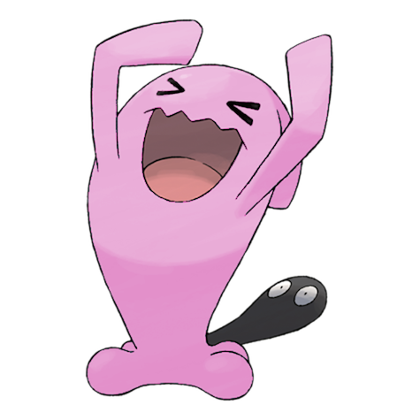

# #202 Wobbuffet (Patient Pokémon)

| Official Artwork | Shiny Artwork |
|------------------|---------------|
|  |  |

**Rising Ruby:** If two or more Wobbuffet meet, they will turn competitive and try to outdo each other’s endurance. However, they may try to see which one can endure the longest without food. Trainers need to beware of this habit.

**Sinking Sapphire:** Wobbuffet does nothing but endure attacks—it won’t attack on its own. However, it won’t endure an attack on its tail. When that happens, the Pokémon will try to take the foe with it using Destiny Bond.

---

## Media

### Default Sprites

| Front | Shiny | Back | Shiny |
|-------|-------|------|-------|
|  |  |  |  |

### Female Sprites

| Front | Shiny | Back | Shiny |
|-------|-------|------|-------|
|  |  |  |  |

### Cries

Latest (Gen VI+):

<audio controls>
<source src='../../assets/cries/wobbuffet/latest.ogg' type='audio/ogg'>
  Your browser does not support the audio element.
</audio>

Legacy:

<audio controls>
<source src='../../assets/cries/wobbuffet/legacy.ogg' type='audio/ogg'>
  Your browser does not support the audio element.
</audio>

---

## Pokédex Data

| National № | Type(s) | Height | Weight | Abilities | Local № |
|------------|---------|--------|--------|-----------|---------|
| #202 | {: width="48"} | 1.3 m / 4.3 ft | 28.5 kg / 62.8 lbs | 1. Shadow Tag 2. Telepathy | N/A |

---

## Base Stats
|   | HP | Attack | Defense | Sp. Atk | Sp. Def | Speed |
|---|----|--------|---------|---------|---------|-------|
| **Base** | 240 | 30 | 60 | 30 | 60 | 30 |
| **Min** | 590 | 58 | 112 | 58 | 112 | 58 |
| **Max** | 684 | 174 | 240 | 174 | 240 | 174 |

The ranges shown above are for a level 100 Pokémon. Maximum values are based on a beneficial nature, 252 EVs, 31 IVs; minimum values are based on a hindering nature, 0 EVs, 0 IVs.

---

## Forms & Evolutions

!!! warning "WARNING"

    Information on evolutions may not be 100% accurate; differences between evolution methods across generations are not accounted for.

### Forms

Wobbuffet has no alternate forms.

### Evolution Line

1. [Wynaut](wynaut.md/)
    1. Level Up: [Wobbuffet](wobbuffet.md/)

---

## Training

| EV Yield | Catch Rate | Base Friendship | Base Exp. | Growth Rate | Held Items |
|----------|------------|-----------------|-----------|-------------|------------|
| 2 HP | 45 | 50 | 142 | Medium | N/A |

---

## Breeding

| Egg Groups | Egg Cycles | Gender | Dimorphic | Color | Shape |
|------------|------------|--------|-----------|-------|-------|
| 1. Indeterminate | 20 | 50.0% Male 50.0% Female | True | Blue | Blob |

---

## Moves

!!! warning "WARNING"

    Specific move information may be incorrect. However, the general movepool should be accurate; this includes changes made in Sacred Gold and Storm Silver.

### Level Up Moves

| Lv. | Move | Type | Cat. | Power | Acc. | PP |
| --- | --- | --- | --- | --- | --- | --- |
| 1 | Counter | {: width="48"} | {: width="36"} | — | 100 | 20 |
| 1 | Destiny Bond | {: width="48"} | {: width="36"} | — | — | 5 |
| 1 | Mirror Coat | {: width="48"} | {: width="36"} | — | 100 | 20 |
| 1 | Safeguard | {: width="48"} | {: width="36"} | — | — | 25 |
| 15 | Mimic | {: width="48"} | {: width="36"} | — | — | 10 |

### TM Moves

| TM | Move | Type | Cat. | Power | Acc. | PP |
| --- | --- | --- | --- | --- | --- | --- |
| TM20 | Safeguard | {: width="48"} | {: width="36"} | — | — | 25 |

### Egg Moves

Wobbuffet cannot learn any moves by breeding.
### Tutor Moves

Wobbuffet cannot learn any moves from tutors.
