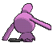

# #360 Wynaut (Bright Pokémon)

| Official Artwork | Shiny Artwork |
|------------------|---------------|
|  |  |

**Rising Ruby:** Wynaut can always be seen with a big, happy smile on its face. Look at its tail to determine if it is angry. When angered, this Pokémon will be slapping the ground with its tail.

**Sinking Sapphire:** Wynaut gather on moonlit nights to play by squeezing up against each other. By being squeezed, this Pokémon gains endurance and is trained to dole out powerful counterattacks.

---

## Media

### Default Sprites

| Front | Shiny | Back | Shiny |
|-------|-------|------|-------|
|  |  |  |  |

### Cries

Latest (Gen VI+):

<audio controls>
<source src='../../assets/cries/wynaut/latest.ogg' type='audio/ogg'>
  Your browser does not support the audio element.
</audio>

Legacy:

<audio controls>
<source src='../../assets/cries/wynaut/legacy.ogg' type='audio/ogg'>
  Your browser does not support the audio element.
</audio>

---

## Pokédex Data

| National № | Type(s) | Height | Weight | Abilities | Local № |
|------------|---------|--------|--------|-----------|---------|
| #360 | {: width="48"} | 0.6 m / 2.0 ft | 14.0 kg / 30.9 lbs | 1. Shadow Tag 3. Telepathy | N/A |

---

## Base Stats
|   | HP | Attack | Defense | Sp. Atk | Sp. Def | Speed |
|---|----|--------|---------|---------|---------|-------|
| **Base** | 95 | 23 | 48 | 23 | 48 | 23 |
| **Min** | 300 | 45 | 90 | 45 | 90 | 45 |
| **Max** | 394 | 159 | 214 | 159 | 214 | 159 |

The ranges shown above are for a level 100 Pokémon. Maximum values are based on a beneficial nature, 252 EVs, 31 IVs; minimum values are based on a hindering nature, 0 EVs, 0 IVs.

---

## Forms & Evolutions

!!! warning "WARNING"

    Information on evolutions may not be 100% accurate; differences between evolution methods across generations are not accounted for.

### Forms

Wynaut has no alternate forms.

### Evolution Line

1. [Wynaut](wynaut.md/)
    1. Level Up: [Wobbuffet](wobbuffet.md/)

---

## Training

| EV Yield | Catch Rate | Base Friendship | Base Exp. | Growth Rate | Held Items |
|----------|------------|-----------------|-----------|-------------|------------|
| 1 HP | 125 | 50 | 52 | Medium | N/A |

---

## Breeding

| Egg Groups | Egg Cycles | Gender | Dimorphic | Color | Shape |
|------------|------------|--------|-----------|-------|-------|
| 1. No-Eggs | 20 | 50.0% Male 50.0% Female | False | Blue | Upright |

---

## Moves

!!! warning "WARNING"

    Specific move information may be incorrect. However, the general movepool should be accurate; this includes changes made in Sacred Gold and Storm Silver.

### Level Up Moves

| Lv. | Move | Type | Cat. | Power | Acc. | PP |
| --- | --- | --- | --- | --- | --- | --- |
| 1 | Charm | {: width="48"} | {: width="36"} | — | 100 | 20 |
| 1 | Encore | {: width="48"} | {: width="36"} | — | 100 | 5 |
| 1 | Splash | {: width="48"} | {: width="36"} | — | — | 40 |
| 15 | Counter | {: width="48"} | {: width="36"} | — | 100 | 20 |
| 15 | Destiny Bond | {: width="48"} | {: width="36"} | — | — | 5 |
| 15 | Mirror Coat | {: width="48"} | {: width="36"} | — | 100 | 20 |
| 15 | Safeguard | {: width="48"} | {: width="36"} | — | — | 25 |

### TM Moves

| TM | Move | Type | Cat. | Power | Acc. | PP |
| --- | --- | --- | --- | --- | --- | --- |
| TM20 | Safeguard | {: width="48"} | {: width="36"} | — | — | 25 |

### Egg Moves

Wynaut cannot learn any moves by breeding.
### Tutor Moves

Wynaut cannot learn any moves from tutors.
