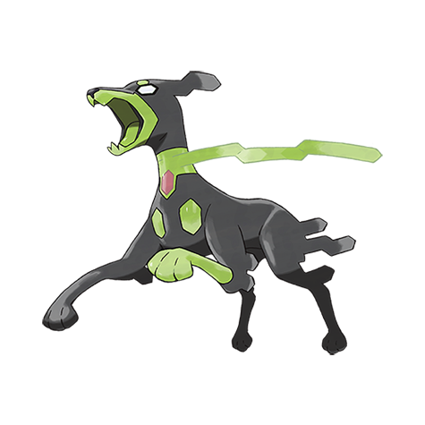

# Zygarde 10 (Order Pokémon)

| Official Artwork | Shiny Artwork |
|------------------|---------------|
|  |  |

**Rising Ruby:** When the Kalos region’s ecosystem falls into disarray, it appears and reveals its secret power.

**Sinking Sapphire:** It’s hypothesized that it’s monitoring those who destroy the ecosystem from deep in the cave where it lives.

---

## Media

### Default Sprites

| Front | Shiny | Back | Shiny |
|-------|-------|------|-------|
|  |  |  |  |

### Cries

Latest (Gen VI+):

<audio controls>
<source src='../../assets/cries/zygarde-10/latest.ogg' type='audio/ogg'>
  Your browser does not support the audio element.
</audio>

Legacy:

<audio controls>
<source src='../../assets/cries/zygarde-10/legacy.ogg' type='audio/ogg'>
  Your browser does not support the audio element.
</audio>

---

## Pokédex Data

| National № | Type(s) | Height | Weight | Abilities | Local № |
|------------|---------|--------|--------|-----------|---------|
| #10181 | {: width="48"} {: width="48"} | 1.2 m / 3.9 ft | 33.5 kg / 73.9 lbs | 1. Aura Break | N/A |

---

## Base Stats
|   | HP | Attack | Defense | Sp. Atk | Sp. Def | Speed |
|---|----|--------|---------|---------|---------|-------|
| **Base** | 54 | 100 | 71 | 61 | 85 | 115 |
| **Min** | 218 | 184 | 132 | 114 | 157 | 211 |
| **Max** | 312 | 328 | 265 | 243 | 295 | 361 |

The ranges shown above are for a level 100 Pokémon. Maximum values are based on a beneficial nature, 252 EVs, 31 IVs; minimum values are based on a hindering nature, 0 EVs, 0 IVs.

---

## Forms & Evolutions

!!! warning "WARNING"

    Information on evolutions may not be 100% accurate; differences between evolution methods across generations are not accounted for.

### Forms

1. [Zygarde 50](zygarde-50.md/)

2. [Zygarde 10 Power Construct](zygarde-10-power-construct.md/)

3. [Zygarde 50 Power Construct](zygarde-50-power-construct.md/)

4. [Zygarde Complete](zygarde-complete.md/)

5. [Zygarde 10](zygarde-10.md/)

### Evolution Line

1. [Zygarde 10 Power Construct](zygarde-10-power-construct.md/)

1. [Zygarde 10](zygarde-10.md/)

1. [Zygarde 50 Power Construct](zygarde-50-power-construct.md/)

1. [Zygarde 50](zygarde-50.md/)

1. [Zygarde Complete](zygarde-complete.md/)

---

## Training

| EV Yield | Catch Rate | Base Friendship | Base Exp. | Growth Rate | Held Items |
|----------|------------|-----------------|-----------|-------------|------------|
| 3 HP | 3 | 0 | 243 | Slow | N/A |

---

## Breeding

| Egg Groups | Egg Cycles | Gender | Dimorphic | Color | Shape |
|------------|------------|--------|-----------|-------|-------|
| 1. No-Eggs | 120 | Genderless | False | Green | Squiggle |

---

## Moves

!!! warning "WARNING"

    Specific move information may be incorrect. However, the general movepool should be accurate; this includes changes made in Sacred Gold and Storm Silver.

### Level Up Moves

| Lv. | Move | Type | Cat. | Power | Acc. | PP |
| --- | --- | --- | --- | --- | --- | --- |
| 1 | Bind | {: width="48"} | {: width="36"} | 15 | 85 | 20 |
| 1 | Bite | {: width="48"} | {: width="36"} | 60 | 100 | 25 |
| 1 | Bulldoze | {: width="48"} | {: width="36"} | 60 | 100 | 20 |
| 1 | Core Enforcer | {: width="48"} | {: width="36"} | 100 | 100 | 10 |
| 1 | Dragon Breath | {: width="48"} | {: width="36"} | 60 | 100 | 20 |
| 1 | Thousand Arrows | {: width="48"} | {: width="36"} | 90 | 100 | 10 |
| 1 | Thousand Waves | {: width="48"} | {: width="36"} | 90 | 100 | 10 |
| 8 | Haze | {: width="48"} | {: width="36"} | — | — | 30 |
| 16 | Dig | {: width="48"} | {: width="36"} | 80 | 100 | 10 |
| 24 | Safeguard | {: width="48"} | {: width="36"} | — | — | 25 |
| 32 | Crunch | {: width="48"} | {: width="36"} | 80 | 100 | 15 |
| 40 | Dragon Pulse | {: width="48"} | {: width="36"} | 85 | 100 | 10 |
| 48 | Lands Wrath | {: width="48"} | {: width="36"} | 90 | 100 | 10 |
| 56 | Glare | {: width="48"} | {: width="36"} | — | 100 | 30 |
| 64 | Sandstorm | {: width="48"} | {: width="36"} | — | — | 10 |
| 72 | Coil | {: width="48"} | {: width="36"} | — | — | 20 |
| 80 | Earthquake | {: width="48"} | {: width="36"} | 100 | 100 | 10 |
| 88 | Outrage | {: width="48"} | {: width="36"} | 120 | 100 | 10 |

### TM Moves

| TM | Move | Type | Cat. | Power | Acc. | PP |
| --- | --- | --- | --- | --- | --- | --- |
| TM08 | Hyper Beam | {: width="48"} | {: width="36"} | 150 | 90 | 5 |
| TM09 | Giga Impact | {: width="48"} | {: width="36"} | 150 | 90 | 5 |
| TM15 | Dig | {: width="48"} | {: width="36"} | 80 | 100 | 10 |
| TM19 | Safeguard | {: width="48"} | {: width="36"} | — | — | 25 |
| TM21 | Rest | {: width="48"} | {: width="36"} | — | — | 5 |
| TM22 | Rock Slide | {: width="48"} | {: width="36"} | 75 | 90 | 10 |
| TM24 | Snore | {: width="48"} | {: width="36"} | 50 | 100 | 15 |
| TM25 | Protect | {: width="48"} | {: width="36"} | — | — | 10 |
| TM32 | Sandstorm | {: width="48"} | {: width="36"} | — | — | 10 |
| TM34 | Sunny Day | {: width="48"} | {: width="36"} | — | — | 5 |
| TM39 | Facade | {: width="48"} | {: width="36"} | 70 | 100 | 20 |
| TM40 | Swift | {: width="48"} | {: width="36"} | 60 | — | 20 |
| TM43 | Brick Break | {: width="48"} | {: width="36"} | 75 | 100 | 15 |
| TM57 | Payback | {: width="48"} | {: width="36"} | 50 | 100 | 10 |
| TM76 | Round | {: width="48"} | {: width="36"} | 60 | 100 | 15 |
| TM79 | Retaliate | {: width="48"} | {: width="36"} | 70 | 100 | 5 |
| TM81 | Bulldoze | {: width="48"} | {: width="36"} | 60 | 100 | 20 |
| TM98 | Stomping Tantrum | {: width="48"} | {: width="36"} | 75 | 100 | 10 |
| TM99 | Breaking Swipe | {: width="48"} | {: width="36"} | 60 | 100 | 15 |
| TR01 | Body Slam | {: width="48"} | {: width="36"} | 85 | 100 | 15 |
| TR10 | Earthquake | {: width="48"} | {: width="36"} | 100 | 100 | 10 |
| TR20 | Substitute | {: width="48"} | {: width="36"} | — | — | 10 |
| TR21 | Reversal | {: width="48"} | {: width="36"} | — | 100 | 15 |
| TR24 | Outrage | {: width="48"} | {: width="36"} | 120 | 100 | 10 |
| TR26 | Endure | {: width="48"} | {: width="36"} | — | — | 10 |
| TR27 | Sleep Talk | {: width="48"} | {: width="36"} | — | — | 10 |
| TR31 | Iron Tail | {: width="48"} | {: width="36"} | 100 | 75 | 15 |
| TR32 | Crunch | {: width="48"} | {: width="36"} | 80 | 100 | 15 |
| TR39 | Superpower | {: width="48"} | {: width="36"} | 120 | 100 | 5 |
| TR42 | Hyper Voice | {: width="48"} | {: width="36"} | 90 | 100 | 10 |
| TR51 | Dragon Dance | {: width="48"} | {: width="36"} | — | — | 20 |
| TR62 | Dragon Pulse | {: width="48"} | {: width="36"} | 85 | 100 | 10 |
| TR64 | Focus Blast | {: width="48"} | {: width="36"} | 120 | 70 | 5 |
| TR67 | Earth Power | {: width="48"} | {: width="36"} | 90 | 100 | 10 |
| TR69 | Zen Headbutt | {: width="48"} | {: width="36"} | 80 | 90 | 15 |
| TR75 | Stone Edge | {: width="48"} | {: width="36"} | 100 | 80 | 5 |
| TR77 | Grass Knot | {: width="48"} | {: width="36"} | — | 100 | 20 |
| TR78 | Sludge Wave | {: width="48"} | {: width="36"} | 95 | 100 | 10 |
| TR94 | High Horsepower | {: width="48"} | {: width="36"} | 95 | 95 | 10 |

### Egg Moves

Zygarde 10 cannot learn any moves by breeding.
### Tutor Moves

| Move | Type | Cat. | Power | Acc. | PP |
| --- | --- | --- | --- | --- | --- |
| Draco Meteor | {: width="48"} | {: width="36"} | 130 | 90 | 5 |
| Scale Shot | {: width="48"} | {: width="36"} | 25 | 90 | 20 |
| Scorching Sands | {: width="48"} | {: width="36"} | 70 | 100 | 10 |
| Skitter Smack | {: width="48"} | {: width="36"} | 70 | 90 | 10 |

