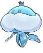

# Aqua Hideout — Trainer Pokémon

---

## [ Main Area ]

### Trainer Rosters

### Special Battles

| Trainer | P1 | P2 | P3 | P4 | P5 | P6 |
|:-------:|:--:|:--:|:--:|:--:|:--:|:--:|

---

## [ Main Area (Postgame) ]

### Trainer Rosters

| Trainer | P1 | P2 | P3 |
|:-------:|:--:|:--:|:--:|
|  Team Aqua Grunt [021] | 
 [Liepard](../../pokemon/liepard.md) Lv. 75
 | 
 [Cradily](../../pokemon/cradily.md) Lv. 75
 | 
 [Lumineon](../../pokemon/lumineon.md) Lv. 75
 |
|  Team Aqua Grunt [861] | 
 [Ledian](../../pokemon/ledian.md) Lv. 75
 | 
 [Sharpedo](../../pokemon/sharpedo.md) Lv. 75
 | 
 [Exploud](../../pokemon/exploud.md) Lv. 75
 |
|  Team Aqua Grunt [948] | 
 [Ursaring](../../pokemon/ursaring.md) Lv. 75
 | 
 [Seviper](../../pokemon/seviper.md) Lv. 75
 | 
 [Simipour](../../pokemon/simipour.md) Lv. 75
 |
|  Team Aqua Grunt [206] | 
 [Jumpluff](../../pokemon/jumpluff.md) Lv. 75
 | 
 [Alomomola](../../pokemon/alomomola.md) Lv. 75
 | 
 [Octillery](../../pokemon/octillery.md) Lv. 75
 |
|  Team Aqua Grunt [207] | 
 [Cloyster](../../pokemon/cloyster.md) Lv. 75
 | 
 [Crobat](../../pokemon/crobat.md) Lv. 75
 | 
 [Muk](../../pokemon/muk.md) Lv. 75
 |
|  Team Aqua Grunt [234] | 
 [Jellicent](../../pokemon/jellicent.md) Lv. 75
 | 
 [Lapras](../../pokemon/lapras.md) Lv. 75
 | 
 [Golduck](../../pokemon/golduck.md) Lv. 75
 |

