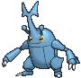
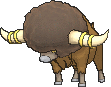
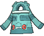
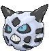
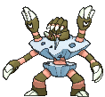

# Battle Resort — Trainer Pokémon

## [ Main Area (Postgame) ]

### Trainer Rosters

| Trainer | P1 | P2 | P3 | P4 | P5 | P6 |
|:-------:|:--:|:--:|:--:|:--:|:--:|:--:|
| ![Ace Trainer Carnation [Cynthia]](../../assets/trainers/ace_trainer.png "Ace Trainer Carnation [Cynthia]") Ace Trainer Carnation [Cynthia] [711] | 
 [Spiritomb](../../pokemon/spiritomb.md) Lv. 86
 | 
 [Roserade](../../pokemon/roserade.md) Lv. 86
 | 
 [Togekiss](../../pokemon/togekiss.md) Lv. 86
 | 
 [Lucario](../../pokemon/lucario.md) Lv. 86
 | 
 [Milotic](../../pokemon/milotic.md) Lv. 86
 | 
 [Garchomp](../../pokemon/garchomp.md) Lv. 88
 |
| ![Leader Carnation [Roxanne]](../../assets/important_trainers/roxanne.png "Leader Carnation [Roxanne]") Leader Carnation [Roxanne] [924] | 
 [Probopass](../../pokemon/probopass.md) Lv. 79
 | 
 [Omastar](../../pokemon/omastar.md) Lv. 77
 | 
 [Tyrantrum](../../pokemon/tyrantrum.md) Lv. 77
 | 
 [Armaldo](../../pokemon/armaldo.md) Lv. 77
 | 
 [Cradily](../../pokemon/cradily.md) Lv. 77
 | 
 [Aerodactyl](../../pokemon/aerodactyl.md) Lv. 79
 |
| ![Leader Carnation [Roxanne]](../../assets/important_trainers/roxanne.png "Leader Carnation [Roxanne]") Leader Carnation [Roxanne] [925] | 
 [Probopass](../../pokemon/probopass.md) Lv. 79
 | 
 [Omastar](../../pokemon/omastar.md) Lv. 77
 | 
 [Tyrantrum](../../pokemon/tyrantrum.md) Lv. 77
 | 
 [Armaldo](../../pokemon/armaldo.md) Lv. 77
 | 
 [Cradily](../../pokemon/cradily.md) Lv. 77
 | 
 [Aerodactyl](../../pokemon/aerodactyl.md) Lv. 79
 |
| ![Leader Carnation [Flannery]](../../assets/important_trainers/flannery.png "Leader Carnation [Flannery]") Leader Carnation [Flannery] [926] | 
 [Ninetales](../../pokemon/ninetales.md) Lv. 77
 | 
 [Houndoom](../../pokemon/houndoom.md) Lv. 77
 | 
 [Delphox](../../pokemon/delphox.md) Lv. 77
 | 
 [Magmortar](../../pokemon/magmortar.md) Lv. 77
 | 
 [Torkoal](../../pokemon/torkoal.md) Lv. 79
 | 
 [Camerupt](../../pokemon/camerupt.md) Lv. 79
 |
| ![Leader Carnation [Flannery]](../../assets/important_trainers/flannery.png "Leader Carnation [Flannery]") Leader Carnation [Flannery] [927] | 
 [Ninetales](../../pokemon/ninetales.md) Lv. 77
 | 
 [Houndoom](../../pokemon/houndoom.md) Lv. 77
 | 
 [Delphox](../../pokemon/delphox.md) Lv. 77
 | 
 [Magmortar](../../pokemon/magmortar.md) Lv. 77
 | 
 [Torkoal](../../pokemon/torkoal.md) Lv. 79
 | 
 [Camerupt](../../pokemon/camerupt.md) Lv. 79
 |
| ![Leader Carnation [Winona]](../../assets/important_trainers/winona.png "Leader Carnation [Winona]") Leader Carnation [Winona] [928] | 
 [Skarmory](../../pokemon/skarmory.md) Lv. 77
 | 
 [Honchkrow](../../pokemon/honchkrow.md) Lv. 77
 | 
 [Sigilyph](../../pokemon/sigilyph.md) Lv. 77
 | 
 [Dragonite](../../pokemon/dragonite.md) Lv. 77
 | 
 [Talonflame](../../pokemon/talonflame.md) Lv. 77
 | 
 [Altaria](../../pokemon/altaria.md) Lv. 79
 |
| ![Leader Carnation [Winona]](../../assets/important_trainers/winona.png "Leader Carnation [Winona]") Leader Carnation [Winona] [929] | 
 [Skarmory](../../pokemon/skarmory.md) Lv. 77
 | 
 [Honchkrow](../../pokemon/honchkrow.md) Lv. 77
 | 
 [Sigilyph](../../pokemon/sigilyph.md) Lv. 77
 | 
 [Dragonite](../../pokemon/dragonite.md) Lv. 77
 | 
 [Talonflame](../../pokemon/talonflame.md) Lv. 77
 | 
 [Altaria](../../pokemon/altaria.md) Lv. 79
 |
| ![Dragon Tamer Antonin [Lance]](../../assets/trainers/dragon_tamer.png "Dragon Tamer Antonin [Lance]") Dragon Tamer Antonin [Lance] [702] | 
 [Salamence](../../pokemon/salamence.md) Lv. 86
 | 
 [Gyarados](../../pokemon/gyarados.md) Lv. 86
 | 
 [Garchomp](../../pokemon/garchomp.md) Lv. 86
 | 
 [Altaria](../../pokemon/altaria.md) Lv. 86
 | 
 [Charizard](../../pokemon/charizard.md) Lv. 86
 | 
 [Dragonite](../../pokemon/dragonite.md) Lv. 88
 |
| ![Leader Antonin [Brawly]](../../assets/important_trainers/brawly.png "Leader Antonin [Brawly]") Leader Antonin [Brawly] [703] | 
 [Machamp](../../pokemon/machamp.md) Lv. 77
 | 
 [Heracross](../../pokemon/heracross.md) Lv. 77
 | 
 [Scrafty](../../pokemon/scrafty.md) Lv. 77
 | 
 [Conkeldurr](../../pokemon/conkeldurr.md) Lv. 77
 | 
 [Hariyama](../../pokemon/hariyama.md) Lv. 79
 | 
 [Medicham](../../pokemon/medicham.md) Lv. 79
 |
| ![Leader Antonin [Brawly]](../../assets/important_trainers/brawly.png "Leader Antonin [Brawly]") Leader Antonin [Brawly] [704] | 
 [Machamp](../../pokemon/machamp.md) Lv. 77
 | 
 [Heracross](../../pokemon/heracross.md) Lv. 77
 | 
 [Scrafty](../../pokemon/scrafty.md) Lv. 77
 | 
 [Conkeldurr](../../pokemon/conkeldurr.md) Lv. 77
 | 
 [Hariyama](../../pokemon/hariyama.md) Lv. 79
 | 
 [Medicham](../../pokemon/medicham.md) Lv. 79
 |
| ![Leader Antonin [Wattson]](../../assets/important_trainers/wattson.png "Leader Antonin [Wattson]") Leader Antonin [Wattson] [705] | 
 [Heliolisk](../../pokemon/heliolisk.md) Lv. 77
 | 
 [Ampharos](../../pokemon/ampharos.md) Lv. 77
 | 
 [Rotom](../../pokemon/rotom.md) Lv. 77
 | 
 [Magnezone](../../pokemon/magnezone.md) Lv. 77
 | 
 [Raichu](../../pokemon/raichu.md) Lv. 77
 | 
 [Manectric](../../pokemon/manectric.md) Lv. 79
 |
| ![Leader Antonin [Wattson]](../../assets/important_trainers/wattson.png "Leader Antonin [Wattson]") Leader Antonin [Wattson] [706] | 
 [Heliolisk](../../pokemon/heliolisk.md) Lv. 77
 | 
 [Ampharos](../../pokemon/ampharos.md) Lv. 77
 | 
 [Rotom](../../pokemon/rotom.md) Lv. 77
 | 
 [Magnezone](../../pokemon/magnezone.md) Lv. 77
 | 
 [Raichu](../../pokemon/raichu.md) Lv. 77
 | 
 [Manectric](../../pokemon/manectric.md) Lv. 79
 |
| ![Leader Antonin [Norman]](../../assets/important_trainers/norman.png "Leader Antonin [Norman]") Leader Antonin [Norman] [707] | 
 [Bouffalant](../../pokemon/bouffalant.md) Lv. 77
 | 
 [Exploud](../../pokemon/exploud.md) Lv. 77
 | 
 [Sawsbuck](../../pokemon/sawsbuck.md) Lv. 77
 | 
 [Zangoose](../../pokemon/zangoose.md) Lv. 77
 | 
 [Slaking](../../pokemon/slaking.md) Lv. 79
 | 
 [Kangaskhan](../../pokemon/kangaskhan.md) Lv. 79
 |
| ![Leader Antonin [Norman]](../../assets/important_trainers/norman.png "Leader Antonin [Norman]") Leader Antonin [Norman] [708] | 
 [Bouffalant](../../pokemon/bouffalant.md) Lv. 77
 | 
 [Exploud](../../pokemon/exploud.md) Lv. 77
 | 
 [Sawsbuck](../../pokemon/sawsbuck.md) Lv. 77
 | 
 [Zangoose](../../pokemon/zangoose.md) Lv. 77
 | 
 [Slaking](../../pokemon/slaking.md) Lv. 79
 | 
 [Kangaskhan](../../pokemon/kangaskhan.md) Lv. 79
 |
| ![Champion Josephine [Diantha]](../../assets/important_trainers/diantha.png "Champion Josephine [Diantha]") Champion Josephine [Diantha] [712] | 
 [Aerodactyl](../../pokemon/aerodactyl.md) Lv. 86
 | 
 [Roserade](../../pokemon/roserade.md) Lv. 86
 | 
 [Azumarill](../../pokemon/azumarill.md) Lv. 86
 | 
 [Delphox](../../pokemon/delphox.md) Lv. 86
 | 
 [Goodra](../../pokemon/goodra.md) Lv. 86
 | 
 [Gardevoir](../../pokemon/gardevoir.md) Lv. 88
 |
| ![Leader Josephine [Liza]](../../assets/important_trainers/liza.png "Leader Josephine [Liza]") Leader Josephine [Liza] [930] | 
 [Slowking](../../pokemon/slowking.md) Lv. 77
 | 
 [Gothitelle](../../pokemon/gothitelle.md) Lv. 77
 | 
 [Claydol](../../pokemon/claydol.md) Lv. 77
 | 
 [Grumpig](../../pokemon/grumpig.md) Lv. 77
 | 
 [Lunatone](../../pokemon/lunatone.md) Lv. 79
 | 
 [Gardevoir](../../pokemon/gardevoir.md) Lv. 79
 |
| ![Leader Josephine [Liza]](../../assets/important_trainers/liza.png "Leader Josephine [Liza]") Leader Josephine [Liza] [931] | 
 [Slowking](../../pokemon/slowking.md) Lv. 77
 | 
 [Gothitelle](../../pokemon/gothitelle.md) Lv. 77
 | 
 [Claydol](../../pokemon/claydol.md) Lv. 77
 | 
 [Grumpig](../../pokemon/grumpig.md) Lv. 77
 | 
 [Lunatone](../../pokemon/lunatone.md) Lv. 79
 | 
 [Gardevoir](../../pokemon/gardevoir.md) Lv. 79
 |
| ![Leader Josephine [Tate]](../../assets/important_trainers/tate.png "Leader Josephine [Tate]") Leader Josephine [Tate] [932] | 
 [Bronzong](../../pokemon/bronzong.md) Lv. 77
 | 
 [Reuniclus](../../pokemon/reuniclus.md) Lv. 77
 | 
 [Xatu](../../pokemon/xatu.md) Lv. 77
 | 
 [Hypno](../../pokemon/hypno.md) Lv. 77
 | 
 [Solrock](../../pokemon/solrock.md) Lv. 79
 | 
 [Gallade](../../pokemon/gallade.md) Lv. 79
 |
| ![Leader Josephine [Tate]](../../assets/important_trainers/tate.png "Leader Josephine [Tate]") Leader Josephine [Tate] [933] | 
 [Bronzong](../../pokemon/bronzong.md) Lv. 77
 | 
 [Reuniclus](../../pokemon/reuniclus.md) Lv. 77
 | 
 [Xatu](../../pokemon/xatu.md) Lv. 77
 | 
 [Hypno](../../pokemon/hypno.md) Lv. 77
 | 
 [Solrock](../../pokemon/solrock.md) Lv. 79
 | 
 [Gallade](../../pokemon/gallade.md) Lv. 79
 |
| ![Leader Josephine [Wallace]](../../assets/important_trainers/wallace.png "Leader Josephine [Wallace]") Leader Josephine [Wallace] [934] | 
 [Politoed](../../pokemon/politoed.md) Lv. 77
 | 
 [Ludicolo](../../pokemon/ludicolo.md) Lv. 77
 | 
 [Kingdra](../../pokemon/kingdra.md) Lv. 77
 | 
 [Milotic](../../pokemon/milotic.md) Lv. 79
 | 
 [Gyarados](../../pokemon/gyarados.md) Lv. 77
 | 
 [Swampert](../../pokemon/swampert.md) Lv. 79
 |
| ![Leader Josephine [Wallace]](../../assets/important_trainers/wallace.png "Leader Josephine [Wallace]") Leader Josephine [Wallace] [935] | 
 [Politoed](../../pokemon/politoed.md) Lv. 77
 | 
 [Ludicolo](../../pokemon/ludicolo.md) Lv. 77
 | 
 [Kingdra](../../pokemon/kingdra.md) Lv. 77
 | 
 [Milotic](../../pokemon/milotic.md) Lv. 79
 | 
 [Gyarados](../../pokemon/gyarados.md) Lv. 77
 | 
 [Swampert](../../pokemon/swampert.md) Lv. 79
 |
| ![Ace Trainer Kelvin [Blue]](../../assets/trainers/ace_trainer.png "Ace Trainer Kelvin [Blue]") Ace Trainer Kelvin [Blue] [709] | 
 [Heracross](../../pokemon/heracross.md) Lv. 86
 | 
 [Alakazam](../../pokemon/alakazam.md) Lv. 86
 | 
 [Arcanine](../../pokemon/arcanine.md) Lv. 86
 | 
 [Gyarados](../../pokemon/gyarados.md) Lv. 86
 | 
 [Exeggutor](../../pokemon/exeggutor.md) Lv. 86
 | 
 [Tyranitar](../../pokemon/tyranitar.md) Lv. 88
 |
| ![Leader Kelvin [Grant]](../../assets/important_trainers/grant.png "Leader Kelvin [Grant]") Leader Kelvin [Grant] [918] | 
 [Crustle](../../pokemon/crustle.md) Lv. 77
 | 
 [Relicanth](../../pokemon/relicanth.md) Lv. 77
 | 
 [Carbink](../../pokemon/carbink.md) Lv. 77
 | 
 [Tyrantrum](../../pokemon/tyrantrum.md) Lv. 77
 | 
 [Aurorus](../../pokemon/aurorus.md) Lv. 77
 | 
 [Aerodactyl](../../pokemon/aerodactyl.md) Lv. 79
 |
| ![Leader Kelvin [Ramos]](../../assets/important_trainers/ramos.png "Leader Kelvin [Ramos]") Leader Kelvin [Ramos] [919] | 
 [Jumpluff](../../pokemon/jumpluff.md) Lv. 77
 | 
 [Victreebel](../../pokemon/victreebel.md) Lv. 77
 | 
 [Exeggutor](../../pokemon/exeggutor.md) Lv. 77
 | 
 [Roserade](../../pokemon/roserade.md) Lv. 77
 | 
 [Gogoat](../../pokemon/gogoat.md) Lv. 79
 | 
 [Venusaur](../../pokemon/venusaur.md) Lv. 79
 |
| ![Leader Kelvin [Clemont]](../../assets/important_trainers/clemont.png "Leader Kelvin [Clemont]") Leader Kelvin [Clemont] [920] | 
 [Emolga](../../pokemon/emolga.md) Lv. 77
 | 
 [Magnezone](../../pokemon/magnezone.md) Lv. 77
 | 
 [Electivire](../../pokemon/electivire.md) Lv. 77
 | 
 [Galvantula](../../pokemon/galvantula.md) Lv. 77
 | 
 [Heliolisk](../../pokemon/heliolisk.md) Lv. 79
 | 
 [Ampharos](../../pokemon/ampharos.md) Lv. 79
 |
| ![Leader Kelvin [Wulfric]](../../assets/important_trainers/wulfric.png "Leader Kelvin [Wulfric]") Leader Kelvin [Wulfric] [921] | 
 [Glalie](../../pokemon/glalie.md) Lv. 77
 | 
 [Mamoswine](../../pokemon/mamoswine.md) Lv. 77
 | 
 [Beartic](../../pokemon/beartic.md) Lv. 77
 | 
 [Cryogonal](../../pokemon/cryogonal.md) Lv. 77
 | 
 [Avalugg](../../pokemon/avalugg.md) Lv. 79
 | 
 [Abomasnow](../../pokemon/abomasnow.md) Lv. 79
 |
| ![Leader Kelvin [Wikstrom]](../../assets/important_trainers/wikstrom.png "Leader Kelvin [Wikstrom]") Leader Kelvin [Wikstrom] [922] | 
 [Klefki](../../pokemon/klefki.md) Lv. 82
 | 
 [Probopass](../../pokemon/probopass.md) Lv. 82
 | 
 [Metagross](../../pokemon/metagross.md) Lv. 82
 | 
 [Aegislash](../../pokemon/aegislash-shield.md) Lv. 84
 | 
 [Empoleon](../../pokemon/empoleon.md) Lv. 82
 | 
 [Scizor](../../pokemon/scizor.md) Lv. 84
 |
| ![Leader Kelvin [Siebold]](../../assets/important_trainers/siebold.png "Leader Kelvin [Siebold]") Leader Kelvin [Siebold] [923] | 
 [Clawitzer](../../pokemon/clawitzer.md) Lv. 82
 | 
 [Starmie](../../pokemon/starmie.md) Lv. 82
 | 
 [Gyarados](../../pokemon/gyarados.md) Lv. 82
 | 
 [Milotic](../../pokemon/milotic.md) Lv. 82
 | 
 [Barbaracle](../../pokemon/barbaracle.md) Lv. 84
 | 
 [Blastoise](../../pokemon/blastoise.md) Lv. 84
 |
| ![Furisode Girl Felix [Iris]](../../assets/important_trainers/iris.png "Furisode Girl Felix [Iris]") Furisode Girl Felix [Iris] [710] | 
 [Hydreigon](../../pokemon/hydreigon.md) Lv. 86
 | 
 [Druddigon](../../pokemon/druddigon.md) Lv. 86
 | 
 [Archeops](../../pokemon/archeops.md) Lv. 86
 | 
 [Aggron](../../pokemon/aggron.md) Lv. 88
 | 
 [Lapras](../../pokemon/lapras.md) Lv. 86
 | 
 [Haxorus](../../pokemon/haxorus.md) Lv. 88
 |
| ![Leader Felix [Viola]](../../assets/important_trainers/viola.png "Leader Felix [Viola]") Leader Felix [Viola] [936] | 
 [Masquerain](../../pokemon/masquerain.md) Lv. 77
 | 
 [Yanmega](../../pokemon/yanmega.md) Lv. 77
 | 
 [Vespiquen](../../pokemon/vespiquen.md) Lv. 77
 | 
 [Crustle](../../pokemon/crustle.md) Lv. 77
 | 
 [Vivillon](../../pokemon/vivillon.md) Lv. 79
 | 
 [Pinsir](../../pokemon/pinsir.md) Lv. 79
 |
| ![Leader Felix [Korrina]](../../assets/important_trainers/korrina.png "Leader Felix [Korrina]") Leader Felix [Korrina] [937] | 
 [Machamp](../../pokemon/machamp.md) Lv. 77
 | 
 [Mienshao](../../pokemon/mienshao.md) Lv. 77
 | 
 [Chesnaught](../../pokemon/chesnaught.md) Lv. 77
 | 
 [Pangoro](../../pokemon/pangoro.md) Lv. 77
 | 
 [Hawlucha](../../pokemon/hawlucha.md) Lv. 79
 | 
 [Lucario](../../pokemon/lucario.md) Lv. 79
 |
| ![Leader Felix [Valerie]](../../assets/important_trainers/valerie.png "Leader Felix [Valerie]") Leader Felix [Valerie] [938] | 
 [Mr. Mime](../../pokemon/mr-mime.md) Lv. 77
 | 
 [Florges](../../pokemon/florges.md) Lv. 77
 | 
 [Aromatisse](../../pokemon/aromatisse.md) Lv. 77
 | 
 [Slurpuff](../../pokemon/slurpuff.md) Lv. 77
 | 
 [Sylveon](../../pokemon/sylveon.md) Lv. 79
 | 
 [Mawile](../../pokemon/mawile.md) Lv. 79
 |
| ![Leader Felix [Olympia]](../../assets/important_trainers/olympia.png "Leader Felix [Olympia]") Leader Felix [Olympia] [939] | 
 [Sigilyph](../../pokemon/sigilyph.md) Lv. 77
 | 
 [Slowking](../../pokemon/slowking.md) Lv. 77
 | 
 [Gothitelle](../../pokemon/gothitelle.md) Lv. 77
 | 
 [Espeon](../../pokemon/espeon.md) Lv. 77
 | 
 [Meowstic](../../pokemon/meowstic-male.md) Lv. 79
 | 
 [Alakazam](../../pokemon/alakazam.md) Lv. 79
 |
| ![Leader Felix [Malva]](../../assets/important_trainers/malva.png "Leader Felix [Malva]") Leader Felix [Malva] [940] | 
 [Pyroar](../../pokemon/pyroar.md) Lv. 82
 | 
 [Chandelure](../../pokemon/chandelure.md) Lv. 82
 | 
 [Magmortar](../../pokemon/magmortar.md) Lv. 82
 | 
 [Torkoal](../../pokemon/torkoal.md) Lv. 82
 | 
 [Talonflame](../../pokemon/talonflame.md) Lv. 84
 | 
 [Houndoom](../../pokemon/houndoom.md) Lv. 84
 |
| ![Leader Felix [Drasna]](../../assets/important_trainers/drasna.png "Leader Felix [Drasna]") Leader Felix [Drasna] [941] | 
 [Dragalge](../../pokemon/dragalge.md) Lv. 82
 | 
 [Druddigon](../../pokemon/druddigon.md) Lv. 82
 | 
 [Altaria](../../pokemon/altaria.md) Lv. 82
 | 
 [Haxorus](../../pokemon/haxorus.md) Lv. 82
 | 
 [Noivern](../../pokemon/noivern.md) Lv. 84
 | 
 [Garchomp](../../pokemon/garchomp.md) Lv. 84
 |
|  PKMN Trainer Wally [944] | 
 [Talonflame](../../pokemon/talonflame.md) Lv. 81
 | 
 [Azumarill](../../pokemon/azumarill.md) Lv. 81
 | 
 [Roserade](../../pokemon/roserade.md) Lv. 81
 | 
 [Magnezone](../../pokemon/magnezone.md) Lv. 81
 | 
 [Garchomp](../../pokemon/garchomp.md) Lv. 81
 | 
 [Gallade](../../pokemon/gallade.md) Lv. 83
 |
|  PKMN Trainer Wally [946] | 
 [Azumarill](../../pokemon/azumarill.md) Lv. 97
 | 
 [Talonflame](../../pokemon/talonflame.md) Lv. 97
 | 
 [Roserade](../../pokemon/roserade.md) Lv. 97
 | 
 [Magnezone](../../pokemon/magnezone.md) Lv. 97
 | 
 [Garchomp](../../pokemon/garchomp.md) Lv. 97
 | 
 [Gallade](../../pokemon/gallade.md) Lv. 99
 |

