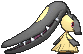
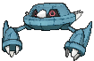
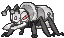
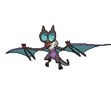

# Cave of Origin — Wild Pokémon

## [ 1F ]

### Cave

| Sprite | Pokémon | Encounter | Chance |
|:------:|---------|:---------:|--------|
|  | [Golbat](../../pokemon/golbat.md/) Lv. 57 |  Cave | 10% |
|  | [Aerodactyl](../../pokemon/aerodactyl.md/) Lv. 57 |  Cave | 10% |
|  | [Sableye](../../pokemon/sableye.md/) Lv. 57 |  Cave | 10% |
|  | [Mawile](../../pokemon/mawile.md/) Lv. 57 |  Cave | 10% |
|  | [Lairon](../../pokemon/lairon.md/) Lv. 57 |  Cave | 10% |
|  | [Metang](../../pokemon/metang.md/) Lv. 57 |  Cave | 10% |
|  | [Swoobat](../../pokemon/swoobat.md/) Lv. 57 |  Cave | 10% |
|  | [Heatmor](../../pokemon/heatmor.md/) Lv. 57 |  Cave | 10% |
|  | [Durant](../../pokemon/durant.md/) Lv. 57 |  Cave | 10% |
|  | [Noivern](../../pokemon/noivern.md/) Lv. 57 |  Cave | 10% |

### Horde

| Sprite | Pokémon | Encounter | Chance |
|:------:|---------|:---------:|--------|
|  | [Golbat](../../pokemon/golbat.md/) Lv. 37 |  Horde | 100% |

## [ B1F / B2F / B3F / B4F / B5F ]

### Cave

| Sprite | Pokémon | Encounter | Chance |
|:------:|---------|:---------:|--------|
|  | [Unown](../../pokemon/unown.md/) Lv. 5 - 75 |  Cave | 100% |

### Horde

| Sprite | Pokémon | Encounter | Chance |
|:------:|---------|:---------:|--------|
|  | [Unown](../../pokemon/unown.md/) Lv. 5 - 75 |  Horde | 100% |

