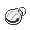
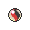

# Credits — Special Battles

---

## [ Main Area ]

|  | **Lv. 75** [Swellow](../../pokemon/swellow.md) **Ability:** Guts   |  Flame Orb | 1. Protect 2. Brave Bird 3. Facade 4. U-turn |
|  | **Lv. 75** [Raichu](../../pokemon/raichu.md) **Ability:** Static  |  Expert Belt | 1. Thunder 2. Surf 3. Focus Blast 4. Light Screen |
|  | **Lv. 75** [Sylveon](../../pokemon/sylveon.md) **Ability:** Pixilate  |  Pixie Plate | 1. Hyper Voice 2. Psyshock 3. Shadow Ball 4. Double Team |
|  | **Lv. 75** [Rapidash](../../pokemon/rapidash.md) **Ability:** Flame Body  |  Shell Bell | 1. Flare Blitz 2. Drill Run 3. Megahorn 4. Poison Jab |
|  | **Lv. 75** [Wailord](../../pokemon/wailord.md) **Ability:** Water Veil  |  Leftovers | 1. Hydro Pump 2. Heavy Slam 3. Ice Beam 4. Earthquake |
|  | **Lv. 77** [Sceptile](../../pokemon/sceptile.md) **Ability:** Overgrow  |  Sceptilite | 1. Leaf Storm 2. Dragon Pulse 3. Focus Blast 4. Protect |
|  | **Lv. 75** [Swellow](../../pokemon/swellow.md) **Ability:** Guts   |  Flame Orb | 1. Protect 2. Brave Bird 3. Facade 4. U-turn |
|  | **Lv. 75** [Raichu](../../pokemon/raichu.md) **Ability:** Static  |  Expert Belt | 1. Thunder 2. Surf 3. Focus Blast 4. Light Screen |
|  | **Lv. 75** [Sylveon](../../pokemon/sylveon.md) **Ability:** Pixilate  |  Pixie Plate | 1. Hyper Voice 2. Psyshock 3. Shadow Ball 4. Double Team |
|  | **Lv. 75** [Wailord](../../pokemon/wailord.md) **Ability:** Water Veil  |  Leftovers | 1. Hydro Pump 2. Heavy Slam 3. Ice Beam 4. Earthquake |
|  | **Lv. 75** [Breloom](../../pokemon/breloom.md) **Ability:** Technician   |  Life Orb | 1. Spore 2. Bullet Seed 3. Mach Punch 4. Rock Tomb |
|  | **Lv. 77** [Blaziken](../../pokemon/blaziken.md) **Ability:** Blaze   |  Blazikenite | 1. Flare Blitz 2. High Jump Kick 3. Thunder Punch 4. Protect |
|  | **Lv. 75** [Swellow](../../pokemon/swellow.md) **Ability:** Guts   |  Flame Orb | 1. Protect 2. Brave Bird 3. Facade 4. U-turn |
|  | **Lv. 75** [Raichu](../../pokemon/raichu.md) **Ability:** Static  |  Expert Belt | 1. Thunder 2. Surf 3. Focus Blast 4. Light Screen |
|  | **Lv. 75** [Sylveon](../../pokemon/sylveon.md) **Ability:** Pixilate  |  Pixie Plate | 1. Hyper Voice 2. Psyshock 3. Shadow Ball 4. Double Team |
|  | **Lv. 75** [Breloom](../../pokemon/breloom.md) **Ability:** Technician   |  Life Orb | 1. Spore 2. Bullet Seed 3. Mach Punch 4. Rock Tomb |
|  | **Lv. 75** [Rapidash](../../pokemon/rapidash.md) **Ability:** Flame Body  |  Shell Bell | 1. Flare Blitz 2. Drill Run 3. Megahorn 4. Poison Jab |
|  | **Lv. 77** [Swampert](../../pokemon/swampert.md) **Ability:** Torrent   |  Swampertite | 1. Aqua Tail 2. Earthquake 3. Stone Edge 4. Protect |

