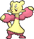

# Dewford Town — Special Battles

---

## [ Gym ]

### Leader Brawly

| Pokémon | Attributes | Item | Moves |
|:-------:|------------|:----:|-------|
|  | **Lv. 17** [Machop](../../pokemon/machop.md) **Ability:** No Guard  |  Berry Juice | 1. Bulk Up 2. Low Sweep 3. Bullet Punch 4. Rock Tomb |
|  | **Lv. 17** [Meditite](../../pokemon/meditite.md) **Ability:** Pure Power   |  Black Belt | 1. Substitute 2. Focus Punch 3. Psyshock 4. Shadow Ball |
|  | **Lv. 17** [Pancham](../../pokemon/pancham.md) **Ability:** Iron Fist  |  Muscle Band | 1. Bulk Up 2. Power-Up Punch 3. Shadow Claw 4. Aerial Ace |
|  | **Lv. 17** [Scraggy](../../pokemon/scraggy.md) **Ability:** Intimidate   |  Assault Vest | 1. Headbutt 2. Drain Punch 3. Feint Attack 4. Fake Out |
|  | **Lv. 17** [Mienfoo](../../pokemon/mienfoo.md) **Ability:** Inner Focus  |  Wise Glasses | 1. Calm Mind 2. Fake Out 3. Aura Sphere 4. Hidden Power |
|  | **Lv. 19** [Hariyama](../../pokemon/hariyama.md) **Ability:** Sheer Force  |  Sitrus Berry | 1. Bulk Up 2. Arm Thrust 3. Bullet Punch 4. Smack Down |

