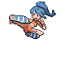
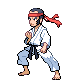
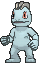

# Dewford Town — Trainer Pokémon

---

## [ Gym ]

### Trainer Rosters

| Trainer | P1 | P2 | P3 | P4 | P5 | P6 |
|:-------:|:--:|:--:|:--:|:--:|:--:|:--:|
|  Battle Girl Laura [060] | 
 [Mankey](../../pokemon/mankey.md) Lv. 17
 | 
 [Croagunk](../../pokemon/croagunk.md) Lv. 17
 |
|  Black Belt Hideki [056] | 
 [Makuhita](../../pokemon/makuhita.md) Lv. 17
 | 
 [Tyrogue](../../pokemon/tyrogue.md) Lv. 17
 |
|  Battle Girl Tessa [059] | 
 [Timburr](../../pokemon/timburr.md) Lv. 17
 | 
 [Riolu](../../pokemon/riolu.md) Lv. 17
 |
|  Leader Brawly [563] | 
 [Machop](../../pokemon/machop.md) Lv. 17
 | 
 [Meditite](../../pokemon/meditite.md) Lv. 17
 | 
 [Pancham](../../pokemon/pancham.md) Lv. 17
 | 
 [Scraggy](../../pokemon/scraggy.md) Lv. 17
 | 
 [Mienfoo](../../pokemon/mienfoo.md) Lv. 17
 | 
 [Hariyama](../../pokemon/hariyama.md) Lv. 19
 |

### Special Battles

1. [Leader Brawly](special_battles.md#leader-brawly)

