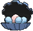

# Dewford Town — Wild Pokémon

### Surfing

| Sprite | Pokémon | Encounter Type | Level | Chance |
|:------:|---------|:--------------:|-------|--------|
|  | [Wingull](../../pokemon/wingull.md/) |  Surfing | 25 - 35 | 25% |
|  | [Tentacool](../../pokemon/tentacool.md/) |  Surfing | 25 - 35 | 25% |
|  | [Frillish](../../pokemon/frillish.md/) |  Surfing | 25 - 35 | 25% |
|  | [Pelipper](../../pokemon/pelipper.md/) |  Surfing | 25 - 35 | 25% |

### Old Rod

| Sprite | Pokémon | Encounter Type | Level | Chance |
|:------:|---------|:--------------:|-------|--------|
|  | [Shellder](../../pokemon/shellder.md/) |  Old Rod | 15 | 33% |
|  | [Clamperl](../../pokemon/clamperl.md/) |  Old Rod | 15 | 33% |
|  | [Corsola](../../pokemon/corsola.md/) |  Old Rod | 15 | 33% |

### Good Rod

| Sprite | Pokémon | Encounter Type | Level | Chance |
|:------:|---------|:--------------:|-------|--------|
|  | [Shellder](../../pokemon/shellder.md/) |  Good Rod | 35 | 33% |
|  | [Clamperl](../../pokemon/clamperl.md/) |  Good Rod | 35 | 33% |
|  | [Corsola](../../pokemon/corsola.md/) |  Good Rod | 35 | 33% |

### Super Rod

| Sprite | Pokémon | Encounter Type | Level | Chance |
|:------:|---------|:--------------:|-------|--------|
|  | [Cloyster](../../pokemon/cloyster.md/) |  Super Rod | 55 | 33% |
|  | [Huntail](../../pokemon/huntail.md/) |  Super Rod | 55 | 33% |
|  | [Corsola](../../pokemon/corsola.md/) |  Super Rod | 55 | 33% |

