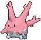

# Ever Grande City — Wild Pokémon

---

## [ Main Area ]

### Surfing

| Sprite | Pokémon | Encounter | Chance |
|:------:|---------|:---------:|--------|
|  | [Pelipper](../../pokemon/pelipper.md/) Lv. 45 - 55 |  Surfing | 33% |
|  | [Tentacruel](../../pokemon/tentacruel.md/) Lv. 45 - 55 |  Surfing | 33% |
|  | [Jellicent](../../pokemon/jellicent.md/) Lv. 45 - 55 |  Surfing | 33% |

### Old Rod

| Sprite | Pokémon | Encounter | Chance |
|:------:|---------|:---------:|--------|
|  | [Luvdisc](../../pokemon/luvdisc.md/) Lv. 15 |  Old Rod | 50% |
|  | [Corsola](../../pokemon/corsola.md/) Lv. 15 |  Old Rod | 50% |

### Good Rod

| Sprite | Pokémon | Encounter | Chance |
|:------:|---------|:---------:|--------|
|  | [Luvdisc](../../pokemon/luvdisc.md/) Lv. 35 |  Good Rod | 50% |
|  | [Corsola](../../pokemon/corsola.md/) Lv. 35 |  Good Rod | 50% |

### Super Rod

| Sprite | Pokémon | Encounter | Chance |
|:------:|---------|:---------:|--------|
|  | [Luvdisc](../../pokemon/luvdisc.md/) Lv. 55 |  Super Rod | 50% |
|  | [Corsola](../../pokemon/corsola.md/) Lv. 55 |  Super Rod | 50% |

