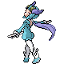

# Fortree City — Special Battles

---

## [ Gym ]

### Winona

| Pokémon | Attributes | Item | Moves |
|:-------:|------------|:----:|-------|
|  | **Lv. 48** [Skarmory](../../pokemon/skarmory.md) **Ability:** Sturdy   | Sitrus Berry | 1. Iron Head 2. Brave Bird 3. Stealth Rock 4. Roost |
|  | **Lv. 48** [Honchkrow](../../pokemon/honchkrow.md) **Ability:** Super Luck   | Scope Lens | 1. Night Slash 2. Brave Bird 3. Steel Wing 4. Thunder Wave |
|  | **Lv. 48** [Sigilyph](../../pokemon/sigilyph.md) **Ability:** Life Orb   | Magic Guard | 1. Psychic 2. Hurricane 3. Dazzling Gleam 4. Ice Beam |
|  | **Lv. 48** [Gyarados](../../pokemon/gyarados.md) **Ability:** Intimidate   | Wacan Berry | 1. Dragon Dance 2. Waterfall 3. Bounce 4. Earthquake |
|  | **Lv. 48** [Talonflame](../../pokemon/talonflame.md) **Ability:** Gale Wings   | Sharp Beak | 1. Brave Bird 2. Flare Blitz 3. Will-O-Wisp 4. Roost |
|  | **Lv. 50** [Altaria](../../pokemon/altaria.md) **Ability:** Natural Cure   | Altarianite | 1. Dragon Dance 2. Body Slam 3. Earthquake 4. Roost |

