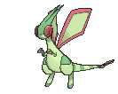

# Fortree City — Trainer Pokémon

## [ Main Area ]

### Trainer Rosters

| Trainer | P1 |
|:-------:|:--:|
|  Secret Base Expert Aarune [856] | 
 [Flygon](../../pokemon/flygon.md) Lv. 48
 |

## [ Gym ]

### Trainer Rosters

### Special Battles

| Trainer | P1 | P2 | P3 | P4 | P5 | P6 |
|:-------:|:--:|:--:|:--:|:--:|:--:|:--:|

