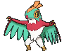

# Fortree City — Trainer Pokémon

### Generic Trainers

| Trainer | P1 |
|:-------:|:--:|
|  Secret Base Expert Aarune [856] | 
 [Flygon](../../pokemon/flygon.md) Lv. 48
 |

## [ Gym ]

### Generic Trainers

| Trainer | P1 | P2 | P3 | P4 | P5 | P6 |
|:-------:|:--:|:--:|:--:|:--:|:--:|:--:|
|  Bird Keeper Jared [115] | 
 [Dodrio](../../pokemon/dodrio.md) Lv. 45
 | 
 [Noctowl](../../pokemon/noctowl.md) Lv. 45
 | 
 [Swanna](../../pokemon/swanna.md) Lv. 45
 |
|  Picnicker Kylee [517] | 
 [Gliscor](../../pokemon/gliscor.md) Lv. 45
 | 
 [Togekiss](../../pokemon/togekiss.md) Lv. 45
 | 
 [Jumpluff](../../pokemon/jumpluff.md) Lv. 45
 |
|  Camper Terrell [516] | 
 [Tropius](../../pokemon/tropius.md) Lv. 45
 | 
 [Crobat](../../pokemon/crobat.md) Lv. 45
 | 
 [Swoobat](../../pokemon/swoobat.md) Lv. 45
 |
|  Bird Keeper Will [118] | 
 [Braviary](../../pokemon/braviary.md) Lv. 45
 | 
 [Farfetch'd](../../pokemon/farfetchd.md) Lv. 45
 | 
 [Delibird](../../pokemon/delibird.md) Lv. 45
 |
|  Bird Keeper Bran [730] | 
 [Hawlucha](../../pokemon/hawlucha.md) Lv. 45
 | 
 [Xatu](../../pokemon/xatu.md) Lv. 45
 | 
 [Mandibuzz](../../pokemon/mandibuzz.md) Lv. 45
 |
|  Leader Winona [571] | 
 [Skarmory](../../pokemon/skarmory.md) Lv. 48
 | 
 [Honchkrow](../../pokemon/honchkrow.md) Lv. 48
 | 
 [Sigilyph](../../pokemon/sigilyph.md) Lv. 48
 | 
 [Gyarados](../../pokemon/gyarados.md) Lv. 48
 | 
 [Talonflame](../../pokemon/talonflame.md) Lv. 48
 | 
 [Altaria](../../pokemon/altaria.md) Lv. 50
 |

