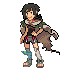
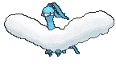

# Granite Cave — Special Battles

---

## [ 1F / 2F (Postgame) ]

### Zinnia

| Pokémon | Attributes | Item | Moves |
|:-------:|------------|:----:|-------|
|  | **Lv. 76** [Altaria](../../pokemon/altaria.md) **Ability:** Natural Cure   |  Lum Berry | 1. Draco Meteor 2. Flamethrower 3. Ice Beam 4. Moonblast |
|  | **Lv. 76** [Tyrantrum](../../pokemon/tyrantrum.md) **Ability:** Strong Jaw   |  Haban Berry | 1. Head Smash 2. Crunch 3. Dragon Claw 4. Fire Fang |
|  | **Lv. 76** [Noivern](../../pokemon/noivern.md) **Ability:** Infiltrator   |  Yache Berry | 1. Draco Meteor 2. Hurricane 3. Focus Blast 4. Flamethrower |
|  | **Lv. 78** [Salamence](../../pokemon/salamence.md) **Ability:** Intimidate   |  Sitrus Berry | 1. Dragon Pulse 2. Fire Blast 3. Hydro Pump 4. Hyper Voice |

