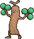

# Granite Cave — Trainer Pokémon

---

## [ B2F ]

### Trainer Rosters

| Trainer | P1 | P2 | P3 |
|:-------:|:--:|:--:|:--:|
|  Ruin Maniac Omari [787] | 
 [Sandshrew](../../pokemon/sandshrew.md) Lv. 22
 | 
 [Baltoy](../../pokemon/baltoy.md) Lv. 22
 | 
 [Bronzor](../../pokemon/bronzor.md) Lv. 22
 |
|  Hiker Davian [788] | 
 [Onix](../../pokemon/onix.md) Lv. 23
 | 
 [Sudowoodo](../../pokemon/sudowoodo.md) Lv. 23
 |

---

## [ 1F / 2F (Postgame) ]

### Trainer Rosters

| Trainer | P1 | P2 | P3 | P4 |
|:-------:|:--:|:--:|:--:|:--:|
|  Lorekeeper Zinnia [898] | 
 [Altaria](../../pokemon/altaria.md) Lv. 76
 | 
 [Tyrantrum](../../pokemon/tyrantrum.md) Lv. 76
 | 
 [Noivern](../../pokemon/noivern.md) Lv. 76
 | 
 [Salamence](../../pokemon/salamence.md) Lv. 78
 |

### Special Battles

1. [Zinnia](special_battles.md#zinnia)

