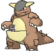

# Granite Cave — Wild Pokémon

## [ 1F ]

### Cave

| Sprite | Pokémon | Encounter | Chance |
|:------:|---------|:---------:|--------|
|  | [Zubat](../../pokemon/zubat.md/) Lv. 13 |  Cave | 10% |
|  | [Abra](../../pokemon/abra.md/) Lv. 13 |  Cave | 10% |
|  | [Geodude](../../pokemon/geodude.md/) Lv. 13 |  Cave | 10% |
|  | [Onix](../../pokemon/onix.md/) Lv. 13 |  Cave | 10% |
|  | [Cubone](../../pokemon/cubone.md/) Lv. 13 |  Cave | 10% |
|  | [Rhyhorn](../../pokemon/rhyhorn.md/) Lv. 13 |  Cave | 10% |
|  | [Makuhita](../../pokemon/makuhita.md/) Lv. 13 |  Cave | 10% |
|  | [Aron](../../pokemon/aron.md/) Lv. 13 |  Cave | 10% |
|  | [Woobat](../../pokemon/woobat.md/) Lv. 13 |  Cave | 10% |
|  | [Axew](../../pokemon/axew.md/) Lv. 13 |  Cave | 10% |

### DexNav

| Sprite | Pokémon | Encounter | Chance |
|:------:|---------|:---------:|--------|
|  | [Probopass](../../pokemon/probopass.md/) Lv. 50 |  DexNav | 100% |

### Horde

| Sprite | Pokémon | Encounter | Chance |
|:------:|---------|:---------:|--------|
|  | [Tepig](../../pokemon/tepig.md/) Lv. 12 |  Horde | 100% |

## [ B1F ]

### Cave

| Sprite | Pokémon | Encounter | Chance |
|:------:|---------|:---------:|--------|
|  | [Kadabra](../../pokemon/kadabra.md/) Lv. 18 |  Cave | 10% |
|  | [Onix](../../pokemon/onix.md/) Lv. 18 |  Cave | 10% |
|  | [Cubone](../../pokemon/cubone.md/) Lv. 18 |  Cave | 10% |
|  | [Rhyhorn](../../pokemon/rhyhorn.md/) Lv. 18 |  Cave | 10% |
|  | [Makuhita](../../pokemon/makuhita.md/) Lv. 18 |  Cave | 10% |
|  | [Sableye](../../pokemon/sableye.md/) Lv. 18 |  Cave | 10% |
|  | [Mawile](../../pokemon/mawile.md/) Lv. 18 |  Cave | 10% |
|  | [Aron](../../pokemon/aron.md/) Lv. 18 |  Cave | 10% |
|  | [Roggenrola](../../pokemon/roggenrola.md/) Lv. 18 |  Cave | 10% |
|  | [Axew](../../pokemon/axew.md/) Lv. 18 |  Cave | 10% |

### DexNav

| Sprite | Pokémon | Encounter | Chance |
|:------:|---------|:---------:|--------|
|  | [Probopass](../../pokemon/probopass.md/) Lv. 50 |  DexNav | 100% |

### Horde

| Sprite | Pokémon | Encounter | Chance |
|:------:|---------|:---------:|--------|
|  | [Zubat](../../pokemon/zubat.md/) Lv. 12 |  Horde | 100% |

## [ B2F ]

### Cave

| Sprite | Pokémon | Encounter | Chance |
|:------:|---------|:---------:|--------|
|  | [Kadabra](../../pokemon/kadabra.md/) Lv. 20 |  Cave | 10% |
|  | [Graveler](../../pokemon/graveler.md/) Lv. 20 |  Cave | 10% |
|  | [Marowak](../../pokemon/marowak.md/) Lv. 20 |  Cave | 10% |
|  | [Kangaskhan](../../pokemon/kangaskhan.md/) Lv. 20 |  Cave | 10% |
|  | [Steelix](../../pokemon/steelix.md/) Lv. 20 |  Cave | 10% |
|  | [Hariyama](../../pokemon/hariyama.md/) Lv. 20 |  Cave | 10% |
|  | [Sableye](../../pokemon/sableye.md/) Lv. 20 |  Cave | 10% |
|  | [Mawile](../../pokemon/mawile.md/) Lv. 20 |  Cave | 10% |
|  | [Lairon](../../pokemon/lairon.md/) Lv. 20 |  Cave | 10% |
|  | [Boldore](../../pokemon/boldore.md/) Lv. 20 |  Cave | 10% |

### Rock Smash

| Sprite | Pokémon | Encounter | Chance |
|:------:|---------|:---------:|--------|
|  | [Nosepass](../../pokemon/nosepass.md/) Lv. 20 |  Rock Smash | 100% |

### DexNav

| Sprite | Pokémon | Encounter | Chance |
|:------:|---------|:---------:|--------|
|  | [Probopass](../../pokemon/probopass.md/) Lv. 50 |  DexNav | 100% |

### Horde

| Sprite | Pokémon | Encounter | Chance |
|:------:|---------|:---------:|--------|
|  | [Zubat](../../pokemon/zubat.md/) Lv. 12 |  Horde | 100% |

