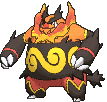

# Jagged Pass — Trainer Pokémon

### Trainer Rosters

### Rematches

| Trainer | P1 | P2 | P3 | P4 | P5 |
|:-------:|:--:|:--:|:--:|:--:|:--:|
| ") Expert Shelby (6) [457] | 
 [Primeape](../../pokemon/primeape.md) Lv. 47
 | 
 [Lucario](../../pokemon/lucario.md) Lv. 47
 | 
 [Emboar](../../pokemon/emboar.md) Lv. 47
 |
| ") Expert Shelby (7) [458] | 
 [Primeape](../../pokemon/primeape.md) Lv. 59
 | 
 [Lucario](../../pokemon/lucario.md) Lv. 59
 | 
 [Emboar](../../pokemon/emboar.md) Lv. 59
 | 
 [Poliwrath](../../pokemon/poliwrath.md) Lv. 59
 |
| ") Expert Shelby (8) [459] | 
 [Primeape](../../pokemon/primeape.md) Lv. 64
 | 
 [Lucario](../../pokemon/lucario.md) Lv. 64
 | 
 [Emboar](../../pokemon/emboar.md) Lv. 64
 | 
 [Poliwrath](../../pokemon/poliwrath.md) Lv. 64
 |
| ") Expert Shelby (C) [460] | 
 [Primeape](../../pokemon/primeape.md) Lv. 75
 | 
 [Lucario](../../pokemon/lucario.md) Lv. 75
 | 
 [Emboar](../../pokemon/emboar.md) Lv. 75
 | 
 [Poliwrath](../../pokemon/poliwrath.md) Lv. 75
 | 
 [Medicham](../../pokemon/medicham.md) Lv. 75
 |
| ") Camper Ethan (5) [469] | 
 [Gliscor](../../pokemon/gliscor.md) Lv. 39
 | 
 [Swalot](../../pokemon/swalot.md) Lv. 39
 | 
 [Arbok](../../pokemon/arbok.md) Lv. 39
 |
| ") Camper Ethan (6) [470] | 
 [Gliscor](../../pokemon/gliscor.md) Lv. 47
 | 
 [Swalot](../../pokemon/swalot.md) Lv. 47
 | 
 [Arbok](../../pokemon/arbok.md) Lv. 47
 | 
 [Drapion](../../pokemon/drapion.md) Lv. 47
 |
| ") Camper Ethan (7) [471] | 
 [Gliscor](../../pokemon/gliscor.md) Lv. 59
 | 
 [Swalot](../../pokemon/swalot.md) Lv. 59
 | 
 [Arbok](../../pokemon/arbok.md) Lv. 59
 | 
 [Drapion](../../pokemon/drapion.md) Lv. 59
 |
| ") Camper Ethan (C) [472] | 
 [Gliscor](../../pokemon/gliscor.md) Lv. 75
 | 
 [Swalot](../../pokemon/swalot.md) Lv. 75
 | 
 [Arbok](../../pokemon/arbok.md) Lv. 75
 | 
 [Drapion](../../pokemon/drapion.md) Lv. 75
 |
| ") Picnicker Diana (5) [473] | 
 [Jumpluff](../../pokemon/jumpluff.md) Lv. 39
 | 
 [Maractus](../../pokemon/maractus.md) Lv. 39
 | 
 [Meganium](../../pokemon/meganium.md) Lv. 39
 |
| ") Picnicker Diana (6) [474] | 
 [Jumpluff](../../pokemon/jumpluff.md) Lv. 47
 | 
 [Maractus](../../pokemon/maractus.md) Lv. 47
 | 
 [Meganium](../../pokemon/meganium.md) Lv. 47
 | 
 [Simisage](../../pokemon/simisage.md) Lv. 47
 |
| ") Picnicker Diana (7) [475] | 
 [Jumpluff](../../pokemon/jumpluff.md) Lv. 59
 | 
 [Maractus](../../pokemon/maractus.md) Lv. 59
 | 
 [Meganium](../../pokemon/meganium.md) Lv. 59
 | 
 [Simisage](../../pokemon/simisage.md) Lv. 59
 |
| ") Picnicker Diana (C) [476] | 
 [Jumpluff](../../pokemon/jumpluff.md) Lv. 75
 | 
 [Maractus](../../pokemon/maractus.md) Lv. 75
 | 
 [Meganium](../../pokemon/meganium.md) Lv. 75
 | 
 [Simisage](../../pokemon/simisage.md) Lv. 75
 |

