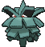

# Jagged Pass — Wild Pokémon

## [ Main Area ]

### Grass

| Sprite | Pokémon | Encounter | Chance |
|:------:|---------|:---------:|--------|
|  | [Primeape](../../pokemon/primeape.md/) Lv. 28 |  Grass | 10% |
|  | [Aipom](../../pokemon/aipom.md/) Lv. 28 |  Grass | 10% |
|  | [Murkrow](../../pokemon/murkrow.md/) Lv. 28 |  Grass | 10% |
|  | [Pineco](../../pokemon/pineco.md/) Lv. 28 |  Grass | 10% |
|  | [Gligar](../../pokemon/gligar.md/) Lv. 28 |  Grass | 10% |
|  | [Meditite](../../pokemon/meditite.md/) Lv. 28 |  Grass | 10% |
|  | [Spoink](../../pokemon/spoink.md/) Lv. 28 |  Grass | 10% |
|  | [Glameow](../../pokemon/glameow.md/) Lv. 28 |  Grass | 10% |
|  | [Stunky](../../pokemon/stunky.md/) Lv. 28 |  Grass | 10% |
|  | [Croagunk](../../pokemon/croagunk.md/) Lv. 28 |  Grass | 10% |

### DexNav

| Sprite | Pokémon | Encounter | Chance |
|:------:|---------|:---------:|--------|
|  | [Grumpig](../../pokemon/grumpig.md/) Lv. 50 |  DexNav | 100% |

### Horde

| Sprite | Pokémon | Encounter | Chance |
|:------:|---------|:---------:|--------|
|  | [Mankey](../../pokemon/mankey.md/) Lv. 17 |  Horde | 100% |

