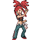

# Lavaridge Town — Special Battles

---

## [ Gym ]

### Flannery

| Pokémon | Attributes | Item | Moves |
|:-------:|------------|:----:|-------|
|  | **Lv. 36** [Ninetales](../../pokemon/ninetales.md) **Ability:** Drought  |  Heat Rock | 1. Overheat 2. Solar Beam 3. Extrasensory 4. Hypnosis |
|  | **Lv. 36** [Houndoom](../../pokemon/houndoom.md) **Ability:** Flash Fire   |  White Herb | 1. Overheat 2. Dark Pulse 3. Sludge Bomb 4. Solar Beam |
|  | **Lv. 36** [Delphox](../../pokemon/delphox.md) **Ability:** Blaze   |  White Herb | 1. Overheat 2. Psyshock 3. Shadow Ball 4. Dazzling Gleam |
|  | **Lv. 36** [Magcargo](../../pokemon/magcargo.md) **Ability:** Flame Body   |  White Herb | 1. Overheat 2. Earth Power 3. Rock Slide 4. Sunny Day |
|  | **Lv. 36** [Camerupt](../../pokemon/camerupt.md) **Ability:** Solid Rock   |  White Herb | 1. Overheat 2. Earth Power 3. Flash Cannon 4. Rock Slide |
|  | **Lv. 38** [Torkoal](../../pokemon/torkoal.md) **Ability:** White Smoke  |  White Herb | 1. Overheat 2. Earthquake 3. Rock Slide 4. Shell Smash |

