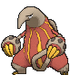
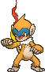
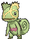
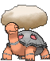

# Lavaridge Town — Trainer Pokémon

## [ Gym ]

### Generic Trainers

| Trainer | P1 | P2 | P3 | P4 | P5 | P6 |
|:-------:|:--:|:--:|:--:|:--:|:--:|:--:|
|  Kindler Cole [081] | 
 [Magmar](../../pokemon/magmar.md) Lv. 34
 | 
 [Charmeleon](../../pokemon/charmeleon.md) Lv. 34
 |
|  Kindler Axle [083] | 
 [Ponyta](../../pokemon/ponyta.md) Lv. 33
 | 
 [Heatmor](../../pokemon/heatmor.md) Lv. 33
 | 
 [Simisear](../../pokemon/simisear.md) Lv. 33
 |
|  Battle Girl Sadie [615] | 
 [Monferno](../../pokemon/monferno.md) Lv. 34
 | 
 [Pignite](../../pokemon/pignite.md) Lv. 34
 | 
 [Combusken](../../pokemon/combusken.md) Lv. 34
 |
|  Ace Trainer Zane [613] | 
 [Kecleon](../../pokemon/kecleon.md) Lv. 35
 | 
 [Arcanine](../../pokemon/arcanine.md) Lv. 35
 | 
 [Darmanitan](../../pokemon/darmanitan-standard.md) Lv. 35
 |
|  Kindler Andy [085] | 
 [Quilava](../../pokemon/quilava.md) Lv. 33
 | 
 [Flareon](../../pokemon/flareon.md) Lv. 33
 | 
 [Litwick](../../pokemon/litwick.md) Lv. 33
 |
|  Ninja Boy Shoji [823] | 
 [Larvesta](../../pokemon/larvesta.md) Lv. 33
 | 
 [Braixen](../../pokemon/braixen.md) Lv. 33
 | 
 [Fletchinder](../../pokemon/fletchinder.md) Lv. 33
 |
|  Ninja Boy Hiromichi [824] | 
 [Skuntank](../../pokemon/skuntank.md) Lv. 35
 |
|  Leader Flannery [569] | 
 [Ninetales](../../pokemon/ninetales.md) Lv. 36
 | 
 [Houndoom](../../pokemon/houndoom.md) Lv. 36
 | 
 [Delphox](../../pokemon/delphox.md) Lv. 36
 | 
 [Magcargo](../../pokemon/magcargo.md) Lv. 36
 | 
 [Camerupt](../../pokemon/camerupt.md) Lv. 36
 | 
 [Torkoal](../../pokemon/torkoal.md) Lv. 38
 |

