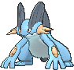

# Lilycove City — Special Battles

---

## [ Main Area ]

|  | **Lv. 53** [Swellow](../../pokemon/swellow.md) **Ability:** Guts   | Toxic Orb | 1. Protect 2. Brave Bird 3. Facade 4. Steel Wing |
|  | **Lv. 53** [Raichu](../../pokemon/raichu.md) **Ability:** Static  | Expert Belt | 1. Thunder 2. Surf 3. Focus Blast 4. Nuzzle |
|  | **Lv. 53** [Sylveon](../../pokemon/sylveon.md) **Ability:** Pixilate  | Pixie Plate | 1. Hyper Voice 2. Psyshock 3. Shadow Ball 4. Reflect |
|  | **Lv. 53** [Rapidash](../../pokemon/rapidash.md) **Ability:** Flame Body  | Shell Bell | 1. Flare Blitz 2. Drill Run 3. Megahorn 4. Wild Charge |
|  | **Lv. 53** [Wailord](../../pokemon/wailord.md) **Ability:** Water Veil  | Leftovers | 1. Scald 2. Protect 3. Aqua Ring 4. Blizzard |
|  | **Lv. 55** [Sceptile](../../pokemon/sceptile.md) **Ability:** Overgrow  | Sceptilite | 1. Energy Ball 2. Dragon Pulse 3. Focus Blast 4. Grass Whistle |
|  | **Lv. 53** [Swellow](../../pokemon/swellow.md) **Ability:** Guts   | Toxic Orb | 1. Protect 2. Brave Bird 3. Facade 4. Steel Wing |
|  | **Lv. 53** [Raichu](../../pokemon/raichu.md) **Ability:** Static  | Expert Belt | 1. Thunder 2. Surf 3. Focus Blast 4. Nuzzle |
|  | **Lv. 53** [Sylveon](../../pokemon/sylveon.md) **Ability:** Pixilate  | Pixie Plate | 1. Hyper Voice 2. Psyshock 3. Shadow Ball 4. Reflect |
|  | **Lv. 53** [Wailord](../../pokemon/wailord.md) **Ability:** Water Veil  | Leftovers | 1. Scald 2. Protect 3. Aqua Ring 4. Blizzard |
|  | **Lv. 53** [Breloom](../../pokemon/breloom.md) **Ability:** Technician   | Life Orb | 1. Spore 2. Bullet Seed 3. Mach Punch 4. Rock Tomb |
|  | **Lv. 55** [Blaziken](../../pokemon/blaziken.md) **Ability:** Blaze   | Blazikenite | 1. High Jump Kick 2. Blaze Kick 3. Thunder Punch 4. Earthquake |
|  | **Lv. 53** [Swellow](../../pokemon/swellow.md) **Ability:** Guts   | Toxic Orb | 1. Protect 2. Brave Bird 3. Facade 4. Steel Wing |
|  | **Lv. 53** [Raichu](../../pokemon/raichu.md) **Ability:** Static  | Expert Belt | 1. Thunder 2. Surf 3. Focus Blast 4. Nuzzle |
|  | **Lv. 53** [Sylveon](../../pokemon/sylveon.md) **Ability:** Pixilate  | Pixie Plate | 1. Hyper Voice 2. Psyshock 3. Shadow Ball 4. Reflect |
|  | **Lv. 53** [Breloom](../../pokemon/breloom.md) **Ability:** Technician   | Life Orb | 1. Spore 2. Bullet Seed 3. Mach Punch 4. Rock Tomb |
|  | **Lv. 53** [Rapidash](../../pokemon/rapidash.md) **Ability:** Flame Body  | Shell Bell | 1. Flare Blitz 2. Drill Run 3. Megahorn 4. Wild Charge |
|  | **Lv. 55** [Swampert](../../pokemon/swampert.md) **Ability:** Torrent   | Swampertite | 1. Earthquake 2. Aqua Tail 3. Rock Slide 4. Yawn |

