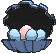

# Lilycove City — Wild Pokémon

---

## [ Main Area ]

### Rock Smash

| Sprite | Pokémon | Encounter | Chance |
|:------:|---------|:---------:|--------|
|  | [Shuckle](../../pokemon/shuckle.md/) Lv. 45 |  Rock Smash | 33% |
|  | [Crustle](../../pokemon/crustle.md/) Lv. 45 |  Rock Smash | 33% |
|  | [Barbaracle](../../pokemon/barbaracle.md/) Lv. 45 |  Rock Smash | 33% |

### Surfing

| Sprite | Pokémon | Encounter | Chance |
|:------:|---------|:---------:|--------|
|  | [Alomomola](../../pokemon/alomomola.md/) Lv. 40 - 50 |  Surfing | 100% |

### Old Rod

| Sprite | Pokémon | Encounter | Chance |
|:------:|---------|:---------:|--------|
|  | [Staryu](../../pokemon/staryu.md/) Lv. 15 |  Old Rod | 33% |
|  | [Clamperl](../../pokemon/clamperl.md/) Lv. 15 |  Old Rod | 33% |
|  | [Corsola](../../pokemon/corsola.md/) Lv. 15 |  Old Rod | 33% |

### Good Rod

| Sprite | Pokémon | Encounter | Chance |
|:------:|---------|:---------:|--------|
|  | [Staryu](../../pokemon/staryu.md/) Lv. 35 |  Good Rod | 33% |
|  | [Clamperl](../../pokemon/clamperl.md/) Lv. 35 |  Good Rod | 33% |
|  | [Corsola](../../pokemon/corsola.md/) Lv. 35 |  Good Rod | 33% |

### Super Rod

| Sprite | Pokémon | Encounter | Chance |
|:------:|---------|:---------:|--------|
|  | [Starmie](../../pokemon/starmie.md/) Lv. 55 |  Super Rod | 33% |
|  | [Gorebyss](../../pokemon/gorebyss.md/) Lv. 55 |  Super Rod | 33% |
|  | [Corsola](../../pokemon/corsola.md/) Lv. 55 |  Super Rod | 33% |

