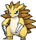

# Magma Hideout — Trainer Pokémon

---

## [ Main Area ]

### Trainer Rosters

### Special Battles

| Trainer | P1 | P2 | P3 | P4 | P5 | P6 |
|:-------:|:--:|:--:|:--:|:--:|:--:|:--:|

---

## [ Main Area (Postgame) ]

### Trainer Rosters

| Trainer | P1 | P2 | P3 |
|:-------:|:--:|:--:|:--:|
|  Team Magma Grunt [248] | 
 [Mightyena](../../pokemon/mightyena.md) Lv. 75
 | 
 [Armaldo](../../pokemon/armaldo.md) Lv. 75
 | 
 [Magcargo](../../pokemon/magcargo.md) Lv. 75
 |
|  Team Magma Grunt [859] | 
 [Ariados](../../pokemon/ariados.md) Lv. 75
 | 
 [Camerupt](../../pokemon/camerupt.md) Lv. 75
 | 
 [Exploud](../../pokemon/exploud.md) Lv. 75
 |
|  Team Magma Grunt [949] | 
 [Donphan](../../pokemon/donphan.md) Lv. 75
 | 
 [Zangoose](../../pokemon/zangoose.md) Lv. 75
 | 
 [Simisear](../../pokemon/simisear.md) Lv. 75
 |
|  Team Magma Grunt [249] | 
 [Magnezone](../../pokemon/magnezone.md) Lv. 75
 | 
 [Torkoal](../../pokemon/torkoal.md) Lv. 75
 | 
 [Sandslash](../../pokemon/sandslash.md) Lv. 75
 |
|  Team Magma Grunt [250] | 
 [Arcanine](../../pokemon/arcanine.md) Lv. 75
 | 
 [Crobat](../../pokemon/crobat.md) Lv. 75
 | 
 [Weezing](../../pokemon/weezing.md) Lv. 75
 |
|  Team Magma Grunt [253] | 
 [Darmanitan](../../pokemon/darmanitan-standard.md) Lv. 75
 | 
 [Snorlax](../../pokemon/snorlax.md) Lv. 75
 | 
 [Rapidash](../../pokemon/rapidash.md) Lv. 75
 |

