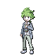

# Mauville City — Special Battles

---

## [ Main Area ]

### Wally

| Pokémon | Attributes | Item | Moves |
|:-------:|------------|:----:|-------|
|  | **Lv. 23** [Fletchinder](../../pokemon/fletchinder.md) **Ability:** Gale Wings   | Flying Gem | 1. Flame Charge 2. Acrobatics 3. Roost 4. Return |
|  | **Lv. 23** [Gible](../../pokemon/gible.md) **Ability:** Rough Skin   | Rocky Helmet | 1. Dragon Rage 2. Slash 3. Dig 4. Shadow Claw |
|  | **Lv. 23** [Marill](../../pokemon/marill.md) **Ability:** Huge Power   | Leftovers | 1. Aqua Tail 2. Play Rough 3. Aqua Ring 4. Sing |
|  | **Lv. 25** [Kirlia](../../pokemon/kirlia.md) **Ability:** Trace   | Sitrus Berry | 1. Psychic 2. Draining Kiss 3. Magical Leaf 4. Shadow Sneak |

---

## [ Gym ]

### Wattson

| Pokémon | Attributes | Item | Moves |
|:-------:|------------|:----:|-------|
|  | **Lv. 26** [Electrode](../../pokemon/electrode.md) **Ability:** Aftermath  | Magnet | 1. Volt Switch 2. Electro Ball 3. Thunder Wave 4. Light Screen |
|  | **Lv. 26** [Magneton](../../pokemon/magneton.md) **Ability:** Sturdy   | Air Balloon | 1. Volt Switch 2. Mirror Shot 3. Electric Terrain 4. Supersonic |
|  | **Lv. 26** [Flaaffy](../../pokemon/flaaffy.md) **Ability:** Static  | Leftovers | 1. Volt Switch 2. Thunder Wave 3. Fire Punch 4. Electric Terrain |
|  | **Lv. 26** [Rotom](../../pokemon/rotom.md) **Ability:** Levitate   | Spell Tag | 1. Volt Switch 2. Ominous Wind 3. Thunder Wave 4. Confuse Ray |
|  | **Lv. 26** [Luxio](../../pokemon/luxio.md) **Ability:** Intimidate  | Muscle Band | 1. Volt Switch 2. Night Slash 3. Ice Fang 4. Baby-Doll Eyes |
|  | **Lv. 28** [Manectric](../../pokemon/manectric.md) **Ability:** Static  | Sitrus Berry | 1. Volt Switch 2. Flame Burst 3. Snarl 4. Electric Terrain |

