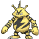
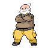

# Mauville City — Trainer Pokémon

### Generic Trainers

| Trainer | P1 | P2 | P3 | P4 |
|:-------:|:--:|:--:|:--:|:--:|
|  PKMN Trainer Wally [518] | 
 [Fletchinder](../../pokemon/fletchinder.md) Lv. 23
 | 
 [Gible](../../pokemon/gible.md) Lv. 23
 | 
 [Marill](../../pokemon/marill.md) Lv. 23
 | 
 [Kirlia](../../pokemon/kirlia.md) Lv. 25
 |

## [ Gym ]

### Generic Trainers

| Trainer | P1 | P2 | P3 | P4 | P5 | P6 |
|:-------:|:--:|:--:|:--:|:--:|:--:|:--:|
|  Guitarist Kirk [034] | 
 [Electrike](../../pokemon/electrike.md) Lv. 23
 | 
 [Voltorb](../../pokemon/voltorb.md) Lv. 23
 | 
 [Helioptile](../../pokemon/helioptile.md) Lv. 23
 |
|  Youngster Ben [568] | 
 [Joltik](../../pokemon/joltik.md) Lv. 23
 | 
 [Tynamo](../../pokemon/tynamo.md) Lv. 23
 | 
 [Stunfisk](../../pokemon/stunfisk.md) Lv. 23
 |
|  Battle Girl Vivian [614] | 
 [Elekid](../../pokemon/elekid.md) Lv. 25
 | 
 [Electabuzz](../../pokemon/electabuzz.md) Lv. 25
 |
|  Guitarist Shawn [035] | 
 [Blitzle](../../pokemon/blitzle.md) Lv. 23
 | 
 [Chinchou](../../pokemon/chinchou.md) Lv. 23
 | 
 [Jolteon](../../pokemon/jolteon.md) Lv. 23
 |
|  Leader Wattson [567] | 
 [Electrode](../../pokemon/electrode.md) Lv. 26
 | 
 [Magneton](../../pokemon/magneton.md) Lv. 26
 | 
 [Flaaffy](../../pokemon/flaaffy.md) Lv. 26
 | 
 [Rotom](../../pokemon/rotom.md) Lv. 26
 | 
 [Luxio](../../pokemon/luxio.md) Lv. 26
 | 
 [Manectric](../../pokemon/manectric.md) Lv. 28
 |

