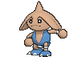
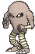

# Meteor Falls — Trainer Pokémon

## [ 1F ]

### Trainer Rosters

| Trainer | P1 | P2 | P3 |
|:-------:|:--:|:--:|:--:|
|  Team Magma Grunt [902] | 
 [Golbat](../../pokemon/golbat.md) Lv. 30
 | 
 [Numel](../../pokemon/numel.md) Lv. 30
 | 
 [Onix](../../pokemon/onix.md) Lv. 30
 |
|  Magma Admin Tabitha [691] | 
 [Mightyena](../../pokemon/mightyena.md) Lv. 33
 | 
 [Weezing](../../pokemon/weezing.md) Lv. 33
 | 
 [Darmanitan](../../pokemon/darmanitan-standard.md) Lv. 35
 |
|  Team Aqua Grunt [903] | 
 [Golbat](../../pokemon/golbat.md) Lv. 30
 | 
 [Carvanha](../../pokemon/carvanha.md) Lv. 30
 | 
 [Tangela](../../pokemon/tangela.md) Lv. 30
 |
|  Aqua Admin Shelly [688] | 
 [Liepard](../../pokemon/liepard.md) Lv. 33
 | 
 [Muk](../../pokemon/muk.md) Lv. 33
 | 
 [Jellicent](../../pokemon/jellicent.md) Lv. 35
 |

## [ 1F / 2F ]

### Trainer Rosters

### Rematches

| Trainer | P1 | P2 | P3 | P4 | P5 |
|:-------:|:--:|:--:|:--:|:--:|:--:|
| ") Dragon Tamer Nicolas (C) [481] | 
 [Gyarados](../../pokemon/gyarados.md) Lv. 75
 | 
 [Sceptile](../../pokemon/sceptile.md) Lv. 75
 | 
 [Haxorus](../../pokemon/haxorus.md) Lv. 75
 | 
 [Tyrantrum](../../pokemon/tyrantrum.md) Lv. 75
 | 
 [Aerodactyl](../../pokemon/aerodactyl.md) Lv. 75
 |
| ") Old Couple John & Jay (C) [634] | 
 [Poliwrath](../../pokemon/poliwrath.md) Lv. 75
 | 
 [Hitmontop](../../pokemon/hitmontop.md) Lv. 75
 | 
 [Hariyama](../../pokemon/hariyama.md) Lv. 75
 | 
 [Conkeldurr](../../pokemon/conkeldurr.md) Lv. 75
 | 
 [Lucario](../../pokemon/lucario.md) Lv. 75
 |

## [ B1F ]

### Trainer Rosters

| Trainer | P1 | P2 | P3 | P4 | P5 |
|:-------:|:--:|:--:|:--:|:--:|:--:|
|  Battle Girl Tess [729] | 
 [Hitmonlee](../../pokemon/hitmonlee.md) Lv. 65
 | 
 [Primeape](../../pokemon/primeape.md) Lv. 65
 | 
 [Breloom](../../pokemon/breloom.md) Lv. 65
 | 
 [Toxicroak](../../pokemon/toxicroak.md) Lv. 65
 | 
 [Heracross](../../pokemon/heracross.md) Lv. 65
 |
|  Dragon Tamer Dray [763] | 
 [Altaria](../../pokemon/altaria.md) Lv. 65
 | 
 [Serperior](../../pokemon/serperior.md) Lv. 65
 | 
 [Milotic](../../pokemon/milotic.md) Lv. 65
 | 
 [Goodra](../../pokemon/goodra.md) Lv. 65
 | 
 [Ampharos](../../pokemon/ampharos.md) Lv. 65
 |

